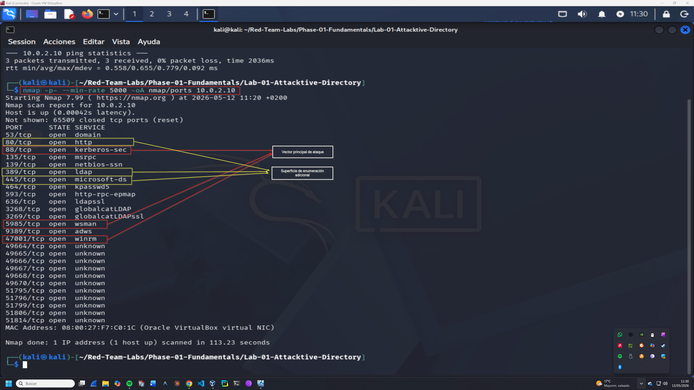
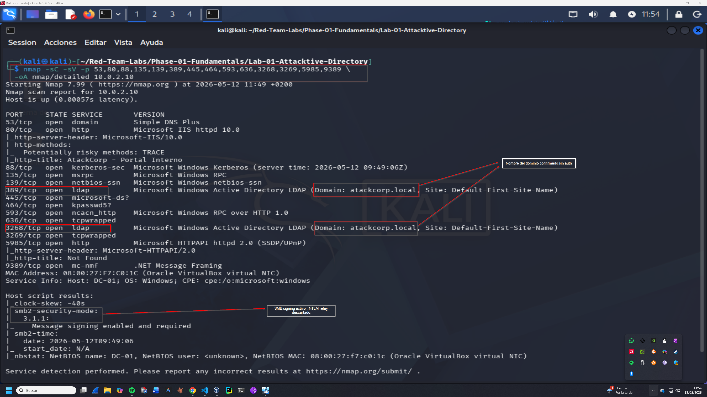
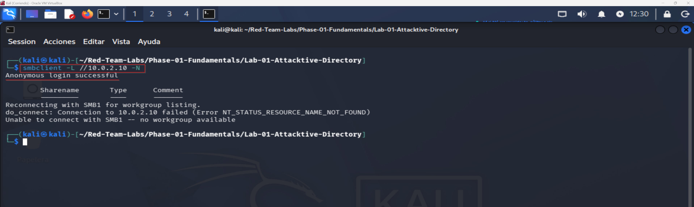
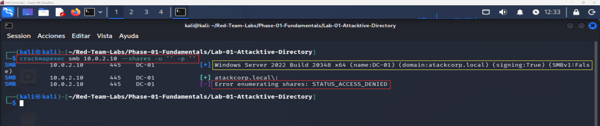
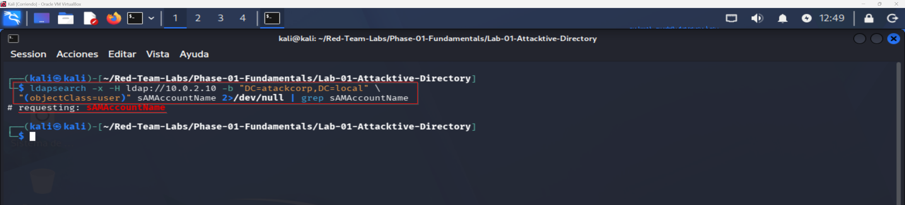

# Enumeration Log — Operación GHOST FOREST
## Fase 1 — Reconnaissance
**Operación:** GHOST FOREST | **Adversario:** APT29 | **Framework:** MITRE ATT&CK v14  
**Operador:** Adrián Camacho | **Fecha:** 12/05/2026  
**Objetivo:** DC-01 (10.0.2.10) — atackcorp.local

---

## 1.1 — Network Service Discovery
**Técnica MITRE:** T1046 — Network Service Discovery  
**Herramienta:** Nmap 7.99  
**Captura:** 

### Fase 1 — Port Discovery (All Ports)

```bash
nmap -p- --min-rate 5000 -oA nmap/ports 10.0.2.10
```

**Resultado:** 20 puertos TCP abiertos identificados.

| Puerto | Estado | Servicio |
|--------|--------|---------|
| 53 | open | domain |
| 80 | open | http |
| 88 | open | kerberos-sec |
| 135 | open | msrpc |
| 139 | open | netbios-ssn |
| 389 | open | ldap |
| 445 | open | microsoft-ds |
| 464 | open | kpasswd5 |
| 593 | open | http-rpc-epmap |
| 636 | open | ldapssl |
| 3268 | open | globalcatLDAP |
| 3269 | open | globalcatLDAPssl |
| 5985 | open | wsman (WinRM) |
| 9389 | open | adws |
| 47001 | open | winrm |
| 49664-49670 | open | unknown (RPC dinámico) |

**Vectores identificados:**
- `88/tcp` — Kerberos → **Vector principal de ataque** (AS-REP Roasting, Kerberoasting)
- `389/tcp` + `3268/tcp` — LDAP → Superficie de enumeración adicional
- `5985/tcp` + `47001/tcp` — WinRM → Vector de acceso remoto
- `445/tcp` — SMB → Enumeración de shares

---

### Fase 2 — Service Version Detection
**Captura:** 

```bash
nmap -sC -sV -p 53,80,88,135,139,389,445,464,593,636,3268,3269,5985,9389 \
  -oA nmap/detailed 10.0.2.10
```

**Hallazgos clave:**

| Hallazgo | Valor | Implicación |
|----------|-------|-------------|
| Dominio confirmado | `atackcorp.local` | Sin autenticación via LDAP banner |
| Hostname | `DC-01` | Naming convention del entorno |
| HTTP Title | `AtackCorp - Portal Interno` | IIS 10.0 expuesto |
| SMB signing | `enabled and required` | NTLM relay descartado |
| OS | `Windows Server 2022` | CPE confirmado |
| Clock skew | `-40s` | Relevante para Kerberos |

**Nota OPSEC:** SMB signing activo descarta ataques de NTLM relay (Responder). El vector principal se confirma como Kerberos abuse.

---

## 1.2 — SMB Enumeration
**Técnica MITRE:** T1135 — Network Share Discovery  
**Herramientas:** smbclient, CrackMapExec

### Null Session (smbclient)
**Captura:** 

```bash
smbclient -L //10.0.2.10 -N
```

**Resultado:** `Anonymous login successful` pero sin shares visibles. SMB1 deshabilitado — no se pueden listar workgroups.

```
Anonymous login successful
Reconnecting with SMB1 for workgroup listing.
do_connect: Connection failed (NT_STATUS_RESOURCE_NAME_NOT_FOUND)
Unable to connect with SMB1 -- no workgroup available
```

**Conclusión:** Sesión anónima posible pero sin acceso a shares. Vector SMB descartado sin credenciales.

### Guest Session (CrackMapExec)
**Captura:** 

```bash
crackmapexec smb 10.0.2.10 --shares -u '' -p ''
```

**Resultado:**
```
[*] Windows Server 2022 Build 20348 x64 (name:DC-01) (domain:atackcorp.local) (signing:True) (SMBv1:False)
[+] atackcorp.local\:
[-] Error enumerating shares: STATUS_ACCESS_DENIED
```

**Datos obtenidos sin autenticación:**
- OS: Windows Server 2022 Build 20348 x64
- Hostname: DC-01
- Dominio: atackcorp.local
- SMB signing: True (NTLM relay imposible)
- SMBv1: False

---

## 1.3 — LDAP Enumeration
**Técnica MITRE:** T1087.002 — Account Discovery: Domain Account  
**Herramienta:** ldapsearch  
**Captura:** 

```bash
ldapsearch -x -H ldap://10.0.2.10 -b "DC=atackcorp,DC=local" \
  "(objectClass=user)" sAMAccountName 2>/dev/null | grep sAMAccountName
```

**Resultado:** LDAP anónimo denegado. Sin output de usuarios.

```
# requesting: sAMAccountName
```

**Conclusión:** LDAP anónimo no habilitado. La enumeración de usuarios requiere credenciales válidas o técnicas alternativas (AS-REP Roasting con lista de usuarios conocidos).

**Pivote táctico:** Se procede a construir una lista de usuarios potenciales basada en naming conventions corporativas estándar para usarla en AS-REP Roasting.

---

## 1.4 — Resumen de Superficie de Ataque

```
SUPERFICIE MAPEADA — DC-01 (10.0.2.10)
════════════════════════════════════════════

DESCARTADO:
  ✗ NTLM Relay     → SMB signing requerido
  ✗ LDAP anónimo   → Acceso denegado
  ✗ SMB shares     → STATUS_ACCESS_DENIED sin credenciales

VECTORES ACTIVOS:
  ✓ Kerberos/88    → AS-REP Roasting (sin preauth)
  ✓ WinRM/5985     → Acceso remoto con credenciales válidas
  ✓ LDAP/389       → Enumeración con credenciales
  ✓ IIS/80         → Portal interno (reconocimiento adicional)

INFORMACIÓN OBTENIDA SIN CREDENCIALES:
  • Dominio:   atackcorp.local
  • DC:        DC-01
  • OS:        Windows Server 2022 Build 20348
  • Servicios: Kerberos, LDAP, SMB, WinRM, IIS, MSSQL (inferido)
```

**Criterio de éxito Fase 1:** ✅ Mapa completo de superficie de ataque identificado. Vector principal confirmado: Kerberos abuse (T1558.004).

---

**Siguiente fase:** [exploitation.md](exploitation.md) — AS-REP Roasting y acceso inicial