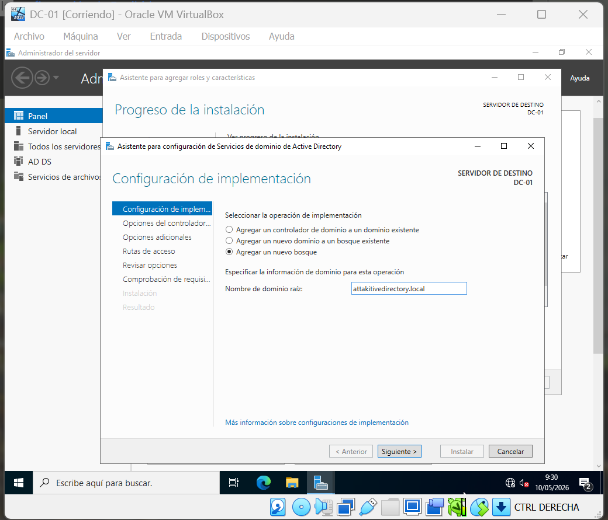
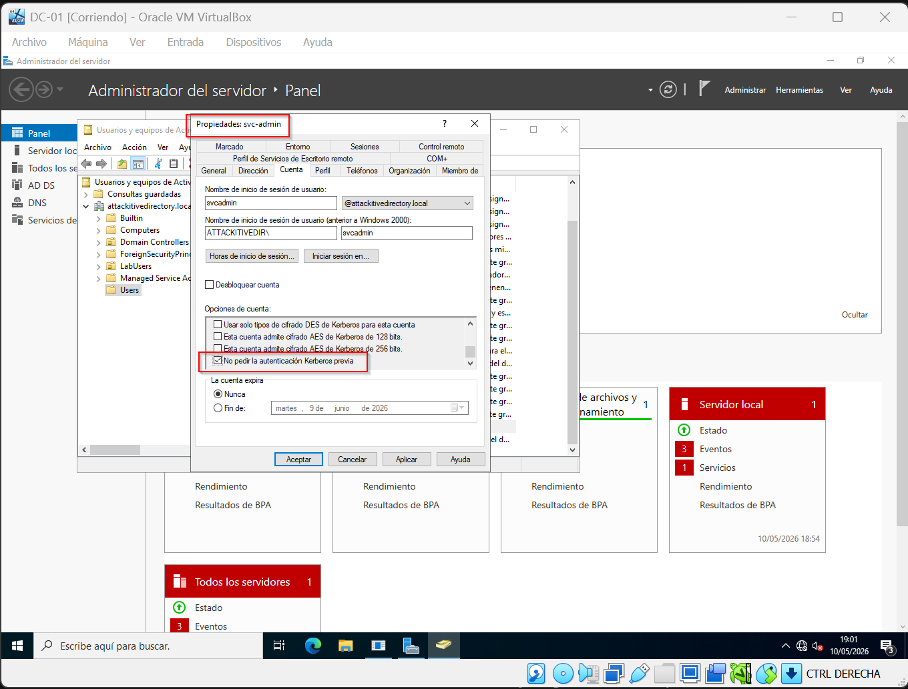

# 🏗️ Infraestructura del Laboratorio: Attackitive Directory

## 1. Diseño de Red
Para este laboratorio se ha diseñado una red aislada que permite la comunicación entre el atacante y los objetivos sin exponer la red anfitriona.

* **Tipo de Red:** VirtualBox NAT Network.
* **Nombre de Red:** LabRedTeam
* **Segmento:** `10.0.2.0/24`
* **DHCP:** Habilitado (para estaciones de trabajo y atacante).

| Host | Sistema Operativo | IP | Rol |
| :--- | :--- | :--- | :--- |
| **DC-01** | Windows Server 2019 | `10.0.2.10` | Domain Controller | `dc01.attackitivedirectory.local` |
| **WKSTN-01** | Windows 10 Ent | DHCP | Workstation | `wkstn01.attackitivedirectory.local` |
| **Kali-Host** | Kali Linux 2026.1 | DHCP | Máquina Atacante |

## 2. Configuración del Controlador de Dominio (DC-01)

### A. Promoción del Dominio
1. Se ha instalado el rol de **Active Directory Domain Services**.
2. Nombre del Bosque: `attackitivedirectory.local`
3. Nivel funcional: Windows Server 2016 (compatibilidad).

> 

### B. Creación del Escenario de Vulnerabilidad
Para replicar el laboratorio, se ha configurado una cuenta de servicio con debilidades en su política de Kerberos.

