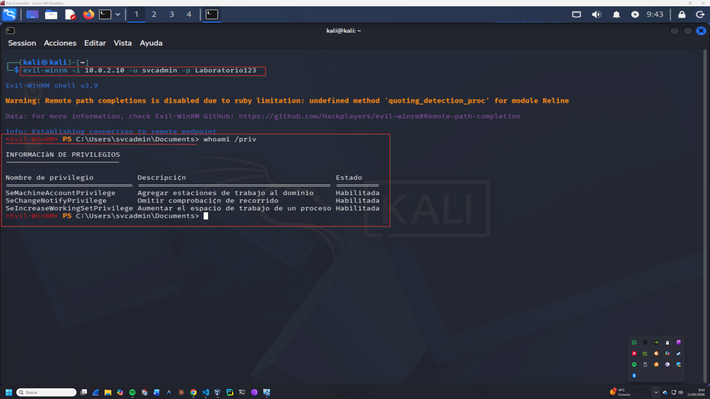

# Fase de Post-Explotación: Acceso Inicial

## 1. Establecimiento de Shell Reversa
Tras obtener las credenciales del usuario `svcadmin` (`Laboratorio123`) y configurar los permisos de acceso remoto, se procede a establecer una conexión interactiva.

**Herramienta:** Evil-WinRM v3.9
**Comando:**
```bash
evil-winrm -i 10.0.2.10 -u svcadmin -p Laboratorio123
```



## 2. Enumeración de Privilegios
Tras el acceso exitoso, se ejecutó `whoami /priv` obteniendo los siguientes privilegios habilitados para `svcadmin`:

| Privilegio | Descripción | Estado |
| :--- | :--- | :--- |
| **SeMachineAccountPrivilege** | Permite agregar equipos al dominio. | Habilitada |
| **SeChangeNotifyPrivilege** | Omitir comprobación de recorrido. | Habilitada |
| **SeIncreaseWorkingSetPrivilege** | Aumentar el espacio de trabajo de un proceso. | Habilitada |

## 3. Escalada de Privilegios Local (LPE)
Tras obtener acceso con `svcadmin`, se identificaron vectores para elevar a `SYSTEM`:

### A. Unquoted Service Path
* **Servicio**: `Servicio Critico`
* **Ruta**: `C:\Program Files\Servicio Critico\Monitor v1.exe`.
* **Vulnerabilidad**: Al no tener comillas y contener espacios, el sistema buscará ejecutar `C:\Program.exe` o `C:\Program Files\Servicio.exe`.

### B. Análisis de Privilegios de Token
El usuario cuenta con `SeMachineAccountPrivilege` y `SeChangeNotifyPrivilege` habilitados. Se debe investigar el abuso de estos privilegios para manipulación de tokens de procesos.