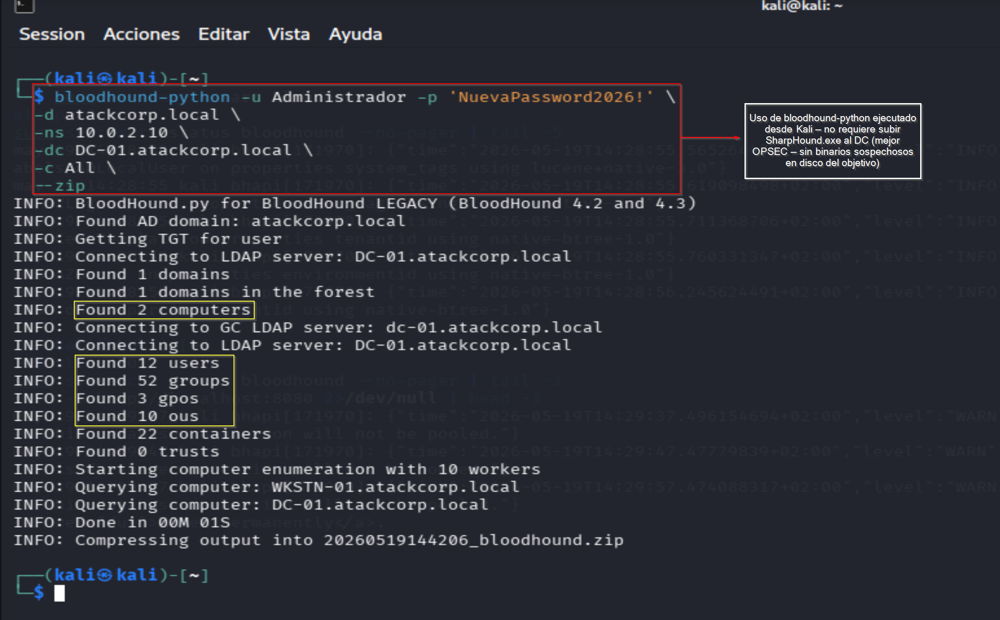
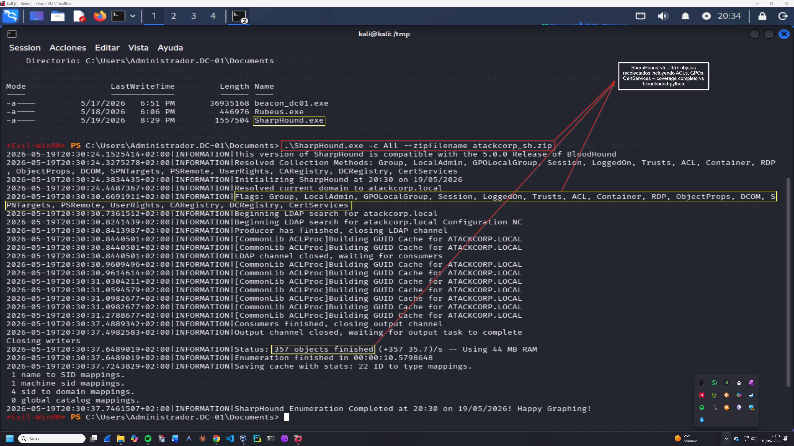
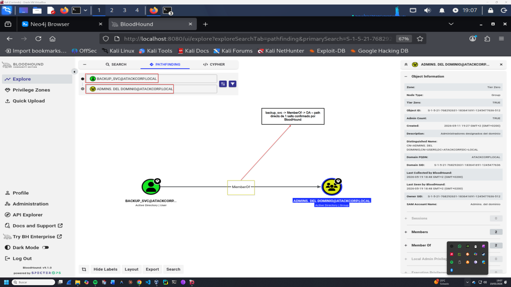
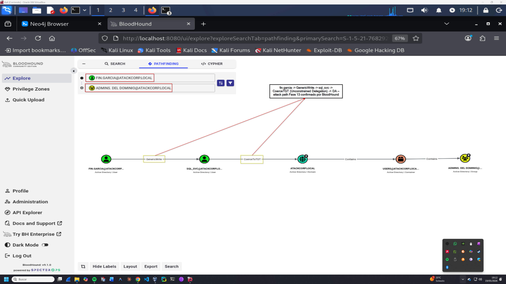
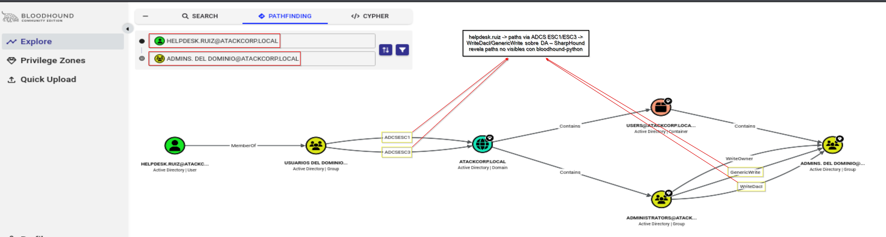

# BloodHound — Metodología y Análisis
## Operación GHOST FOREST — atackcorp.local

**Operación:** GHOST FOREST | **Adversario:** APT29 | **Framework:** MITRE ATT&CK v14  
**Fecha:** 19/05/2026 | **Operador:** Adrián Camacho  
**Herramientas:** BloodHound CE v9.1.0 | bloodhound-python | SharpHound v2.5.9

---

## 1. Introducción — Por qué BloodHound es fundamental

BloodHound no es solo una herramienta — es una **metodología de análisis de Active Directory** que convierte horas de enumeración manual en segundos de análisis visual de attack paths. En un engagement real APT29 usaría BloodHound (o herramientas equivalentes) para:

1. **Mapear el dominio completo** — usuarios, grupos, equipos, OUs, GPOs, ACLs, SPNs, delegaciones
2. **Identificar Tier Zero** — activos de mayor valor (DA, EA, KRBTGT, DCs)
3. **Encontrar attack paths** — caminos hacia DA desde cualquier cuenta comprometida
4. **Priorizar objetivos** — qué cuenta comprometer primero para el path más corto

> **Principio OPSEC:** bloodhound-python ejecutado desde Kali no requiere subir SharpHound al objetivo — genera solo tráfico LDAP/SMB legítimo, sin binarios sospechosos en disco del DC.

---

## 2. Setup — BloodHound CE

### Instalación inicial

```bash
# Primera ejecución — configura PostgreSQL y Neo4j
bloodhound-setup

# Cambiar contraseña por defecto en http://localhost:7474
# neo4j / neo4j → Bloodhound2026!

# Actualizar configuración
sudo nano /etc/bhapi/bhapi.json
# "secret": "Bloodhound2026!"

# Arrancar BloodHound CE
sudo bloodhound-start
# Acceder: http://localhost:8080/ui
# Credenciales: admin / admin
```

### Troubleshooting — Neo4j Unauthorized

Si BloodHound falla con `Neo4jError: Security.Unauthorized`:

```bash
# Resetear auth de Neo4j
sudo neo4j stop
sudo rm -rf /etc/neo4j/data/databases/system
sudo rm -rf /etc/neo4j/data/transactions/system
sudo neo4j start
sleep 15

# Cambiar contraseña via Cypher en http://localhost:7474
# ALTER USER neo4j SET PASSWORD 'Bloodhound2026!' CHANGE NOT REQUIRED
```

---

## 3. Recolección — bloodhound-python (OPSEC preferido)

### Ventajas vs SharpHound

| Criterio | bloodhound-python | SharpHound |
|----------|-------------------|------------|
| **Ejecución** | Desde Kali | En el objetivo (DC/workstation) |
| **Binarios en disco** | ❌ Ninguno | ✅ SharpHound.exe en objetivo |
| **Detección** | Solo tráfico LDAP/SMB | Proceso sospechoso + eventos |
| **Coverage ACLs** | ⚠️ Parcial (no GPO ACLs) | ✅ Completo |
| **Coverage GPOs** | ⚠️ Básico | ✅ Completo |
| **OPSEC** | ✅ Alto | ⚠️ Medio |

### Comando de recolección

```bash
bloodhound-python -u Administrador -p 'NuevaPassword2026!' \
  -d atackcorp.local \
  -ns 10.0.2.10 \
  -dc DC-01.atackcorp.local \
  -c All \
  --zip
```

**Resultado:**
```
INFO: Found 1 domains
INFO: Found 2 computers
INFO: Found 12 users
INFO: Found 52 groups
INFO: Found 3 gpos
INFO: Found 10 ous
INFO: Found 22 containers
INFO: Done in 00M 01S
INFO: Compressing output into 20260519144206_bloodhound.zip
```

> 📸 Captura: 

---

## 4. Recolección — SharpHound v2.5.9 (Coverage completo)

Cuando se necesita coverage completo de ACLs y GPOs — o cuando ya se tiene acceso privilegiado al DC — SharpHound proporciona datos más completos.

### Descarga e instalación

```bash
# Descargar desde Kali con Internet
curl -sL "https://github.com/BloodHoundAD/SharpHound/releases/download/v2.5.9/SharpHound-v2.5.9.zip" \
  -o /tmp/SharpHound.zip
unzip -q /tmp/SharpHound.zip -d /tmp/SharpHound
```

### Ejecución en DC-01

```bash
evil-winrm -i 10.0.2.10 -u Administrador -p 'NuevaPassword2026!'
```

```powershell
upload /tmp/SharpHound/SharpHound.exe
.\SharpHound.exe -c All --zipfilename atackcorp_sh.zip
```

**Resultado:**
```
INFO: Status: 357 objects finished (+357 35.7)/s -- Using 44 MB RAM
INFO: Enumeration finished in 00:00:10.5
INFO: SharpHound Enumeration Completed!
```

> 📸 Captura: 

### Descarga del ZIP

```powershell
ls *.zip
download 20260519203031_atackcorp_sh.zip
```

---

## 5. Importar datos en BloodHound CE

1. Abrir `http://localhost:8080/ui`
2. Click en **Quick Upload** (menú lateral izquierdo)
3. Seleccionar el ZIP descargado
4. Esperar ingesta de datos

---

## 6. Análisis — Attack Paths Identificados

### 6.1 ADMINS. DEL DOMINIO — Tier Zero

```
Pathfinding:
  Start: ATACKCORP.LOCAL
  End: ADMINS. DEL DOMINIO@ATACKCORP.LOCAL
```

**Datos del grupo:**
- **Tier Zero: TRUE** — BloodHound identifica correctamente el grupo como activo crítico
- **Admin Count: TRUE** — grupo privilegiado
- **Members: 2** — `backup_svc` y `Administrador`

> 📸 Captura: 

### 6.2 backup_svc → Domain Admin (1 salto)

```
Pathfinding:
  Start: BACKUP_SVC@ATACKCORP.LOCAL
  End: ADMINS. DEL DOMINIO@ATACKCORP.LOCAL
```

**Grafo:**
```
BACKUP_SVC → MemberOf → ADMINS. DEL DOMINIO
```

**Impacto:** Path directo de 1 salto. Si backup_svc está comprometida (contraseña crackeada via AS-REP Roasting en Fase 2), es DA inmediato.

> 📸 Captura: 

### 6.3 fin.garcia → sql_svc → Domain Admin (Fase 13)

```
Pathfinding:
  Start: FIN.GARCIA@ATACKCORP.LOCAL
  End: ADMINS. DEL DOMINIO@ATACKCORP.LOCAL
```

**Grafo:**
```
fin.garcia → GenericWrite → sql_svc → CoerceTGT → ATACKCORP.LOCAL → Contains → DA
```

**Impacto:** BloodHound visualiza en segundos el attack path que justifica la Fase 13 completa. La relación `GenericWrite` sobre sql_svc, combinada con la propiedad `CoerceTGT` (Unconstrained Delegation), forma un path automático hacia DA.

> 📸 Captura: 

### 6.4 helpdesk.ruiz → Domain Admin (Múltiples paths)

Con datos de **SharpHound** (no disponibles con bloodhound-python):

```
helpdesk.ruiz → MemberOf → USUARIOS DEL DOMINIO
              → ADCSESC1/ESC3 → ATACKCORP.LOCAL
              → WriteOwner/GenericWrite/WriteDacl → ADMINS. DEL DOMINIO
```

BloodHound CE con SharpHound revela paths via **ADCS ESC1/ESC3** y ACLs directas sobre el grupo DA que bloodhound-python no captura.

> 📸 Captura: 

---

## 7. Limitaciones — bloodhound-python vs SharpHound

| Path | bloodhound-python | SharpHound |
|------|-------------------|------------|
| backup_svc → DA | ✅ Visible | ✅ Visible |
| fin.garcia → DA | ✅ Visible (GenericWrite) | ✅ Visible |
| helpdesk.ruiz → DA | ❌ Path not found | ✅ Múltiples paths |
| ceo.martinez → DA | ❌ Path not found | ✅ Via ADCS |

**Causa:** bloodhound-python LEGACY (compatibilidad BloodHound 4.x) no recolecta:
- ACLs de objetos GPO
- Permisos DCSync vía ACEs extendidos
- Paths ADCS (ESC1, ESC3, etc.)

**Solución:** Usar SharpHound cuando se necesite coverage completo, bloodhound-python cuando el OPSEC sea prioritario.

---

## 8. Queries Cypher Útiles

### Encontrar todos los Tier Zero

```cypher
MATCH (n) WHERE n.system_tags CONTAINS 'admin_tier_0' RETURN n
```

### Cuentas con GenericWrite sobre otras cuentas

```cypher
MATCH (u:User)-[:GenericWrite]->(t:User) RETURN u.name, t.name
```

### Paths más cortos hacia DA

```cypher
MATCH p=shortestPath((u:User)-[*1..5]->(g:Group {name:"ADMINS. DEL DOMINIO@ATACKCORP.LOCAL"}))
WHERE NOT u=g
RETURN p
```

### Cuentas con Unconstrained Delegation

```cypher
MATCH (u:User {unconstraineddelegation:true}) RETURN u.name, u.description
```

### Cuentas Kerberoasteables

```cypher
MATCH (u:User) WHERE u.hasspn=true AND u.enabled=true RETURN u.name, u.serviceprincipalnames
```

---

## 9. OPSEC — BloodHound en Entornos Reales

| Técnica | Riesgo de detección | Mitigación |
|---------|---------------------|------------|
| bloodhound-python desde Kali | Bajo — tráfico LDAP voluminoso | Ejecutar fuera de horario de negocio |
| SharpHound en DC | Medio — binario + eventos de proceso | Renombrar binario, usar reflective loading |
| Consultas Cypher | N/A — local en Kali | — |
| Transferir ZIP | Bajo — archivo cifrado | Usar canal C2 para exfiltrar |

---

## 10. Integración con el Workflow del Lab

BloodHound debe usarse **antes de atacar**, no después. El flujo correcto:

```
1. Foothold inicial (ceo.martinez via AS-REP Roasting)
2. bloodhound-python → recolectar dominio completo
3. Analizar paths en BloodHound → identificar vectores
4. Priorizar ataques basándose en paths (backup_svc → DA en 1 salto)
5. Ejecutar técnicas específicas (Fases 11-13) con contexto visual
```

En este lab, BloodHound se introdujo en la Fase 11 por motivos pedagógicos (primero ejecutar las técnicas manualmente para entenderlas). En un engagement real sería el paso 2 inmediato tras el primer foothold.

---

*Operación GHOST FOREST — Adrián Camacho | Mayo 2026*  
*Entorno de laboratorio — Únicamente con fines educativos*