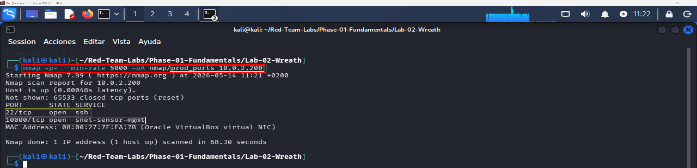
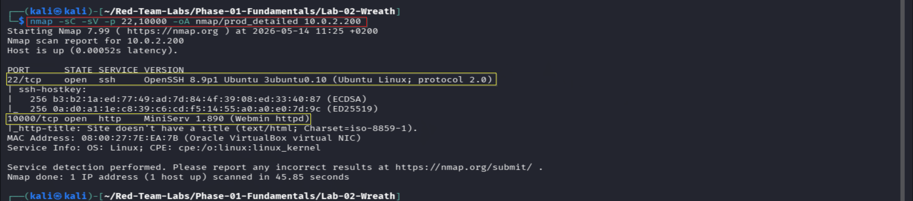
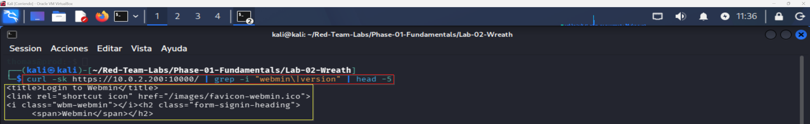
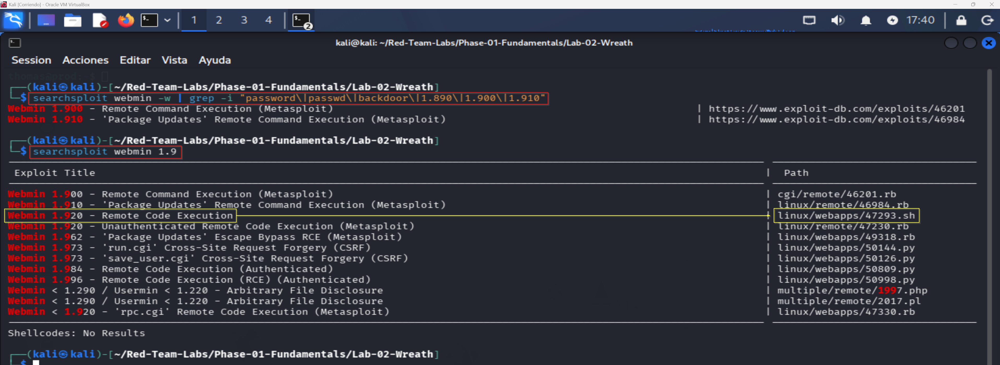
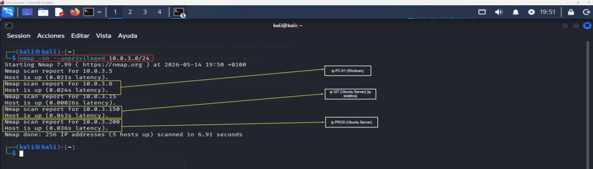
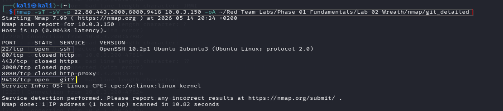
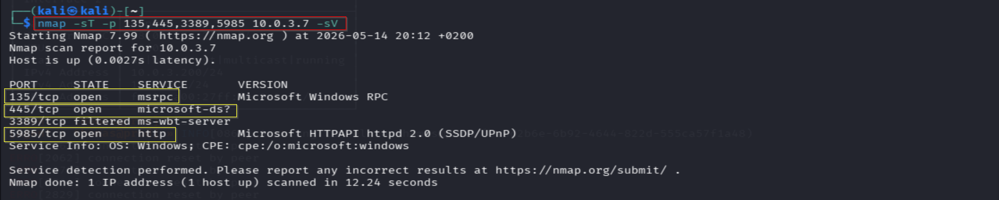
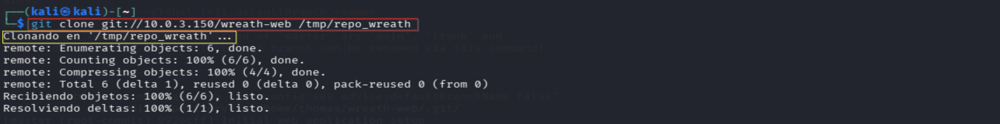
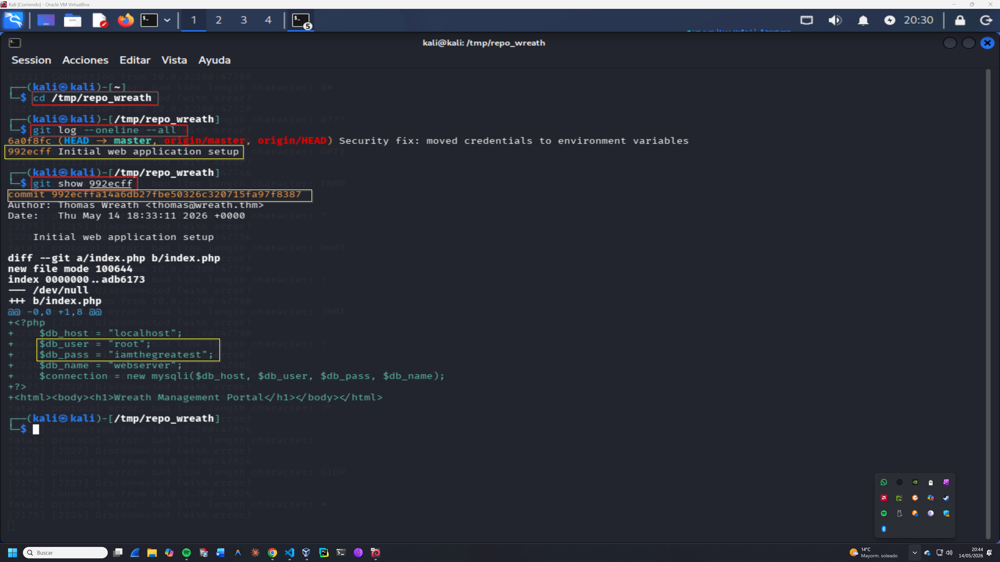

# Enumeration Log — Operación SILENT BRIDGE
## Fases 1 y 4 — Reconnaissance externo + Enumeración red interna
**Operación:** SILENT BRIDGE | **Adversario:** APT41 | **Framework:** MITRE ATT&CK v14  
**Operador:** Adrián Camacho | **Fecha:** 14/05/2026  
**Objetivo Fase 1:** PROD (10.0.2.200) — superficie de ataque externa  
**Objetivo Fase 4:** Red interna — GIT (10.0.3.150) + PC-01 Windows (10.0.3.7)

---

## FASE 1 — Reconnaissance externo

**Táctica MITRE:** TA0043 — Reconnaissance

---

### 1.1 — Network Service Discovery
**Técnica MITRE:** T1046  
**Captura:** 

```bash
nmap -p- --min-rate 5000 -oA nmap/prod_ports 10.0.2.200
```

| Puerto | Estado | Servicio |
|--------|--------|---------|
| 22/tcp | open | ssh |
| 10000/tcp | open | snet-sensor-mgmt (Webmin) |

---

### 1.2 — Service Version Detection
**Técnica MITRE:** T1046  
**Captura:** 

```bash
nmap -sC -sV -p 22,10000 -oA nmap/prod_detailed 10.0.2.200
```

| Hallazgo | Valor | Implicación |
|----------|-------|-------------|
| Webmin | `MiniServ 1.890` | **Vulnerable — CVE-2019-12840** |
| OS | Linux Ubuntu | — |
| SSH | OpenSSH 8.9p1 Ubuntu 3ubuntu0.10 | Acceso post-explotación |

---

### 1.3 — Webmin Fingerprint
**Técnica MITRE:** T1592.002  
**Captura:** 

```bash
curl -sk https://10.0.2.200:10000/ | grep -i "webmin\|title" | head -5
```

Página de login accesible. Versión `MiniServ 1.890` confirmada.

---

### 1.4 — CVE Identification
**Técnica MITRE:** T1596  
**Captura:** 

```bash
searchsploit webmin 1.9
```

| Exploit | CVE | Vector |
|---------|-----|--------|
| 46984 — Package Updates RCE | **CVE-2019-12840** | Autenticado ← **usado** |
| 47330 — RCE Metasploit | CVE-2019-15107 | Pre-auth (bloqueado) |

**Pivote táctico documentado:** CVE-2019-15107 bloqueado por check `MINISERV_INTERNAL` en `password_change.cgi` línea 8. Se pivota a CVE-2019-12840 (Package Updates RCE autenticado) — igualmente válido para el perfil APT41.

**Weaponization:** Exploit construido manualmente en Python analizando el módulo Ruby de Metasploit (`46984.rb`) — replica el proceso real de un operador APT sin depender de frameworks.

---

### Resumen Fase 1

```
SUPERFICIE MAPEADA — PROD (10.0.2.200)
════════════════════════════════════════════

DESCARTADO:
  ✗ CVE-2019-15107 pre-auth → MINISERV_INTERNAL check activo
  ✗ SMB / NTLM              → no expuesto

VECTORES ACTIVOS:
  ✓ Webmin :10000 → CVE-2019-12840 (autenticado)
  ✓ SSH :22       → acceso post-explotación

INFORMACIÓN OBTENIDA:
  Webmin:  MiniServ 1.890
  OS:      Ubuntu 22.04 / Kernel 5.15.0-119
  SSH:     OpenSSH 8.9p1
```

**Criterio de éxito Fase 1:** ✅

---

## FASE 4 — Enumeración red interna (post-pivote)

**Táctica MITRE:** TA0007 — Discovery  
**Prerrequisito:** Túnel Ligolo-ng activo (Fase 3 ✅)

---

### 4.1 — Host Discovery
**Técnica MITRE:** T1046  
**Captura:** 

```bash
nmap -sn --unprivileged 10.0.3.0/24
```

| IP | SO | Rol |
|----|-----|-----|
| `10.0.3.7` | Windows | **PC-01 — objetivo final** |
| `10.0.3.150` | Linux | **GIT server** |
| `10.0.3.200` | Linux | PROD — ya comprometida |

---

### 4.2 — Service Discovery — GIT
**Técnica MITRE:** T1046  
**Captura:** 

```bash
nmap -sT -sV -p 22,80,443,3000,8080,9418 10.0.3.150 -oA nmap/git_detailed
```

| Puerto | Servicio | Relevancia |
|--------|---------|-----------|
| 22/tcp | OpenSSH 10.2p1 | Acceso remoto |
| 9418/tcp | Git daemon | **Repositorios accesibles** |

---

### 4.3 — Service Discovery — PC-01 Windows
**Técnica MITRE:** T1046  
**Captura:** 

```bash
nmap -sT -p 135,445,3389,5985 10.0.3.7 -sV
```

| Puerto | Servicio | Relevancia |
|--------|---------|-----------|
| 135/tcp | msrpc | — |
| 445/tcp | microsoft-ds | SMB |
| 5985/tcp | Microsoft HTTPAPI 2.0 | **WinRM ← vector de acceso** |

---

### 4.4 — Repositorio Git
**Técnica MITRE:** T1083  
**Captura:** 

```bash
git clone git://10.0.3.150/wreath-web /tmp/repo_wreath
cd /tmp/repo_wreath
git log --oneline --all
```

```
6a0f8fc (HEAD) Security fix: moved credentials to environment variables
992ecff         Initial web application setup
```

---

### 4.5 — Credential Discovery
**Técnica MITRE:** T1552.001  
**Captura:** 

```bash
git show 992ecff
```

```php
$db_pass = "iamthegreatest";   // ← commit 992ecff
```

| Usuario | Contraseña | Fuente | Commit |
|---------|-----------|--------|--------|
| `thomas` | `iamthegreatest` | `index.php` | `992ecff` |

**Nota:** El commit `6a0f8fc` intentó eliminar la credencial pero el historial Git la preserva. Reutilización de credenciales → PC-01 WinRM.

---

### Resumen Fase 4

```
RED INTERNA — Estado final
════════════════════════════════════════════════════════

HOSTS:
  GIT    10.0.3.150  Linux    SSH :22 + Git :9418
  PC-01  10.0.3.7    Windows  WinRM :5985 + SMB :445

CREDENCIALES:
  thomas : iamthegreatest  ←  git history (992ecff)
```

**Criterio de éxito Fase 4:** ✅

---

**Siguiente:** [exploitation.md](exploitation.md) | [post-exploitation.md](post-exploitation.md)