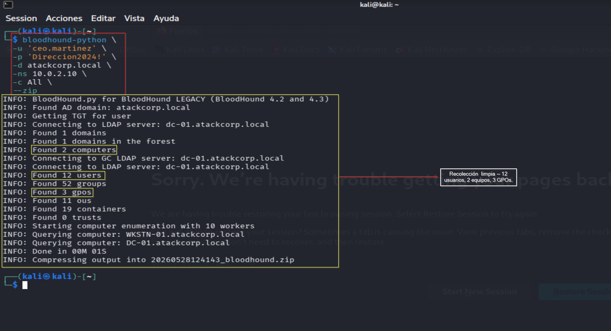
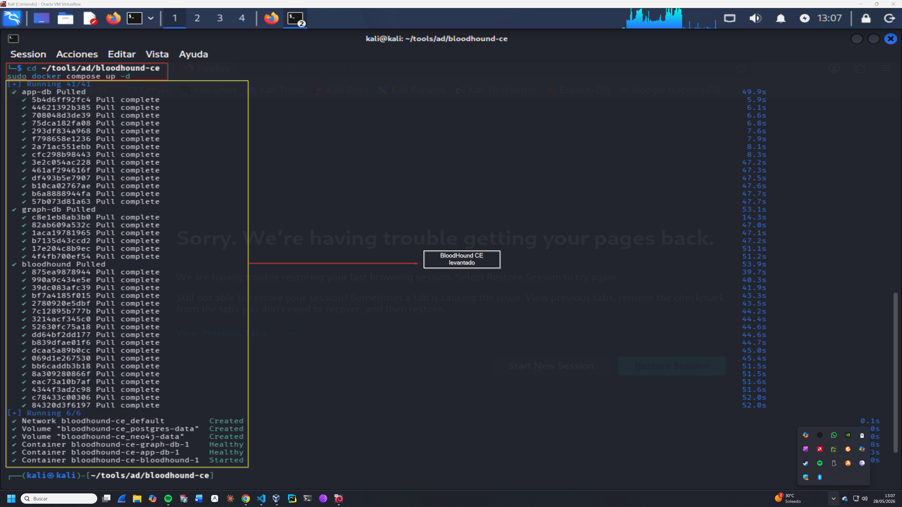
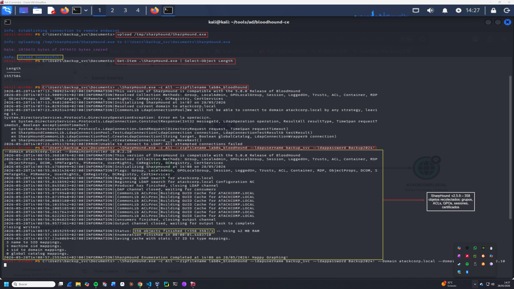
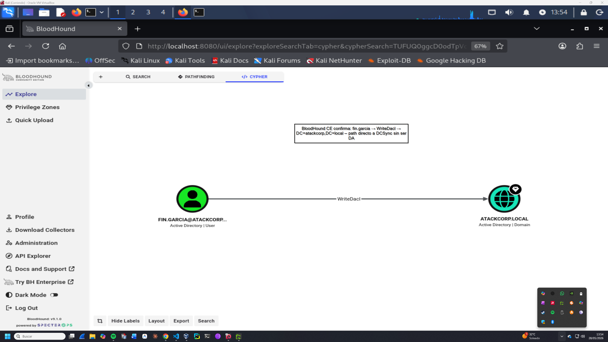

# Enumeration Log — Operación IRON FOREST
## Lab-04: ACL Abuse Avanzado, Credential Hunting y Movimiento Lateral

**Operación:** IRON FOREST | **Adversario:** APT28 (Fancy Bear) | **Fase:** 01 — Reconnaissance  
**Fecha:** 28/05/2026 | **Operador:** Adrián Camacho

---

## FASE 01 — Reconnaissance

### 1.1 Recolección BloodHound — bloodhound-python

**Objetivo:** Mapear el dominio atackcorp.local desde Kali sin ejecutar binarios en el objetivo (OPSEC).

```bash
bloodhound-python \
  -u 'ceo.martinez' \
  -p 'Direccion2024!' \
  -d atackcorp.local \
  -ns 10.0.2.10 \
  -c All \
  --zip
```

**Output:**
```
INFO: Found AD domain: atackcorp.local
INFO: Found 1 domains
INFO: Found 2 computers
INFO: Found 12 users
INFO: Found 52 groups
INFO: Found 3 gpos
INFO: Found 11 ous
INFO: Found 19 containers
INFO: Found 0 trusts
INFO: Done in 00M 01S
INFO: Compressing output into 20260528124143_bloodhound.zip
```

> 📸 Captura:
> 

**Análisis:** Recolección limpia en 1 segundo — 12 usuarios, 2 equipos, 3 GPOs, 0 forest trusts.  
**OPSEC:** bloodhound-python opera via LDAP/Kerberos desde Kali — no ejecuta binarios en el objetivo.

---

### 1.2 BloodHound CE — Instalación y configuración

**Problema encontrado:** BloodHound CE requiere Neo4j 4.4 con APOC configurado correctamente.  
Neo4j 5 no es compatible con la versión actual de BloodHound CE (error `db.indexes procedure not found`).  
Solución: fijar `neo4j:4.4` en docker-compose.yml con `NEO4J_PLUGINS: '["apoc"]'`.

```bash
# Setup BloodHound CE en ~/tools/ad/bloodhound-ce/
cd ~/tools/ad/bloodhound-ce
sudo docker compose up -d
```

> 📸 Captura:
> 

---

### 1.3 Recolección SharpHound — desde WKSTN-01

**Motivo:** bloodhound-python legacy no importa correctamente en BloodHound CE 5.x.  
SharpHound v2.5.9 genera JSONs compatibles con BloodHound CE.

```powershell
# Upload desde Kali via Evil-WinRM
evil-winrm -i 10.0.2.8 -u 'backup_svc' -p 'Backup2024!'
upload /tmp/sharphound/SharpHound.exe

# Ejecución con credenciales explícitas (requerido desde sesión WinRM)
.\SharpHound.exe -c All --zipfilename lab04_bloodhound `
  --ldapusername backup_svc `
  --ldappassword Backup2024! `
  --domain atackcorp.local `
  --domaincontroller 10.0.2.10
```

**Output:**
```
INFO: Resolved Collection Methods: Group, LocalAdmin, GPOLocalGroup, Session, LoggedOn,
      Trusts, ACL, Container, RDP, ObjectProps, DCOM, SPNTargets, PSRemote, UserRights,
      CARegistry, DCRegistry, CertServices
INFO: Status: 358 objects finished (+358 358)/s -- Using 42 MB RAM
INFO: Enumeration finished in 00:00:01.4483710
INFO: SharpHound Enumeration Completed at 14:08 on 28/05/2026
```

> 📸 Captura:
> 

**Problema OPSEC documentado:** SharpHound desde sesión Evil-WinRM no hereda contexto Kerberos automáticamente.  
Requiere `--ldapusername` y `--ldappassword` explícitos → genera Event ID 4688 con credenciales visibles en argumentos si Process Command Line auditing está activo.

---

### 1.4 BloodHound CE — Confirmación WriteDACL

**Query Cypher ejecutada:**
```cypher
MATCH p=(u:User {samaccountname:"fin.garcia"})-[:WriteDacl]->(d:Domain)
RETURN p
```

**Resultado:** `FIN.GARCIA@ATACKCORP.LOCAL → WriteDacl → ATACKCORP.LOCAL`

> 📸 Captura:
> 

**Análisis:** fin.garcia tiene `WriteDACL` sobre el objeto dominio `DC=atackcorp,DC=local`.  
Esto permite añadir ACEs de DCSync sin ser Domain Admin — path directo a volcado completo de credenciales del dominio.

**Attack path:**
```
fin.garcia (WriteDACL) → añadir DS-Replication-Get-Changes + DS-Replication-Get-Changes-All
→ DCSync → hash Administrador → Domain Admin
```

---

*Operación IRON FOREST — Adrián Camacho | 28/05/2026*  
*Entorno de laboratorio — Únicamente con fines educativos*