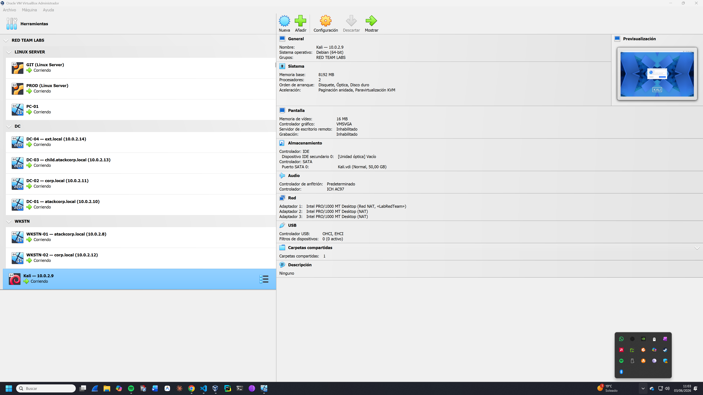
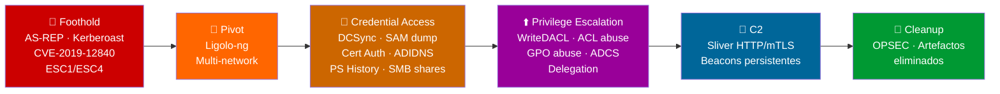

<div align="center">

```
 ██████╗ ███████╗██████╗     ████████╗███████╗ █████╗ ███╗   ███╗
 ██╔══██╗██╔════╝██╔══██╗    ╚══██╔══╝██╔════╝██╔══██╗████╗ ████║
 ██████╔╝█████╗  ██║  ██║       ██║   █████╗  ███████║██╔████╔██║
 ██╔══██╗██╔══╝  ██║  ██║       ██║   ██╔══╝  ██╔══██║██║╚██╔╝██║
 ██║  ██║███████╗██████╔╝       ██║   ███████╗██║  ██║██║ ╚═╝ ██║
 ╚═╝  ╚═╝╚══════╝╚═════╝        ╚═╝   ╚══════╝╚═╝  ╚═╝╚═╝     ╚═╝
```

```
  [ Active Directory Adversary Emulation — APT29 · APT41 · APT28 · Lazarus · APT10 ]
  [ CRTO Preparation · Sliver C2 · MITRE ATT&CK v14 · 7/18 Labs · 56 técnicas MITRE ]
```

[](.)
[](.)
[](.)
[](https://attack.mitre.org)
[](.)
[](.)

**Documentación operacional de Red Team en Active Directory.**  
Adversary emulation real — APT29, APT41, APT28, Lazarus, APT10 — con C2 Open Source.

[📋 Estado de labs](#-estado-de-labs) · [🗺️ Roadmap completo](#️-roadmap-completo) · [🧠 Metodología](#-metodología) · [⚙️ Setup](#️-setup-del-entorno) · [📊 MITRE Coverage](#-mitre-attck-coverage)

</div>

---

## 📌 ¿Qué es este repositorio?

Este repositorio documenta mi preparación para la certificación **CRTO (Certified Red Team Operator)**. No es una colección de writeups — es **documentación operacional** estructurada como lo haría un equipo Red Team profesional.

**Lo que lo diferencia:**

- Cada lab tiene una **operación nombrada** con adversario APT real, objetivos concretos y Crown Jewels definidos
- Todo está mapeado contra **MITRE ATT&CK v14 Enterprise** con ID de técnica y subtécnica
- Los fallos se documentan con la misma profundidad que los éxitos — una técnica bloqueada por PAC Validation o KB5005413 es una lección más valiosa que una que funciona sin fricción
- El C2 principal es **Sliver** (BishopFox) replicando capacidades de Cobalt Strike en Open Source
- Cada técnica ofensiva viene acompañada de su detección: Event IDs, reglas SIGMA, hardening

> ⚠️ **Entorno 100% controlado.** Todo se ejecuta en laboratorio local con VMs. Uso exclusivamente educativo y de preparación para certificación.

---

## 🏗️ Arquitectura del Entorno

```
┌─────────────────────────────────────────────────────────────────────┐
│                    RED TEAM LAB — 10.0.2.0/24 (LabRedTeam NAT)     │
│                                                                     │
│  FOREST 1: atackcorp.local                                          │
│  ┌──────────────┐  ┌──────────────┐  ┌──────────────┐             │
│  │    DC-01      │  │    DC-03      │  │   WKSTN-01   │             │
│  │  10.0.2.10    │  │  10.0.2.13    │  │  10.0.2.8    │             │
│  │  Root DC      │  │  child.atack. │  │  Windows 11  │             │
│  │  ADCS         │  │  corp.local   │  │              │             │
│  └──────┬────────┘  └──────────────┘  └──────────────┘             │
│         │ BiDir Trust          BiDir Trust                          │
│  FOREST 2: corp.local ◄────────────────────────────────            │
│  ┌──────────────┐  ┌──────────────┐                                │
│  │    DC-02      │  │   WKSTN-02   │                                │
│  │  10.0.2.11    │  │  10.0.2.12   │                                │
│  │  Root DC      │  │  Windows 11  │                                │
│  └──────────────┘  └──────────────┘                                │
│         │ BiDir Trust                                               │
│  FOREST 3: ext.local ◄─────────────────────────────────            │
│  ┌──────────────┐                                                   │
│  │    DC-04      │                                                  │
│  │  10.0.2.14    │                                                  │
│  │  Root DC      │                                                  │
│  └──────────────┘                                                   │
│                                                                     │
│  ┌──────────────────────────────────────────────────────────────┐  │
│  │  Kali Linux 10.0.2.9 — Atacante / C2 / Arsenal               │  │
│  └──────────────────────────────────────────────────────────────┘  │
│                                                                     │
│  ┌──────────────────────────────────────────────────────────────┐  │
│  │  Lab-02 — Red interna 10.0.3.0/24                            │  │
│  │  PROD (10.0.3.10) · GIT (10.0.3.11) · PC-01 (10.0.3.20)     │  │
│  └──────────────────────────────────────────────────────────────┘  │
└─────────────────────────────────────────────────────────────────────┘
```

> 🖥️ **Entorno real en VirtualBox** — todos los labs se ejecutan en máquinas virtuales locales



| Host | IP | OS | RAM | Rol |
|---|---|---|---|---|
| DC-01 | 10.0.2.10 | Windows Server 2025 | 22GB | Domain Controller — atackcorp.local + ADCS + Windows LAPS |
| DC-02 | 10.0.2.11 | Windows Server 2022 | 3GB | Domain Controller — corp.local (Forest 2) |
| DC-03 | 10.0.2.13 | Windows Server 2022 | 3GB | Domain Controller — child.atackcorp.local |
| DC-04 | 10.0.2.14 | Windows Server 2022 | 2GB | Domain Controller — ext.local (Forest 3) |
| WKSTN-01 | 10.0.2.8 | Windows 11 | 3GB | Workstation — atackcorp.local |
| WKSTN-02 | 10.0.2.12 | Windows 11 | 3GB | Workstation — corp.local |
| Kali | 10.0.2.9 | Kali Linux 2026.1 | 8GB | Atacante / C2 Server |
| PROD | 10.0.3.10 | Ubuntu 22.04 | — | Servidor web Lab-02 (Webmin 1.890) |
| GIT | 10.0.3.11 | Ubuntu 22.04 | — | Servidor Git Lab-02 |
| PC-01 | 10.0.3.20 | Windows 11 | — | Workstation red interna Lab-02 |

---

## 🗺️ Roadmap Completo

El roadmap está **alineado al temario CRTO** y recorre **4 Fases** y **18 Labs** (7 completados). La piel
APT es cosmética: el alcance de cada lab lo fija el temario. Fuente de verdad: [`docs/design/ROADMAP.md`](docs/design/ROADMAP.md).

```
PHASE-01 ── APT29 + APT41 ──► Fundamentos AD, Kerberos, ADCS, Pivotaje
PHASE-02 ── APT28          ──► AD Avanzado, WriteDACL, DCSync, Credential Hunting
PHASE-03 ── Lazarus Group  ──► C2, Operativa de Host, Evasión (Defender/AMSI/AppLocker)
PHASE-04 ── APT10          ──► MSSQL, Domain Dominance, Trusts, C2 avanzado, Capstone
```

---

### 🟢 Phase-01 — Fundamentos y Pivotaje

| # | Operación | Adversario | Estado | Técnicas principales |
|---|---|---|---|---|
| Lab-01 | 🌲 **GHOST FOREST** | APT29 (Cozy Bear) | ✅ Completado ~40h | AS-REP Roasting, Kerberoasting, DCSync, Delegation, GPO Abuse, ACL Abuse |
| Lab-02 | 🌉 **SILENT BRIDGE** | APT41 (Double Dragon) | ✅ Completado ~18h | CVE-2019-12840, Ligolo-ng Pivot, Sliver relay C2, SAM dump, Git cred disclosure |
| Lab-03 | 🌑 **DARK GATE** | APT29 (Cozy Bear) | ✅ Completado ~16h | ADCS ESC1/ESC4/ESC8, Certipy, NTLM Relay, Certificate persistence |

### 🟡 Phase-02 — AD Avanzado

| # | Operación | Adversario | Estado | Técnicas principales |
|---|---|---|---|---|
| Lab-04 | 🔴 **IRON FOREST** | APT28 (Fancy Bear) | ✅ Completado ~20h | WriteDACL→DCSync, Credential Hunting, ADIDNS Poisoning, Overpass-the-Hash |
| Lab-05 | ⛓️ **SILVER CHAIN** | APT28 (Fancy Bear) | ✅ Completado ~20h | RBCD, Shadow Credentials, Silver Ticket, Diamond Ticket |
| Lab-06 | 📋 **BLACK POLICY** | APT28 (Fancy Bear) | ✅ Completado ~25h | SID History Injection, Cross-Forest Trust, GPO Abuse, DSInternals |
| Lab-07 | 🔒 **SHADOW VAULT** | APT28 (Fancy Bear) | ✅ Completado ~8h | LAPS abuse, DPAPI extraction, Shadow Credentials, C2 Sliver |

### 🔴 Phase-03 — Red Team Operations (C2, host, evasión)

| # | Operación | Adversario | Estado | Bloque CRTO |
|---|---|---|---|---|
| Lab-08 | 📶 **BLACK BEACON** | Lazarus Group | ⏳ Pendiente | C2 / modelo operador (listeners, beacons, OPSEC) |
| Lab-09 | 📡 **FIRST CONTACT** | Lazarus Group | ⏳ Pendiente | Initial Access & Foothold (recon, compromise, host recon) |
| Lab-10 | 🌱 **DEEP ROOT** | Lazarus Group | ⏳ Pendiente | Host Persistence & Privilege Escalation |
| Lab-11 | 👁️ **GHOST SIGNAL** | Lazarus Group | ⏳ Pendiente | Evasión I — Defender / AMSI / ETW |
| Lab-12 | 🛡️ **IRON VEIL** | Lazarus Group | ⏳ Pendiente | Evasión II — AppLocker / CLM / LOLBAS |

### 🏴 Phase-04 — Enterprise & Exam (maestría AD, C2 avanzado, capstone)

| # | Operación | Adversario | Estado | Bloque CRTO |
|---|---|---|---|---|
| Lab-13 | 🔗 **LINKED SHADOWS** | APT10 (Stone Panda) | ⏳ Pendiente | MS SQL Servers (linked servers, escalada, lateral) |
| Lab-14 | 👑 **GOLDEN THRONE** | APT10 (Stone Panda) | ⏳ Pendiente | Domain Dominance & Persistence (Golden/Silver/Diamond, forged certs) |
| Lab-15 | 🌲 **FOREST REIGN** | APT10 (Stone Panda) | ⏳ Pendiente | Forest & Domain Trusts (cross-forest, SID history/filtering) |
| Lab-16 | 🧰 **CUSTOM ARSENAL** | APT10 (Stone Panda) | ⏳ Pendiente | Extending the C2 (BOFs, Malleable C2, Aggressor) |
| Lab-17 | 🚪 **SILENT EXIT** | APT10 (Stone Panda) | ⏳ Pendiente | Data Exfiltration & Reporting / OPSEC |
| Lab-18 | ⚖️ **FINAL VERDICT** | APT10 (Stone Panda) | ⏳ Pendiente | Capstone — Exam Simulation (Defender ON, por objetivos) |

---

## 📋 Estado de Labs

### ✅ Lab-01 — GHOST FOREST | APT29 (Cozy Bear)

**13 fases completadas · ~40 horas · Documentación completa**

<details>
<summary>Ver todas las fases y TTPs</summary>

| Fase | Nombre | Técnica | MITRE ID | Herramienta |
|---|---|---|---|---|
| 01 | Reconnaissance | Network scanning + LDAP/SMB enum | T1046, T1135 | Nmap, enum4linux-ng |
| 02 | Initial Access | AS-REP Roasting → crack | T1558.004, T1110.002 | GetNPUsers, Hashcat |
| 03 | Execution / Foothold | Evil-WinRM shell como ceo.martinez | T1021.006, T1078.002 | Evil-WinRM, CrackMapExec |
| 04 | Discovery | BloodHound CE + PowerView + SPN enum | T1087.002, T1069.002, T1482 | BloodHound, ldapsearch |
| 05 | Credential Access | Kerberoasting → backup_svc → DA | T1558.003, T1110.002 | GetUserSPNs, John |
| 06 | Lateral Movement | WinRM a WKSTN-01 como backup_svc | T1021.006, T1550.002 | Evil-WinRM, Impacket |
| 07 | C2 Establishment | Sliver HTTPS beacon `EASY_PROFIT` | T1071.001, T1573.002 | Sliver v1.7.3 |
| 08 | Privilege Escalation | SeImpersonatePrivilege + Defender bypass | T1134.001, T1562.001 | PrintSpoofer (parcial) |
| 09 | Persistence | Golden Ticket (bloqueado PAC Validation) | T1558.001 | Impacket ticketer |
| 10 | Objective Completion | DCSync → Pass-the-Hash → Domain Admin | T1003.006, T1550.002 | secretsdump, Evil-WinRM |
| 11 | Delegation Abuse | Unconstrained (PetitPotam) + Constrained S4U2Proxy | T1558.001, T1187 | Rubeus, PetitPotam |
| 12 | GPO Abuse | helpdesk.ruiz → ScheduledTasks.xml SYSVOL → admin local | T1484.001, T1053.005 | PowerShell + SYSVOL |
| 13 | ACL Abuse | fin.garcia GenericWrite → Targeted Kerberoast → SQLService2024! | T1222, T1558.003 | bloodyAD, GetUserSPNs |

**Crown Jewels:** Hash NTLM Administrador · Dominio comprometido al 100%  
**Lecciones clave:** PAC Validation bloquea Golden Ticket · Potato attacks fallan en WinRM · SharpHound cubre ACLs/GPOs que bloodhound-python no recoge

</details>

---

### ✅ Lab-02 — SILENT BRIDGE | APT41 (Double Dragon)

**7 fases completadas · ~18 horas · Documentación completa**

<details>
<summary>Ver todas las fases y TTPs</summary>

| Fase | Nombre | Técnica | MITRE ID | Herramienta |
|---|---|---|---|---|
| 01 | Reconnaissance | Fingerprint Webmin 1.890 + CVE research | T1046, T1592 | Nmap, WhatWeb |
| 02 | Initial Access | CVE-2019-12840 RCE → root@prod | T1190, T1587.001 | Exploit Python |
| 03 | Pivoting | Ligolo-ng v0.7.5 → red interna enrutada | T1572, T1090.001 | Ligolo-ng |
| 04 | Internal Enum | Git history → thomas:iamthegreatest | T1552.001, T1213 | git log, curl |
| 05 | Lateral Movement | Evil-WinRM PC-01 como thomas | T1021.006 | Evil-WinRM |
| 06 | C2 Establishment | Beacon `SUDDEN_COMMUNICATION` vía relay PROD | T1071.001, T1090 | Sliver + Ligolo |
| 07 | Persistence + Loot | schtasks + SAM dump | T1053.005, T1003.002 | Impacket secretsdump |

**Crown Jewels:** Hash NTLM thomas + SAM de PC-01 · Red interna 10.0.3.0/24 comprometida

</details>

---

### ✅ Lab-03 — DARK GATE | APT29 (Cozy Bear)

**6 fases completadas · ~16 horas · Documentación completa**

<details>
<summary>Ver todas las fases y TTPs</summary>

| Fase | Nombre | Técnica | MITRE ID | Herramienta |
|---|---|---|---|---|
| 01 | ADCS Enumeration | certipy-ad find → ESC1 + ESC4 + ESC8 | T1046 | Certipy v5.0.4 |
| 02 | ESC1 — SAN Abuse | ceo.martinez → cert como Administrador → DA | T1649 | Certipy |
| 03 | ESC4 — Template Modification | fin.garcia GenericWrite → plantilla modificada | T1222, T1649 | Certipy |
| 04 | ESC8 — NTLM Relay | PetitPotam exitoso, relay bloqueado KB5005413 | T1557.001, T1187 | PetitPotam, ntlmrelayx |
| 05 | C2 Establishment | `CLINICAL_CHAIRMAN` en DC-01 | T1071.001 | Sliver v1.7.3 |
| 06 | Certificate Persistence | Cert válido post-rotación de contraseña | T1649 | Certipy |

**Crown Jewels:** Certificado Administrador válido · Persistencia post-rotación de contraseña

</details>

---

### ✅ Lab-04 — IRON FOREST | APT28 (Fancy Bear)

**8 fases completadas · ~20 horas · Documentación completa**

<details>
<summary>Ver todas las fases y TTPs</summary>

| Fase | Nombre | Técnica | MITRE ID | Herramienta |
|---|---|---|---|---|
| 01 | Reconnaissance | BloodHound CE + SharpHound v2.5.9 | T1087.002 | BloodHound CE, SharpHound |
| 02 | Credential Hunting | Share IT-Scripts + historial PS | T1552.001, T1039 | smbclient |
| 03 | Overpass-the-Hash | fin.garcia → TGT Kerberos válido 10h | T1550.003 | impacket-getTGT |
| 04 | WriteDACL Abuse | fin.garcia → DCSync rights sobre dominio | T1222 | impacket-dacledit |
| 05 | DCSync | Volcado completo hashes NTLM (13 entradas) | T1003.006 | impacket-secretsdump |
| 06 | ADIDNS Abuse | wpad.atackcorp.local → Responder NTLMv2 | T1557.001 | dnstool + Responder |
| 07 | C2 Establishment | Beacon `iron_forest_dc01` en DC-01 como DA | T1071.001 | Sliver v1.7.3 |
| 08 | Cleanup OPSEC | DCSync rights eliminados + WPAD tombstoned | T1070 | dacledit + dnstool |

**Crown Jewels:** Hash NTLM Administrador `bc3abc2e...` · Hash krbtgt `d5237a2e...` · NTLMv2 backup_svc  
**Lecciones clave:** DNS Global Query Block List bloquea WPAD · Responder conflicto puerto 80 con Docker · bloodhound-python no importa en BloodHound CE 5.x

</details>

---

### ✅ Lab-05 — SILVER CHAIN | APT28 (Fancy Bear)

**6 fases completadas · ~20 horas · Documentación completa**

<details>
<summary>Ver todas las fases y TTPs</summary>

| Fase | Nombre | Técnica | MITRE ID | Herramienta |
|---|---|---|---|---|
| 01 | Reconnaissance | BloodHound CE + SharpHound v2.5.9 | T1087.002 | BloodHound CE, SharpHound |
| 02 | RBCD Abuse | MachineAccountQuota + S4U2Self/S4U2Proxy | T1558.001 | impacket-addcomputer, getST |
| 03 | Shadow Credentials | msDS-KeyCredentialLink → PKINIT → hash | T1556, T1649 | pywhisker, certipy-ad |
| 04 | Silver Ticket | NTLM hash iis_svc → TGS MSSQLSvc forjado | T1558.002 | impacket-ticketer |
| 05 | Diamond Ticket | krbtgt AES256 → TGT real + PAC modificado | T1558.001 | Rubeus |
| 06 | C2 + Cleanup | Beacon WKSTN-01 + OPSEC cleanup | T1071.001, T1070 | Sliver, impacket, pywhisker |

**Crown Jewels:** TGS Administrador@WKSTN-01 · iis_svc NTLM `b329981877f0ca1243192863f356a2f9` · Silver Ticket MSSQLSvc · Diamond Ticket bypass PAC Validation  
**Lecciones clave:** pywhisker rompe impacket (reinstalar 0.13.1) · Diamond Ticket requiere AES256 · kirbi→ccache para usar desde Linux

</details>

---

### ✅ Lab-06 — BLACK POLICY | APT28 (Fancy Bear)

**5 fases completadas · ~25 horas · Documentación completa**

<details>
<summary>Ver todas las fases y TTPs</summary>

| Fase | Nombre | Técnica | MITRE ID | Herramienta |
|---|---|---|---|---|
| 01 | Reconnaissance | Cross-Forest enum + Kerberoasting corp_svc/ext_svc | T1558.003, T1135 | nxc, impacket-GetUserSPNs, John |
| 02 | SID History Injection | DSInternals Add-ADDBSidHistory → child.user = DA atackcorp | T1134.005 | DSInternals v4.14, Evil-WinRM |
| 03 | Cross-Forest Trust | corp.local + ext.local comprometidos · DCSync krbtgt x3 | T1482, T1003.006 | bloodyAD, impacket-secretsdump |
| 04 | GPO Abuse | WriteDACL helpdesk.ruiz → FullControl GPO → admin WKSTN-01 | T1484.001 | dacledit, pyGPOAbuse |
| 05 | C2 + Cleanup | Beacons WKSTN-01 + DC-02 · Crown Jewel IPO_strategy_2026.txt | T1071.001, T1070 | Sliver, dacledit |

**Crown Jewels:** `IPO_strategy_2026.txt` · krbtgt atackcorp/corp/ext · helpdesk.ruiz admin local WKSTN-01  
**Lecciones clave:** Evil-WinRM limita tokens de red (Get-ADGroup cross-domain falla) · bloodyAD v2.5.4 elimina sIDHistory · DSInternals como alternativa a mimikatz misc::addsid · pyGPOAbuse más compatible que GPP XML en Windows 11

</details>

---

### ✅ Lab-07 — SHADOW VAULT | APT28 (Fancy Bear)

**5 fases completadas · ~8 horas · Documentación completa**

<details>
<summary>Ver todas las fases y TTPs</summary>

| Fase | Nombre | Técnica | MITRE ID | Herramienta |
|---|---|---|---|---|
| 01 | LAPS Password Extraction | Windows LAPS Password Disclosure via LDAP | T1201, T1078.003 | nxc ldap -M laps, impacket-smbclient |
| 02 | DPAPI Credential Extraction | DPAPI Master Key dump + Credential Manager decrypt | T1555.004 | impacket-dpapi masterkey/credential |
| 03 | LSASS Dump sin Mimikatz | comsvcs.dll MiniDump — BLOQUEADO Windows 11 23H2+ | T1003.001 | Bloqueado por KPP — Labs 08-11 |
| 04 | Shadow Credentials | msDS-KeyCredentialLink abuse + PKINIT | T1649 | pywhisker, certipy-ad |
| 05 | C2 + OPSEC Cleanup | Sliver HTTPS beacon + eliminación artefactos | T1071.001, T1070.004 | Sliver, impacket-smbclient |

**Crown Jewels:** `WKSTN-01\Administrador:@98q6$13Z{K99;` · `sa:SQLsa2026!` (DC-01\SQLEXPRESS) · NT hash WKSTN-01$  
**Lecciones clave:** WS2025 LAPS usa GKDI por defecto (herramientas Linux no descifran) · Evil-WinRM Network Logon no tiene SeDebugPrivilege · Windows 11 23H2+ KPP bloquea LSASS dump incluso con PPL=0 · pywhisker requiere --use-ldaps en WS2025 · usar certipy-ad (no certipy)

</details>

---

## 🔜 Próximo objetivo

**Lab-08 — BLACK BEACON · C2 Foundations**

| Campo | Detalle |
|-------|---------|
| Bloque CRTO | Command & Control — listeners, beacons, staging, OPSEC |
| Objetivo | Construir el modelo operador de C2 y la equivalencia CS↔Sliver |
| Adversario | Lazarus Group (piel cosmética; el alcance lo fija el temario) |

## 📂 Estructura del Repositorio

```
Red-Team_Labs/
│
├── README.md
│
├── docs/
│   ├── design/
│   │   ├── DESIGN.md                        # Filosofía, adversary emulation, roadmap v3.0
│   │   └── ROADMAP.md                       # Plan canónico 18 labs (fuente de verdad)
│   ├── standards/
│   │   └── REPOSITORY_STANDARDS.md          # Estándar del producto + Definition of Done
│   ├── learning/
│   │   └── STUDY_GUIDE.md                   # Guía de estudio + autoevaluación CRTO
│   ├── detection/
│   │   └── DETECTION_RULES.md               # Reglas SIGMA y Event IDs por técnica
│   ├── operations/
│   │   ├── ENGAGEMENT_CHECKLIST.md          # Checklist pre/durante/post operación
│   │   ├── METHODOLOGY.md                   # Proceso operacional estándar
│   │   ├── OPSEC_NOTES.md                   # 17 secciones de OPSEC operacional
│   │   ├── THREAT_MODEL.md                  # Modelo de amenaza del entorno
│   │   └── WRITEUP_TEMPLATE.md              # Plantilla para nuevos labs
│   ├── progress/
│   │   ├── PROGRESS.md                      # Diario de sesiones + técnicas dominadas por lab
│   │   └── CHANGELOG.md                     # Historial de cambios del repo
│   └── reference/
│       ├── ARSENAL.md                        # Arsenal completo con rutas y versiones
│       ├── LAB_INFRASTRUCTURE.md            # Infraestructura detallada de cada lab
│       ├── MITRE_MAPPING.md                 # Mapping MITRE ATT&CK v14 por lab
│       └── TOOL_INDEX.md                    # Índice de herramientas con versiones
│
├── setup/
│   ├── DC-01/                               # Scripts DC-01 (atackcorp.local)
│   │   ├── 01_promover_controlador_de_dominio_atackcorp.ps1
│   │   ├── 02_crear_usuarios_ous_atackcorp.ps1
│   │   ├── 03_configurar_acls_delegaciones_atackcorp.ps1
│   │   ├── 04_instalar_iis_smb_shares_gpos_atackcorp.ps1
│   │   ├── 05_instalar_sql_server_express_atackcorp.ps1
│   │   ├── 10_configurar_forest_trusts_sid_filtering.ps1
│   │   ├── 12_configurar_windows_laps_atackcorp.ps1
│   │   ├── 13_instalar_adcs_ca_atackcorp.ps1
│   │   └── 14_configurar_defender_exclusiones_atackcorp.ps1
│   ├── DC-02/                               # Scripts DC-02 (corp.local)
│   ├── DC-03/                               # Scripts DC-03 (child.atackcorp.local)
│   ├── DC-04/                               # Scripts DC-04 (ext.local)
│   ├── WKSTN-01/                            # Scripts WKSTN-01
│   ├── WKSTN-02/                            # Scripts WKSTN-02
│   ├── CrownJewels/                         # Crown Jewels Labs 01-07 (completados)
│   ├── README.md                            # Guia completa de aprovisionamiento
│   └── screenshots/                         # Evidencia del setup del entorno
│
├── tooling/                                 # Scripts de setup del arsenal Kali + mantenimiento
│   ├── arsenal_setup.sh
│   ├── lab_start.sh
│   ├── lab_stop.sh
│   ├── scaffold-v3.ps1                      # Reestructura el repo al ROADMAP v3.0 (Windows)
│   └── scaffold-v3.sh                       # Reestructura el repo al ROADMAP v3.0 (Linux)
│
├── Phase-01-Fundamentals/
│   ├── Lab-01-Ghost-Forest/    ✅ 13 fases · ~40h · APT29
│   ├── Lab-02-Silent-Bridge/   ✅ 7 fases  · ~18h · APT41
│   └── Lab-03-Dark-Gate/       ✅ 6 fases  · ~16h · APT29
│
├── Phase-02-Post-Exploitation/
│   ├── Lab-04-Iron-Forest/     ✅ 8 fases  · ~20h · APT28
│   ├── Lab-05-Silver-Chain/    ✅ 6 fases  · ~20h · APT28
│   ├── Lab-06-Black-Policy/    ✅ Completado · ~25h · APT28
│   └── Lab-07-Shadow-Vault/    ✅ Completado · ~8h · APT28
│
├── Phase-03-Red-Team-Operations/
│   ├── Lab-08-Black-Beacon/    ⏳ Pendiente · C2 Foundations
│   ├── Lab-09-First-Contact/   ⏳ Pendiente · Initial Access
│   ├── Lab-10-Deep-Root/       ⏳ Pendiente · Persistence & PrivEsc
│   ├── Lab-11-Ghost-Signal/    ⏳ Pendiente · Evasión I (Defender/AMSI)
│   └── Lab-12-Iron-Veil/       ⏳ Pendiente · Evasión II (AppLocker/CLM)
│
└── Phase-04-Enterprise-Simulation/
    ├── Lab-13-Linked-Shadows/  ⏳ Pendiente · MS SQL Servers
    ├── Lab-14-Golden-Throne/   ⏳ Pendiente · Domain Dominance
    ├── Lab-15-Forest-Reign/    ⏳ Pendiente · Forest & Trusts
    ├── Lab-16-Custom-Arsenal/  ⏳ Pendiente · Extending the C2
    ├── Lab-17-Silent-Exit/     ⏳ Pendiente · Exfil & Reporting
    └── Lab-18-Final-Verdict/   ⏳ Pendiente · Capstone (Exam Sim)
```

**Cada lab completado contiene:**
- `OPERATION_*.md` — Resumen ejecutivo de la operación
- `docs/theory/tradecraft.md` — Fundamentos teóricos
- `docs/execution/*.md` — Comandos reales con output y notas OPSEC
- `docs/analysis/lessons_learned.md` — Qué funcionó, qué falló y por qué
- `docs/analysis/mitigations.md` — Detección y hardening Blue Team
- `docs/report/*.pdf` — Reporte ejecutivo en PDF
- `setup/CrownJewels/CrownJewels-Lab*.ps1` — Script de verificación de objetivos
- `screenshots/FASE-XX-Nombre/` — Evidencia visual organizada por fase
- `loot/` — Hashes, tickets y credenciales capturadas

---

## 🔗 Kill Chain — Operaciones completadas



---

## 🧠 Metodología

```
┌────────────────────────────────────────────────────────────────────┐
│  PASO  1: ADVERSARY SELECTION  → APT real · Kill chain · TTPs      │
│  PASO  2: THREAT MODEL         → Crown Jewels · Scope · Éxito      │
│  PASO  3: THEORY               → Fundamentos antes de ejecutar     │
│  PASO  4: INFRASTRUCTURE       → Setup reproducible + snapshots    │
│  PASO  5: RECONNAISSANCE       → BloodHound · Attack paths         │
│  PASO  6: EXECUTION            → Comandos + output + OPSEC         │
│  PASO  7: CLEANUP              → Artefactos · ACLs · GPOs          │
│  PASO  8: ANALYSIS             → Post-mortem + lecciones           │
│  PASO  9: BLUE TEAM            → Event IDs · SIGMA · Hardening     │
│  PASO 10: REPORT               → PDF ejecutivo + lessons learned   │
└────────────────────────────────────────────────────────────────────┘
```

> Metodología completa en [`docs/operations/METHODOLOGY.md`](docs/operations/METHODOLOGY.md)

---

## 🛠️ Arsenal

### C2 Frameworks

| Herramienta | Versión | Labs | Uso |
|---|---|---|---|
| **Sliver** (BishopFox) | v1.7.3 | Lab-01/02/03/04 | C2 principal — HTTP/mTLS beacons, post-explotación |
| **Havoc C2** | Latest | Lab-10 | C2 alternativo — BOFs, sleep obfuscation |

### Active Directory & Kerberos

| Herramienta | Uso |
|---|---|
| **Impacket** | GetNPUsers, GetUserSPNs, secretsdump, getTGT, dacledit |
| **Rubeus** | Ticket manipulation, S4U2Self/S4U2Proxy |
| **BloodHound CE** v9.1.0 | Attack paths, ACL analysis — Docker `~/tools/ad/bloodhound-ce/` |
| **SharpHound** v2.5.9 | Recolección CE-compatible — `/opt/redteam/windows/SharpHound.exe` |
| **bloodhound-python** | Recolección OPSEC-friendly (sin binarios en objetivo) |
| **PowerView** | Enumeración AD desde PowerShell — LOLBins |
| **bloodyAD** | ACL abuse — GenericWrite, WriteDACL |
| **Evil-WinRM** | Shell remota WinRM con upload/download |
| **Kerbrute** | Enumeración de usuarios sin bloqueo de cuentas |

### ADCS & ACL Abuse

| Herramienta | Versión | Uso |
|---|---|---|
| **Certipy** | v5.0.4 | ESC1/ESC4/ESC8 |
| **impacket-dacledit** | v0.14 | WriteDACL → DCSync rights |
| **dnstool.py** (krbrelayx) | Latest | ADIDNS registro WPAD |
| **Responder** | v3.2.2 | NTLMv2 capture via WPAD |
| **PetitPotam** | Latest | NTLM coercion |

### Pivotaje & Red

| Herramienta | Uso |
|---|---|
| **Ligolo-ng** v0.7.5 | Tunneling full-duplex — redes segmentadas |
| **Chisel** | Tunneling HTTP/HTTPS reversible |
| **Nmap** | Reconocimiento a través de túneles Ligolo |

---

## ⚙️ Setup del Entorno

### Requisitos de hardware

```
RAM mínima:    40 GB  (entorno CRTO completo — 4 DCs + 2 WKSTNs + Kali)
CPU:           8 cores (recomendado — VT-x/AMD-V activo en BIOS)
Disco:         400 GB libres
Hypervisor:    VirtualBox 7.x
RAM por VM:    Kali 8GB · DC-01 22GB · DC-02/03/04 4GB · WKSTNs 4GB
```

### Setup automatizado

```powershell
# DC-01 — atackcorp.local (ejecutar en orden)
.\setup\DC-01\01_promover_controlador_de_dominio_atackcorp.ps1
.\setup\DC-01\02_crear_usuarios_ous_atackcorp.ps1
.\setup\DC-01\03_configurar_acls_delegaciones_atackcorp.ps1
.\setup\DC-01\04_instalar_iis_smb_shares_gpos_atackcorp.ps1
.\setup\DC-01\05_instalar_sql_server_express_atackcorp.ps1  # GUI recomendada

# WKSTN-01 — atackcorp.local
.\setup\WKSTN-01\01_configurar_workstation_wkstn01_atackcorp.ps1

# DC-02 — corp.local
.\setup\DC-02\01_configurar_dominio_corp_local.ps1

# DC-03 — child.atackcorp.local
.\setup\DC-03\01_configurar_dominio_child_atackcorp.ps1

# DC-04 — ext.local
.\setup\DC-04\01_configurar_dominio_ext_local.ps1

# WKSTN-02 — corp.local
.\setup\WKSTN-02\01_configurar_workstation_wkstn02_corp.ps1

# Trusts + LAPS + ADCS + Defender (DC-01)
.\setup\DC-01\10_configurar_forest_trusts_sid_filtering.ps1
.\setup\DC-01\12_configurar_windows_laps_atackcorp.ps1
.\setup\DC-01\13_instalar_adcs_ca_atackcorp.ps1
.\setup\DC-01\14_configurar_defender_exclusiones_atackcorp.ps1

# Crown Jewels (DC-01, antes de cada lab)
.\setup\CrownJewels\CrownJewels-Lab0X-NombreOperacion.ps1
```

```bash
# En Kali Linux
git clone https://github.com/adr-camacho/RedTeam-Ops-Roadmap.git
cd RedTeam-Ops-Roadmap
bash tooling/arsenal_setup.sh
```

---

## 📊 MITRE ATT&CK Coverage

**Técnicas dominadas: 56 · Parciales: 2 · En roadmap: 24+**

| Táctica | Técnica | ID | Lab | Estado |
|---|---|---|---|---|
| Reconnaissance | Network Service Discovery | T1046 | Lab-01/02/03 | ✅ |
| Initial Access | Exploit Public Application | T1190 | Lab-02 | ✅ |
| Execution | Windows Remote Management | T1021.006 | Lab-01/02/03/04 | ✅ |
| Persistence | Certificate Persistence | T1649 | Lab-03 | ✅ |
| Privilege Escalation | GPO Modification | T1484.001 | Lab-01 | ✅ |
| Privilege Escalation | WriteDACL → DCSync | T1222 | Lab-04 | ✅ |
| Defense Evasion | Impair Defenses | T1562.001 | Lab-01 | ✅ |
| Defense Evasion | Indicator Removal | T1070 | Lab-04 | ✅ |
| Credential Access | AS-REP Roasting | T1558.004 | Lab-01 | ✅ |
| Credential Access | Kerberoasting | T1558.003 | Lab-01 | ✅ |
| Credential Access | DCSync | T1003.006 | Lab-01/03/04 | ✅ |
| Credential Access | Overpass-the-Hash | T1550.003 | Lab-04 | ✅ |
| Credential Access | ESC1/ESC4 ADCS | T1649 | Lab-03 | ✅ |
| Credential Access | Credential Hunting | T1552.001 | Lab-02/04 | ✅ |
| Credential Access | ADIDNS/WPAD Poisoning | T1557.001 | Lab-04 | ✅ |
| Lateral Movement | Pass-the-Hash | T1550.002 | Lab-01/03 | ✅ |
| C&C | Sliver HTTP/mTLS | T1071.001, T1573.002 | Lab-01/02/03/04 | ✅ |
| C&C | Protocol Tunneling Ligolo-ng | T1572 | Lab-02 | ✅ |
| Privilege Escalation | RBCD S4U2Proxy | T1558.001 | Lab-05 | ✅ |
| Credential Access | Shadow Credentials | T1556 | Lab-05 | ✅ |
| Credential Access | Silver Ticket | T1558.002 | Lab-05 | ✅ |
| Credential Access | Diamond Ticket | T1558.001 | Lab-05 |  ✅ |
| Privilege Escalation | SID History Injection | T1134.005 | Lab-06 | ✅ |
| Lateral Movement | Cross-Forest Trust Abuse | T1482 | Lab-06 | ✅ |
| Credential Access | LAPS Password Disclosure | T1201 | Lab-07 | ✅ |
| Credential Access | DPAPI Credential Extraction | T1555.004 | Lab-07 | ✅ |
| Credential Access | Shadow Credentials (PKINIT) | T1649 | Lab-07 | ✅ |

---

## 📁 Documentación Global

| Documento | Descripción |
|---|---|
| `docs/design/DESIGN.md` | Filosofía, adversary emulation, roadmap v2.0 |
| `docs/detection/DETECTION_RULES.md` | Reglas SIGMA y Event IDs por técnica |
| `docs/operations/ENGAGEMENT_CHECKLIST.md` | Checklist pre/durante/post operación |
| `docs/operations/OPSEC_NOTES.md` | 17 secciones de OPSEC operacional |
| `docs/reference/ARSENAL.md` | Arsenal completo con rutas y versiones |
| `docs/reference/LAB_INFRASTRUCTURE.md` | Infraestructura detallada de cada lab |
| `docs/reference/MITRE_MAPPING.md` | Mapping MITRE ATT&CK v14 completo |
| `docs/progress/PROGRESS.md` | Diario de sesiones + técnicas dominadas por lab |
| `docs/progress/CHANGELOG.md` | Historial completo de cambios |

---

<div align="center">

---

**Adrián Camacho** · Red Team Ops

[](https://www.linkedin.com/in/adrian-camacho-mora/)
[](https://tryhackme.com/p/sapodos)
[](https://github.com/adr-camacho)

> *"Documenta como si alguien más tuviera que ejecutar la operación."*

⚠️ **Disclaimer:** Todo el contenido de este repositorio es de uso exclusivamente educativo y se ejecuta en entornos de laboratorio controlados bajo consentimiento explícito. El uso de estas técnicas contra sistemas sin autorización explícita es ilegal y está penado por la ley. El autor no se hace responsable del uso indebido de este material.

</div>